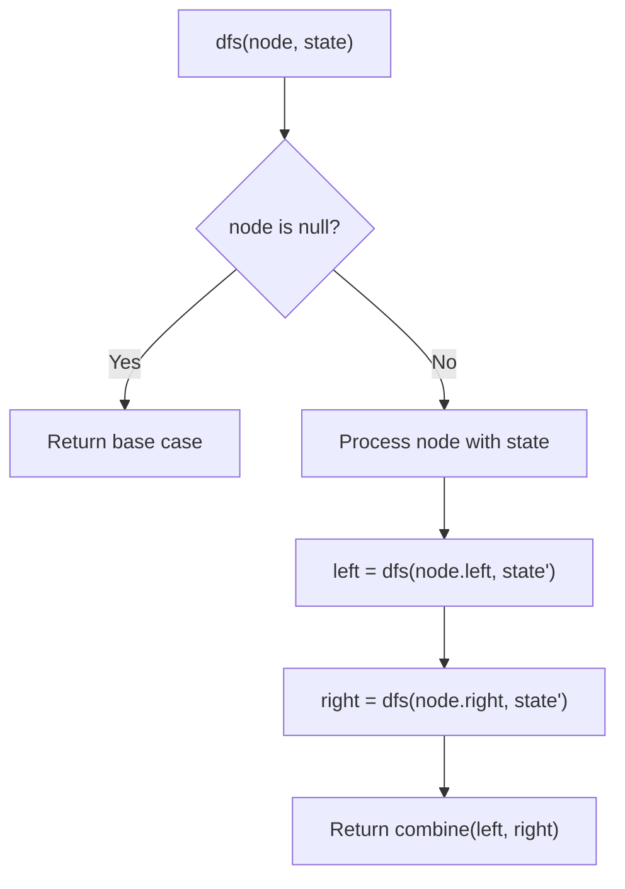
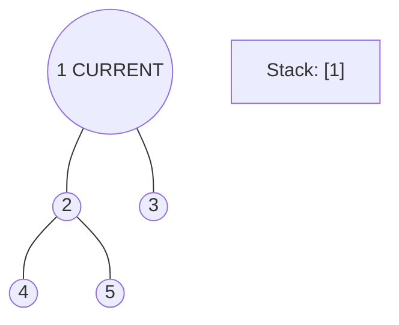
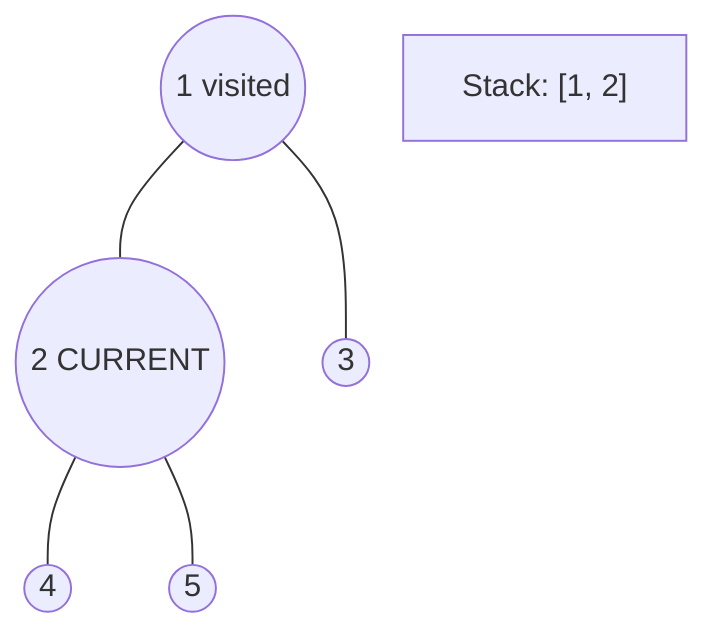
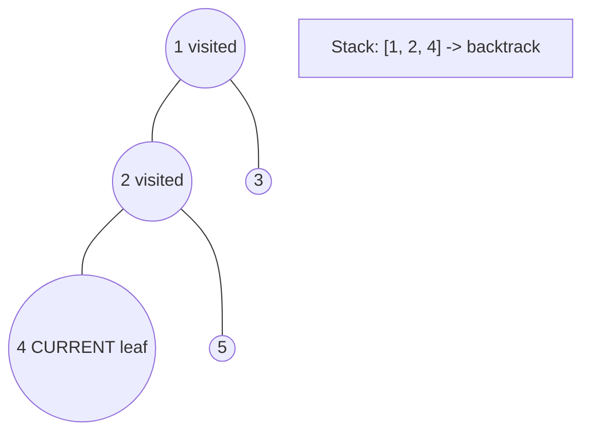
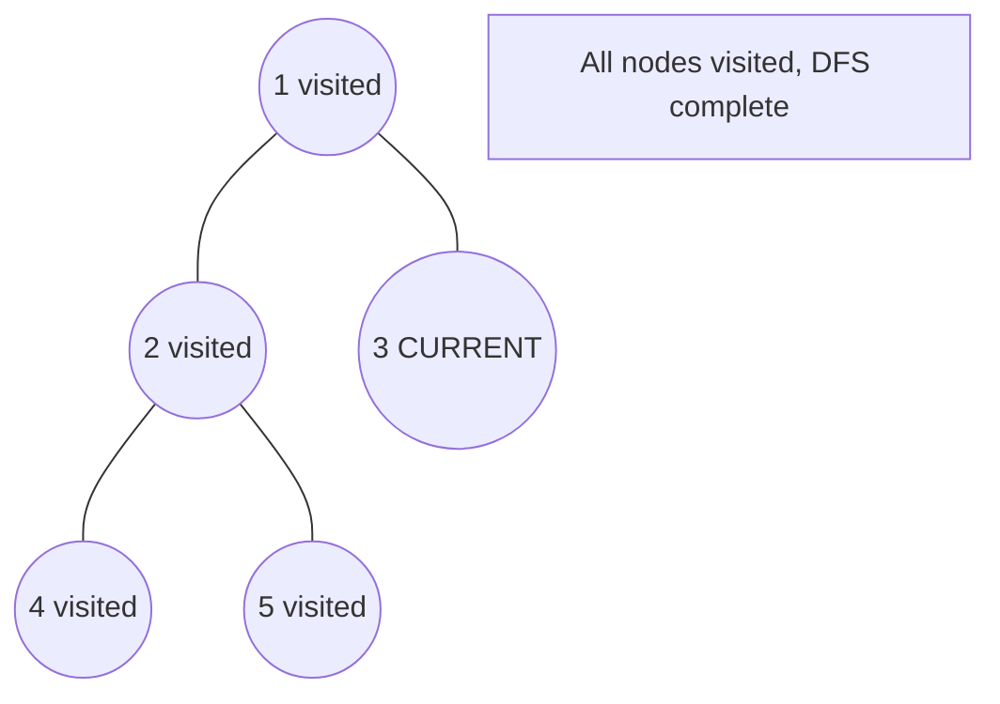

# Problem 314: Binary Tree Vertical Order Traversal

**Difficulty:** Medium  
**Tags:** Hash Table, Tree, Depth-First Search, Breadth-First Search, Sorting, Binary Tree  
**Pattern:** DFS Tree Traversal  
**Link:** [leetcode.com/problems/binary-tree-vertical-order-traversal](https://leetcode.com/problems/binary-tree-vertical-order-traversal/)

## Description

*(Premium problem -- description requires LeetCode subscription)*

## Approach: DFS Tree Traversal

Perform depth-first search on the tree. Recurse on left and right subtrees, combining results bottom-up. Track state (path, depth, sum) during traversal.

## Pseudocode

```
1. Define dfs(node, state):
   a. Base case: if null, return default
   b. Process node with current state
   c. left_result = dfs(node.left, updated_state)
   d. right_result = dfs(node.right, updated_state)
   e. Return combine(left_result, right_result)
2. Return dfs(root, initial_state)
```

## Algorithm Flow



## Visual State Transitions

**DFS Tree Traversal Step-by-Step:**

**Frame 1: Start at root**


**Frame 2: Go left - visit node 2**


**Frame 3: Go left - visit node 4 (leaf)**


**Frame 4: Backtrack, visit node 5, then node 3**



## Complexity Analysis

- **Time:** O(n)
- **Space:** O(h)

## Solution (Python3)

```python
class Solution:
    pass
```

## Solution (C++)

```cpp
class Solution {
public:
    // Design problem stub
};
```
