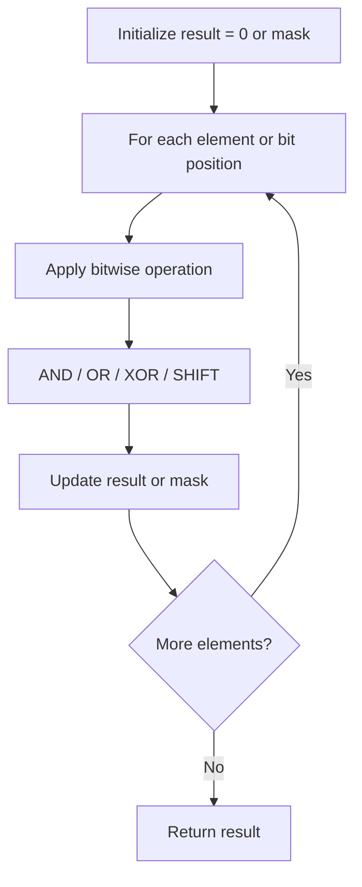

# Problem 318: Maximum Product of Word Lengths

**Difficulty:** Medium  
**Tags:** Array, String, Bit Manipulation  
**Pattern:** Bit Manipulation  
**Link:** [leetcode.com/problems/maximum-product-of-word-lengths](https://leetcode.com/problems/maximum-product-of-word-lengths/)

## Description

Given a string array `words`, return *the maximum value of* `length(word[i]) * length(word[j])` *where the two words do not share common letters*. If no such two words exist, return `0`.

 

Example 1:

```

**Input:** words = ["abcw","baz","foo","bar","xtfn","abcdef"]
**Output:** 16
**Explanation:** The two words can be "abcw", "xtfn".

```

Example 2:

```

**Input:** words = ["a","ab","abc","d","cd","bcd","abcd"]
**Output:** 4
**Explanation:** The two words can be "ab", "cd".

```

Example 3:

```

**Input:** words = ["a","aa","aaa","aaaa"]
**Output:** 0
**Explanation:** No such pair of words.

```

 

**Constraints:**

	- `2 <= words.length <= 1000`
	- `1 <= words[i].length <= 1000`
	- `words[i]` consists only of lowercase English letters.

## Approach: Bit Manipulation

Operate on individual bits using bitwise operators (AND, OR, XOR, shift). Common tricks: x & (x-1) removes lowest set bit, x ^ x = 0, XOR all elements to find unique.

## Pseudocode

```
1. Apply bitwise operations:
   - XOR all elements to cancel paired bits
   - Use bitmask to track state
   - Shift and mask to extract/set individual bits
2. Return result
```

## Algorithm Flow



## Complexity Analysis

- **Time:** O(n) or O(log n)
- **Space:** O(1)

## Solution (Python3)

```python
class Solution:
    def maxProduct(self, words: List[str]) -> int:
        # Bit manipulation - O(n) time, O(1) space
        result = 0
        for val in words:
            result ^= val
        return result
```

## Solution (C++)

```cpp
#include <string>
#include <vector>
using namespace std;

class Solution {
public:
    int maxProduct(vector<string>& words) {
        // Bit manipulation - O(n) time, O(1) space
        int result = 0;
        for (int val : words) {
            result ^= val;
        }
        return result;
    }
};
```
