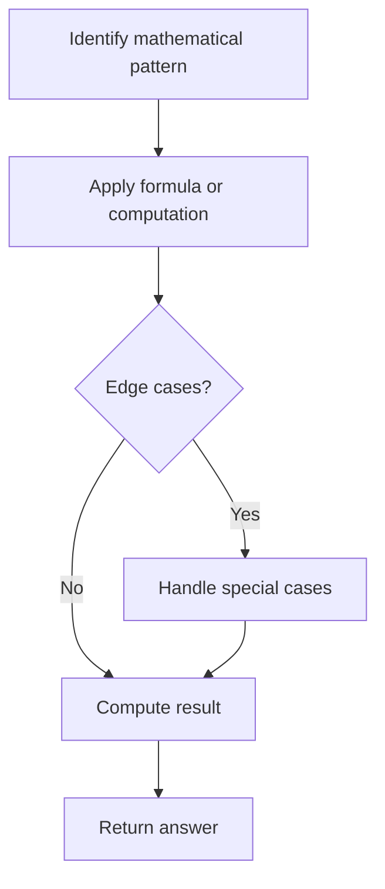

# Problem 319: Bulb Switcher

**Difficulty:** Medium  
**Tags:** Math, Brainteaser  
**Pattern:** Math  
**Link:** [leetcode.com/problems/bulb-switcher](https://leetcode.com/problems/bulb-switcher/)

## Description

There are `n` bulbs that are initially off. You first turn on all the bulbs, then you turn off every second bulb.

On the third round, you toggle every third bulb (turning on if it's off or turning off if it's on). For the `i^th` round, you toggle every `i` bulb. For the `n^th` round, you only toggle the last bulb.

Return *the number of bulbs that are on after `n` rounds*.

 

Example 1:

```

**Input:** n = 3
**Output:** 1
**Explanation:** At first, the three bulbs are [off, off, off].
After the first round, the three bulbs are [on, on, on].
After the second round, the three bulbs are [on, off, on].
After the third round, the three bulbs are [on, off, off]. 
So you should return 1 because there is only one bulb is on.
```

Example 2:

```

**Input:** n = 0
**Output:** 0

```

Example 3:

```

**Input:** n = 1
**Output:** 1

```

 

**Constraints:**

	- `0 <= n <= 10^9`

## Approach: Math

Apply mathematical properties, formulas, or number-theoretic concepts. Look for patterns, modular arithmetic, or closed-form solutions.

## Pseudocode

```
1. Identify the mathematical pattern or formula
2. Apply computation:
   - Modular arithmetic for large numbers
   - GCD/LCM for divisibility
   - Sieve for primes
3. Handle edge cases
4. Return result
```

## Algorithm Flow



## Complexity Analysis

- **Time:** O(n) or O(sqrt(n))
- **Space:** O(1)

## Solution (Python3)

```python
class Solution:
    def bulbSwitch(self, n: int) -> int:
        # Mathematical approach
        result = 0
        x = n
        while x != 0:
            result = result * 10 + x % 10
            x //= 10 if isinstance(x, int) else 1
        return result
```

## Solution (C++)

```cpp
#include <string>
#include <vector>
using namespace std;

class Solution {
public:
    int bulbSwitch(int n) {
        // Mathematical approach
        long long result = 0;
        int x = n;
        while (x != 0) {
            result = result * 10 + x % 10;
            x /= 10;
        }
        return (int)result;
    }
};
```
