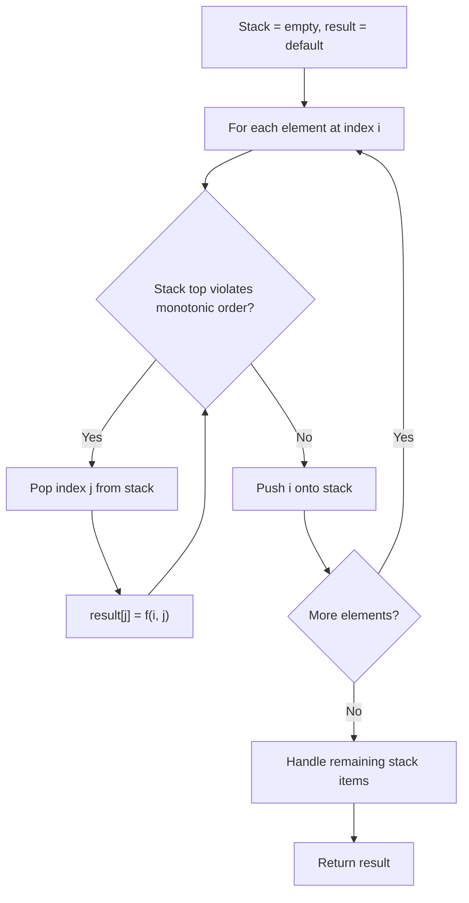
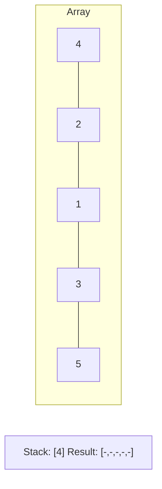
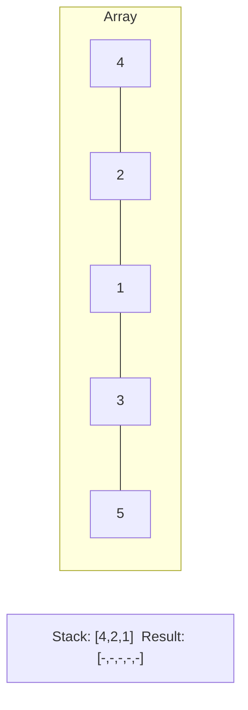
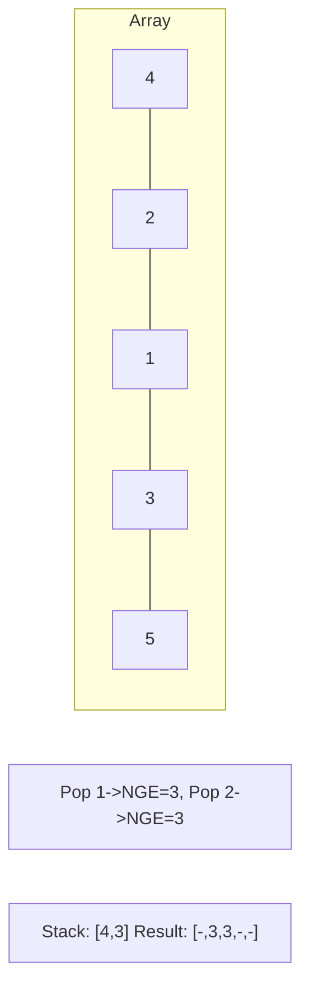
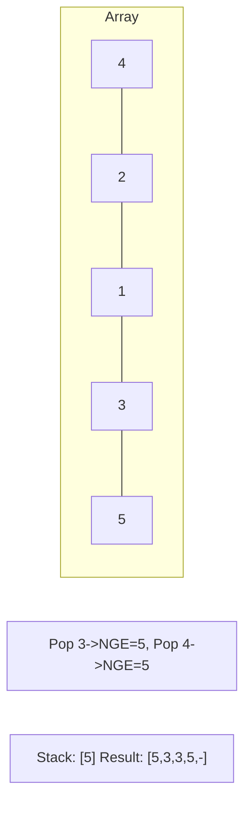

# Problem 321: Create Maximum Number

**Difficulty:** Hard  
**Tags:** Array, Two Pointers, Stack, Greedy, Monotonic Stack  
**Pattern:** Monotonic Stack  
**Link:** [leetcode.com/problems/create-maximum-number](https://leetcode.com/problems/create-maximum-number/)

## Description

You are given two integer arrays `nums1` and `nums2` of lengths `m` and `n` respectively. `nums1` and `nums2` represent the digits of two numbers. You are also given an integer `k`.

Create the maximum number of length `k <= m + n` from digits of the two numbers. The relative order of the digits from the same array must be preserved.

Return an array of the `k` digits representing the answer.

 

Example 1:

```

**Input:** nums1 = [3,4,6,5], nums2 = [9,1,2,5,8,3], k = 5
**Output:** [9,8,6,5,3]

```

Example 2:

```

**Input:** nums1 = [6,7], nums2 = [6,0,4], k = 5
**Output:** [6,7,6,0,4]

```

Example 3:

```

**Input:** nums1 = [3,9], nums2 = [8,9], k = 3
**Output:** [9,8,9]

```

 

**Constraints:**

	- `m == nums1.length`
	- `n == nums2.length`
	- `1 <= m, n <= 500`
	- `0 <= nums1[i], nums2[i] <= 9`
	- `1 <= k <= m + n`
	- `nums1` and `nums2` do not have leading zeros.

## Approach: Monotonic Stack

Maintain a stack where elements are always in monotonic order (increasing or decreasing). When a new element violates the monotonic property, pop elements and compute results (e.g., next greater/smaller element, spans, areas).

## Pseudocode

```
1. Initialize empty stack, result array
2. For each element (index i):
   a. While stack not empty and arr[i] breaks monotonic order:
      - Pop index j from stack
      - result[j] = compute(i, j)
   b. Push i onto stack
3. Handle remaining elements in stack
4. Return result
```

## Algorithm Flow



## Visual State Transitions

**Monotonic Stack (Next Greater Element):**

**Frame 1: Process first elements**


**Frame 2: Push smaller elements**


**Frame 3: Element 3 pops 1 and 2**


**Frame 4: Element 5 pops all**



## Complexity Analysis

- **Time:** O(n)
- **Space:** O(n)

## Solution (Python3)

```python
class Solution:
    def maxNumber(self, nums1: List[int], nums2: List[int], k: int) -> List[int]:
        # Monotonic stack - O(n) time, O(n) space
        n = len(nums1)
        result = [0] * n
        stack = []  # indices
        for i in range(n):
            while stack and nums1[i] > nums1[stack[-1]]:
                idx = stack.pop()
                result[idx] = i - idx
            stack.append(i)
        return result
```

## Solution (C++)

```cpp
#include <stack>
#include <string>
#include <vector>
using namespace std;

class Solution {
public:
    vector<int> maxNumber(vector<int>& nums1, vector<int>& nums2, int k) {
        // Monotonic stack - O(n) time, O(n) space
        int n = nums1.size();
        vector<int> result(n, 0);
        stack<int> st;
        for (int i = 0; i < n; i++) {
            while (!st.empty() && nums1[i] > nums1[st.top()]) {
                int idx = st.top(); st.pop();
                result[idx] = i - idx;
            }
            st.push(i);
        }
        return result;
    }
};
```
