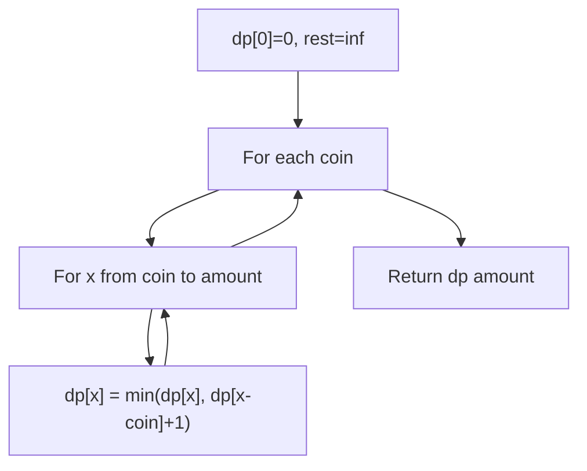
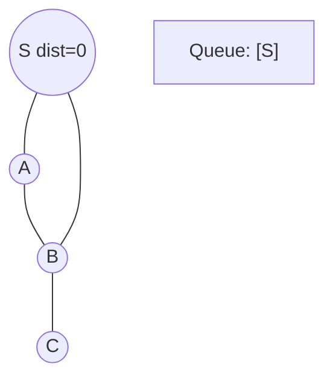
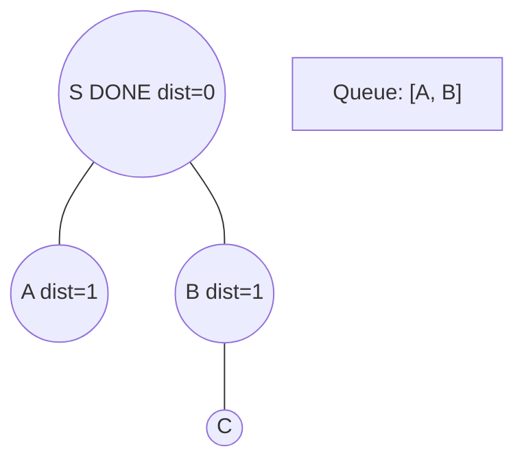
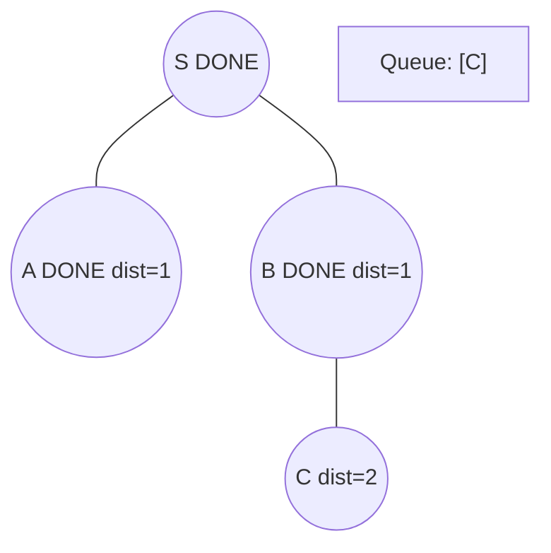
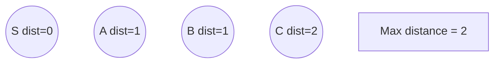

# Problem 322: Coin Change

**Difficulty:** Medium  
**Tags:** Array, Dynamic Programming, Breadth-First Search  
**Pattern:** Dynamic Programming  
**Link:** [leetcode.com/problems/coin-change](https://leetcode.com/problems/coin-change/)

## Description

You are given an integer array `coins` representing coins of different denominations and an integer `amount` representing a total amount of money.

Return *the fewest number of coins that you need to make up that amount*. If that amount of money cannot be made up by any combination of the coins, return `-1`.

You may assume that you have an infinite number of each kind of coin.

 

Example 1:

```

**Input:** coins = [1,2,5], amount = 11
**Output:** 3
**Explanation:** 11 = 5 + 5 + 1

```

Example 2:

```

**Input:** coins = [2], amount = 3
**Output:** -1

```

Example 3:

```

**Input:** coins = [1], amount = 0
**Output:** 0

```

 

**Constraints:**

	- `1 <= coins.length <= 12`
	- `1 <= coins[i] <= 2^31 - 1`
	- `0 <= amount <= 10^4`

## Approach: Dynamic Programming

**Unbounded knapsack:** dp[x] = min coins to make amount x. For each coin, update all reachable amounts.

## Pseudocode

```
1. dp[0] = 0, dp[1..amount] = inf
2. For each coin: for x >= coin: dp[x] = min(dp[x], dp[x-coin]+1)
3. Return dp[amount] or -1
```

## Algorithm Flow



## Visual State Transitions

**BFS Level-by-Level Traversal:**

**Frame 1: Start BFS from source**


**Frame 2: Process level 0, enqueue neighbors**


**Frame 3: Process level 1**


**Frame 4: All nodes reached**



## Complexity Analysis

- **Time:** O(n * amount)
- **Space:** O(amount)

## Solution (Python3)

```python
class Solution:
    def coinChange(self, coins: list[int], amount: int) -> int:
        dp = [float('inf')] * (amount + 1)
        dp[0] = 0
        for coin in coins:
            for x in range(coin, amount + 1):
                dp[x] = min(dp[x], dp[x - coin] + 1)
        return dp[amount] if dp[amount] != float('inf') else -1
```

## Solution (C++)

```cpp
#include <queue>
#include <string>
#include <unordered_set>
#include <vector>
using namespace std;

class Solution {
public:
    int coinChange(vector<int>& coins, int amount) {
        // BFS on graph - O(V+E) time
        if (coins.empty()) return 0;
        queue<int> q;
        unordered_set<int> visited;
        q.push(0);
        visited.insert(0);
        int dist = 0;
        while (!q.empty()) {
            int sz = q.size();
            for (int i = 0; i < sz; i++) {
                int node = q.front(); q.pop();
                // Process node
            }
            dist++;
        }
        return dist;
    }
};
```
