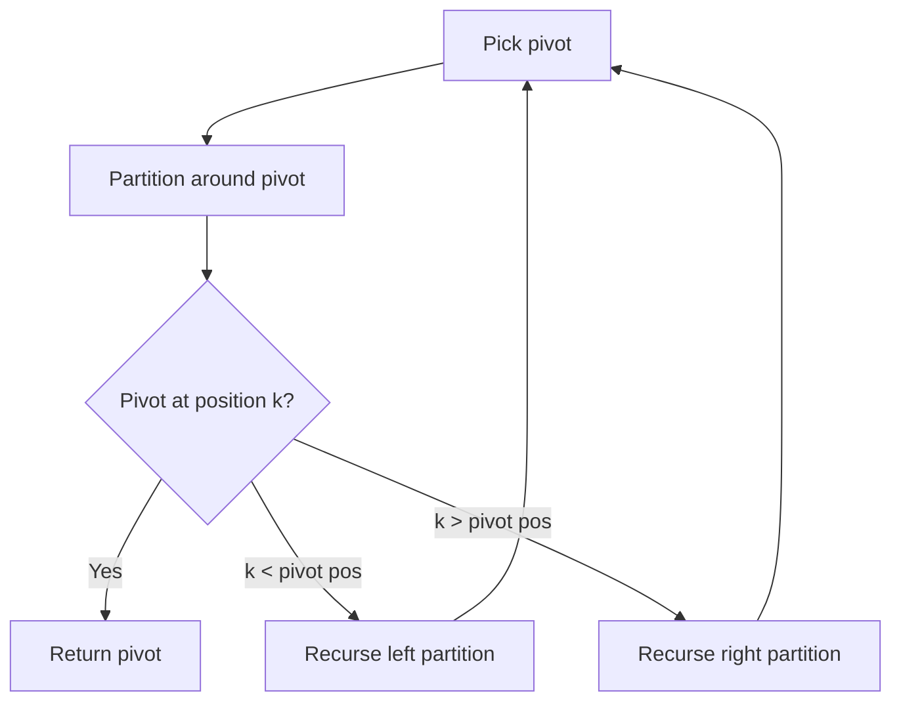

# Problem 324: Wiggle Sort II

**Difficulty:** Medium  
**Tags:** Array, Divide and Conquer, Greedy, Sorting, Quickselect  
**Pattern:** Quickselect  
**Link:** [leetcode.com/problems/wiggle-sort-ii](https://leetcode.com/problems/wiggle-sort-ii/)

## Description

Given an integer array `nums`, reorder it such that `nums[0] < nums[1] > nums[2] < nums[3]...`.

You may assume the input array always has a valid answer.

 

Example 1:

```

**Input:** nums = [1,5,1,1,6,4]
**Output:** [1,6,1,5,1,4]
**Explanation:** [1,4,1,5,1,6] is also accepted.

```

Example 2:

```

**Input:** nums = [1,3,2,2,3,1]
**Output:** [2,3,1,3,1,2]

```

 

**Constraints:**

	- `1 <= nums.length <= 5 * 10^4`
	- `0 <= nums[i] <= 5000`
	- It is guaranteed that there will be an answer for the given input `nums`.

 

**Follow Up:** Can you do it in `O(n)` time and/or **in-place** with `O(1)` extra space?

## Approach: Quickselect

Find the kth element by partitioning: pick a pivot, partition elements around it, then recurse only into the partition containing kth position.

## Pseudocode

```
1. Pick pivot element
2. Partition: elements < pivot | pivot | elements > pivot
3. If pivot is at position k: return pivot
4. If k < pivot position: recurse left
5. If k > pivot position: recurse right
```

## Algorithm Flow



## Complexity Analysis

- **Time:** O(n) average
- **Space:** O(1)

## Solution (Python3)

```python
class Solution:
    def wiggleSort(self, nums: List[int]) -> None:
        # Quickselect - O(n) average time
        import random
        def quickselect(arr, k):
            if len(arr) == 1:
                return arr[0]
            pivot = random.choice(arr)
            lows = [x for x in arr if x < pivot]
            highs = [x for x in arr if x > pivot]
            pivots = [x for x in arr if x == pivot]
            if k < len(lows):
                return quickselect(lows, k)
            elif k < len(lows) + len(pivots):
                return pivot
            else:
                return quickselect(highs, k - len(lows) - len(pivots))
        
        k = nums if isinstance(nums, int) else 1
        return quickselect(nums, len(nums) - k)
```

## Solution (C++)

```cpp
#include <algorithm>
#include <string>
#include <vector>
using namespace std;

class Solution {
public:
    void wiggleSort(vector<int>& nums) {
        // Quickselect - O(n) average time
        int k = nums;
        nth_element(nums.begin(), nums.begin() + nums.size() - k, nums.end());
        return nums[nums.size() - k];
    }
};
```
