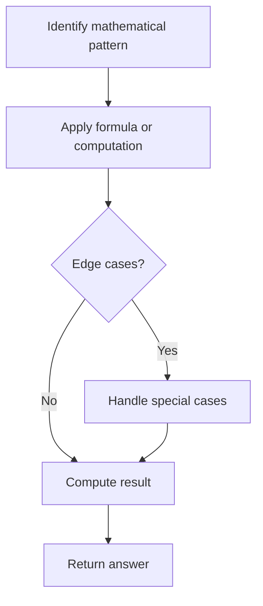

# Problem 326: Power of Three

**Difficulty:** Easy  
**Tags:** Math, Recursion  
**Pattern:** Math  
**Link:** [leetcode.com/problems/power-of-three](https://leetcode.com/problems/power-of-three/)

## Description

Given an integer `n`, return *`true` if it is a power of three. Otherwise, return `false`*.

An integer `n` is a power of three, if there exists an integer `x` such that `n == 3^x`.

 

Example 1:

```

**Input:** n = 27
**Output:** true
**Explanation:** 27 = 33

```

Example 2:

```

**Input:** n = 0
**Output:** false
**Explanation:** There is no x where 3x = 0.

```

Example 3:

```

**Input:** n = -1
**Output:** false
**Explanation:** There is no x where 3x = (-1).

```

 

**Constraints:**

	- `-2^31 <= n <= 2^31 - 1`

 

**Follow up:** Could you solve it without loops/recursion?

## Approach: Math

Apply mathematical properties, formulas, or number-theoretic concepts. Look for patterns, modular arithmetic, or closed-form solutions.

## Pseudocode

```
1. Identify the mathematical pattern or formula
2. Apply computation:
   - Modular arithmetic for large numbers
   - GCD/LCM for divisibility
   - Sieve for primes
3. Handle edge cases
4. Return result
```

## Algorithm Flow



## Complexity Analysis

- **Time:** O(n) or O(sqrt(n))
- **Space:** O(1)

## Solution (Python3)

```python
class Solution:
    def isPowerOfThree(self, n: int) -> bool:
        # Mathematical approach
        result = 0
        x = n
        while x != 0:
            result = result * 10 + x % 10
            x //= 10 if isinstance(x, int) else 1
        return result
```

## Solution (C++)

```cpp
#include <string>
#include <vector>
using namespace std;

class Solution {
public:
    bool isPowerOfThree(int n) {
        // Mathematical approach
        long long result = 0;
        int x = n;
        while (x != 0) {
            result = result * 10 + x % 10;
            x /= 10;
        }
        return (int)result;
    }
};
```
