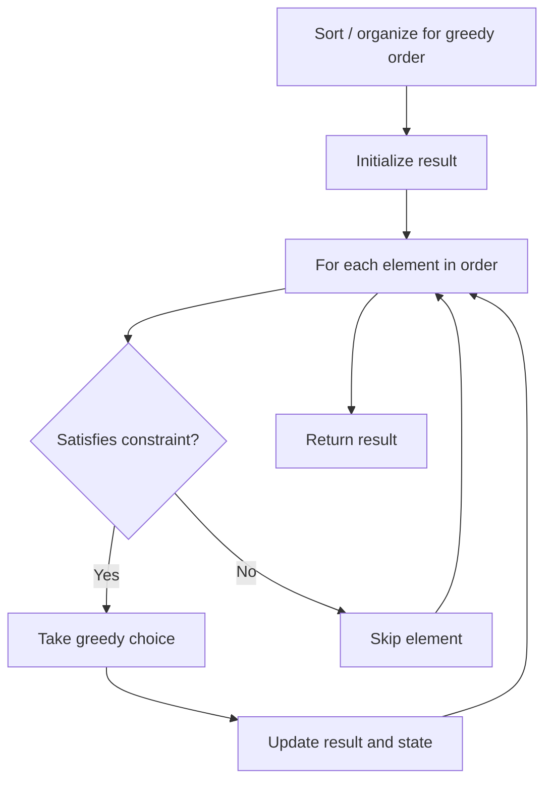

# Problem 330: Patching Array

**Difficulty:** Hard  
**Tags:** Array, Greedy  
**Pattern:** Greedy  
**Link:** [leetcode.com/problems/patching-array](https://leetcode.com/problems/patching-array/)

## Description

Given a sorted integer array `nums` and an integer `n`, add/patch elements to the array such that any number in the range `[1, n]` inclusive can be formed by the sum of some elements in the array.

Return *the minimum number of patches required*.

 

Example 1:

```

**Input:** nums = [1,3], n = 6
**Output:** 1
Explanation:
Combinations of nums are [1], [3], [1,3], which form possible sums of: 1, 3, 4.
Now if we add/patch 2 to nums, the combinations are: [1], [2], [3], [1,3], [2,3], [1,2,3].
Possible sums are 1, 2, 3, 4, 5, 6, which now covers the range [1, 6].
So we only need 1 patch.

```

Example 2:

```

**Input:** nums = [1,5,10], n = 20
**Output:** 2
Explanation: The two patches can be [2, 4].

```

Example 3:

```

**Input:** nums = [1,2,2], n = 5
**Output:** 0

```

 

**Constraints:**

	- `1 <= nums.length <= 1000`
	- `1 <= nums[i] <= 10^4`
	- `nums` is sorted in **ascending order**.
	- `1 <= n <= 2^31 - 1`

## Approach: Greedy

Make the locally optimal choice at each step, trusting it leads to a global optimum. Greedy works when the problem has the greedy-choice property and optimal substructure.

## Pseudocode

```
1. Sort or organize data for greedy ordering
2. Initialize result
3. For each element in greedy order:
   a. If element satisfies constraint:
      - Take the greedy choice
      - Update result and state
4. Return result
```

## Algorithm Flow



## Complexity Analysis

- **Time:** O(n log n)
- **Space:** O(1)

## Solution (Python3)

```python
class Solution:
    def minPatches(self, nums: List[int], n: int) -> int:
        # Greedy approach - O(n) time
        result = 0
        curr_max = 0
        for i in range(len(nums)):
            if isinstance(nums[i], int):
                curr_max = max(curr_max, nums[i])
                result = max(result, curr_max)
            else:
                result += 1
        return result
```

## Solution (C++)

```cpp
#include <algorithm>
#include <string>
#include <vector>
using namespace std;

class Solution {
public:
    int minPatches(vector<int>& nums, int n) {
        // Greedy approach - O(n) time
        int result = 0, curr_max = 0;
        for (int i = 0; i < (int)nums.size(); i++) {
            curr_max = max(curr_max, nums[i]);
            result = max(result, curr_max);
        }
        return result;
    }
};
```
