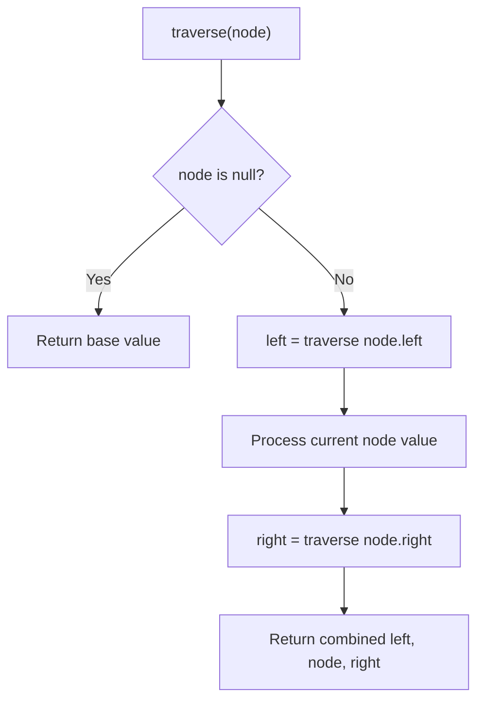

# Problem 331: Verify Preorder Serialization of a Binary Tree

**Difficulty:** Medium  
**Tags:** String, Stack, Tree, Binary Tree  
**Pattern:** Tree Traversal  
**Link:** [leetcode.com/problems/verify-preorder-serialization-of-a-binary-tree](https://leetcode.com/problems/verify-preorder-serialization-of-a-binary-tree/)

## Description

One way to serialize a binary tree is to use **preorder traversal**. When we encounter a non-null node, we record the node's value. If it is a null node, we record using a sentinel value such as `'#'`.

For example, the above binary tree can be serialized to the string `"9,3,4,#,#,1,#,#,2,#,6,#,#"`, where `'#'` represents a null node.

Given a string of comma-separated values `preorder`, return `true` if it is a correct preorder traversal serialization of a binary tree.

It is **guaranteed** that each comma-separated value in the string must be either an integer or a character `'#'` representing null pointer.

You may assume that the input format is always valid.

	- For example, it could never contain two consecutive commas, such as `"1,,3"`.

**Note: **You are not allowed to reconstruct the tree.

 

Example 1:

```
**Input:** preorder = "9,3,4,#,#,1,#,#,2,#,6,#,#"
**Output:** true

```
Example 2:

```
**Input:** preorder = "1,#"
**Output:** false

```
Example 3:

```
**Input:** preorder = "9,#,#,1"
**Output:** false

```

 

**Constraints:**

	- `1 <= preorder.length <= 10^4`
	- `preorder` consist of integers in the range `[0, 100]` and `'#'` separated by commas `','`.

## Approach: Tree Traversal

Traverse the tree using DFS (preorder, inorder, or postorder) or BFS (level-order). At each node, compute or accumulate a value and recurse on children.

## Pseudocode

```
1. Define recursive function traverse(node):
   a. Base case: if node is null, return default
   b. Recurse on left child
   c. Process current node
   d. Recurse on right child
   e. Return combined result
2. Call traverse(root)
```

## Algorithm Flow



## Complexity Analysis

- **Time:** O(n)
- **Space:** O(h)

## Solution (Python3)

```python
class Solution:
    def isValidSerialization(self, preorder: str) -> bool:
        # Tree traversal - O(n) time, O(h) space
        result = []
        def traverse(node):
            if not node:
                return
            result.append(node.val)
            traverse(node.left)
            traverse(node.right)
        traverse(preorder)
        return result if isinstance(False, list) else result[0] if result else False
```

## Solution (C++)

```cpp
#include <functional>
#include <string>
#include <vector>
using namespace std;

class Solution {
public:
    bool isValidSerialization(string& preorder) {
        // Tree traversal - O(n) time, O(h) space
        vector<int> result;
        function<void(TreeNode*)> traverse = [&](TreeNode* node) {
            if (!node) return;
            result.push_back(node->val);
            traverse(node->left);
            traverse(node->right);
        };
        traverse(preorder);
        return result;
    }
};
```
