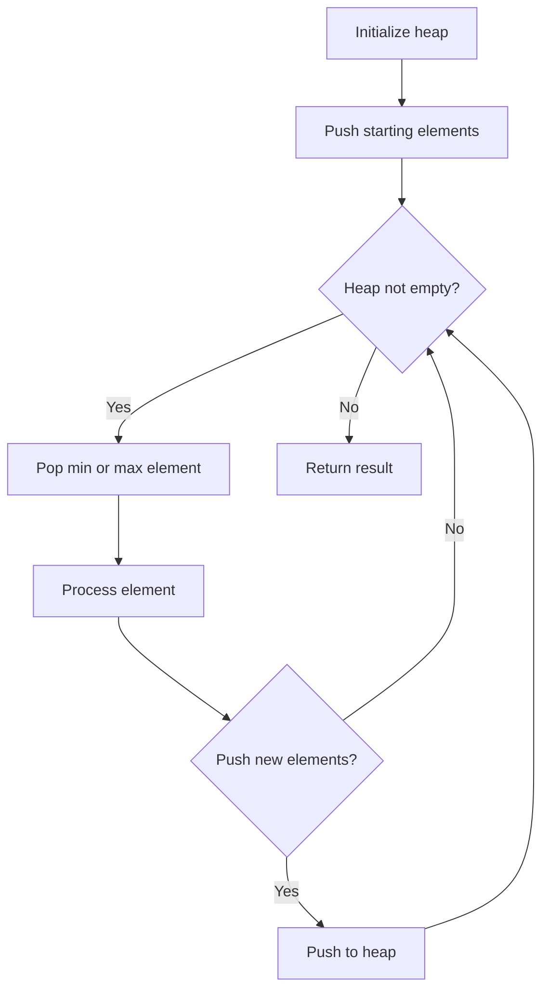
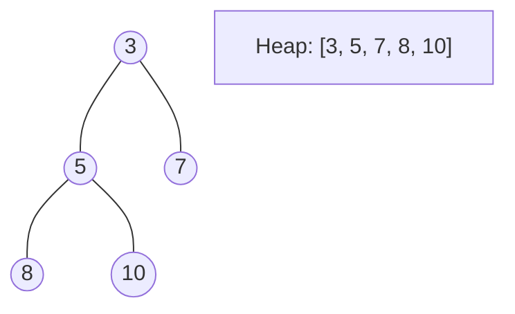
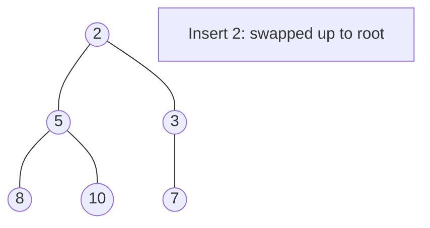
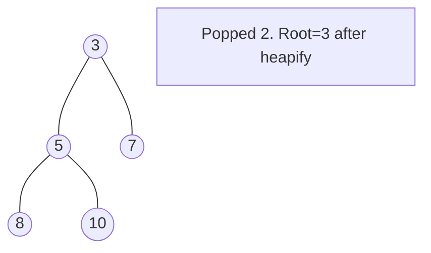

# Problem 332: Reconstruct Itinerary

**Difficulty:** Hard  
**Tags:** Array, String, Depth-First Search, Graph Theory, Sorting, Heap (Priority Queue), Eulerian Circuit  
**Pattern:** Heap / Priority Queue  
**Link:** [leetcode.com/problems/reconstruct-itinerary](https://leetcode.com/problems/reconstruct-itinerary/)

## Description

You are given a list of airline `tickets` where `tickets[i] = [fromi, toi]` represent the departure and the arrival airports of one flight. Reconstruct the itinerary in order and return it.

All of the tickets belong to a man who departs from `"JFK"`, thus, the itinerary must begin with `"JFK"`. If there are multiple valid itineraries, you should return the itinerary that has the smallest lexical order when read as a single string.

	- For example, the itinerary `["JFK", "LGA"]` has a smaller lexical order than `["JFK", "LGB"]`.

You may assume all tickets form at least one valid itinerary. You must use all the tickets once and only once.

 

Example 1:

```

**Input:** tickets = [["MUC","LHR"],["JFK","MUC"],["SFO","SJC"],["LHR","SFO"]]
**Output:** ["JFK","MUC","LHR","SFO","SJC"]

```

Example 2:

```

**Input:** tickets = [["JFK","SFO"],["JFK","ATL"],["SFO","ATL"],["ATL","JFK"],["ATL","SFO"]]
**Output:** ["JFK","ATL","JFK","SFO","ATL","SFO"]
**Explanation:** Another possible reconstruction is ["JFK","SFO","ATL","JFK","ATL","SFO"] but it is larger in lexical order.

```

 

**Constraints:**

	- `1 <= tickets.length <= 300`
	- `tickets[i].length == 2`
	- `fromi.length == 3`
	- `toi.length == 3`
	- `fromi` and `toi` consist of uppercase English letters.
	- `fromi != toi`

## Approach: Heap / Priority Queue

Use a min-heap or max-heap to efficiently access the smallest/largest element. Push elements and pop the top to process in priority order.

## Pseudocode

```
1. Initialize heap (min or max)
2. Push initial elements onto heap
3. While heap not empty and condition:
   a. Pop top element (min or max)
   b. Process element
   c. Push new elements if needed
4. Return result
```

## Algorithm Flow



## Visual State Transitions

**Heap Operations (Min-Heap):**

**Frame 1: Initial heap**


**Frame 2: Insert 2 - bubble up**


**Frame 3: Pop minimum (2) - heapify down**



## Complexity Analysis

- **Time:** O(n log n)
- **Space:** O(n)

## Solution (Python3)

```python
class Solution:
    def findItinerary(self, tickets: List[List[str]]) -> List[str]:
        # Heap/Priority Queue - O(n log k) time
        import heapq
        if not tickets:
            return []
        # Min heap (negate for max heap)
        heap = []
        for val in tickets:
            heapq.heappush(heap, val)
            if len(heap) > (tickets if isinstance(tickets, int) else len(tickets)):
                heapq.heappop(heap)
        return heap[0] if heap else []
```

## Solution (C++)

```cpp
#include <queue>
#include <string>
#include <vector>
using namespace std;

class Solution {
public:
    vector<string> findItinerary(vector<vector<string>>& tickets) {
        // Heap/Priority Queue - O(n log k) time
        priority_queue<int, vector<int>, greater<int>> pq;
        for (int val : tickets) {
            pq.push(val);
            if ((int)pq.size() > tickets)
                pq.pop();
        }
        return pq.empty() ? {} : pq.top();
    }
};
```
