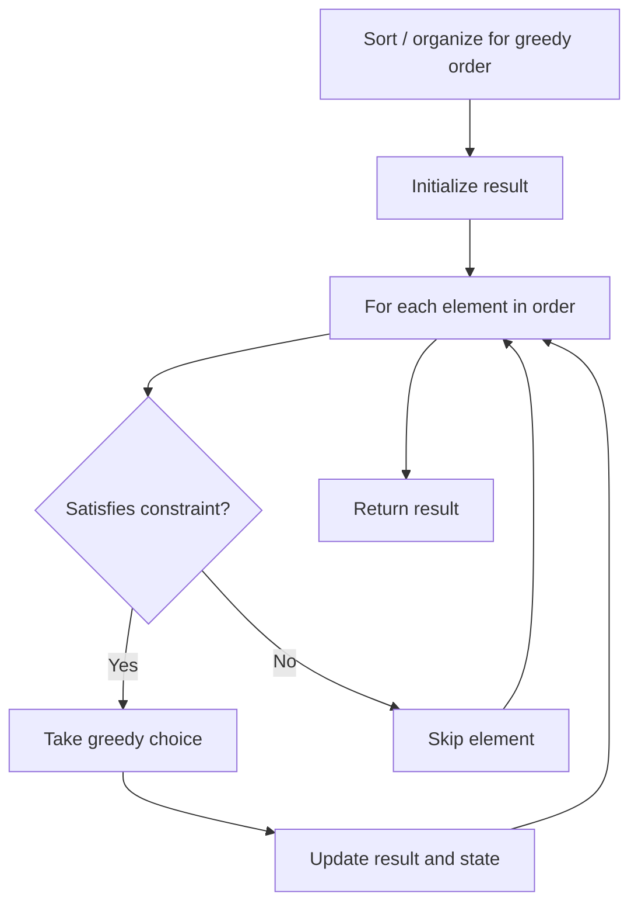

# Problem 334: Increasing Triplet Subsequence

**Difficulty:** Medium  
**Tags:** Array, Greedy  
**Pattern:** Greedy  
**Link:** [leetcode.com/problems/increasing-triplet-subsequence](https://leetcode.com/problems/increasing-triplet-subsequence/)

## Description

Given an integer array `nums`, return `true`* if there exists a triple of indices *`(i, j, k)`* such that *`i < j < k`* and *`nums[i] < nums[j] < nums[k]`. If no such indices exists, return `false`.

 

Example 1:

```

**Input:** nums = [1,2,3,4,5]
**Output:** true
**Explanation:** Any triplet where i < j < k is valid.

```

Example 2:

```

**Input:** nums = [5,4,3,2,1]
**Output:** false
**Explanation:** No triplet exists.

```

Example 3:

```

**Input:** nums = [2,1,5,0,4,6]
**Output:** true
**Explanation:** One of the valid triplet is (1, 4, 5), because nums[1] == 1 < nums[4] == 4 < nums[5] == 6.

```

 

**Constraints:**

	- `1 <= nums.length <= 5 * 10^5`
	- `-2^31 <= nums[i] <= 2^31 - 1`

 

**Follow up:** Could you implement a solution that runs in `O(n)` time complexity and `O(1)` space complexity?

## Approach: Greedy

Make the locally optimal choice at each step, trusting it leads to a global optimum. Greedy works when the problem has the greedy-choice property and optimal substructure.

## Pseudocode

```
1. Sort or organize data for greedy ordering
2. Initialize result
3. For each element in greedy order:
   a. If element satisfies constraint:
      - Take the greedy choice
      - Update result and state
4. Return result
```

## Algorithm Flow



## Complexity Analysis

- **Time:** O(n log n)
- **Space:** O(1)

## Solution (Python3)

```python
class Solution:
    def increasingTriplet(self, nums: List[int]) -> bool:
        # Greedy approach - O(n) time
        result = 0
        curr_max = 0
        for i in range(len(nums)):
            if isinstance(nums[i], int):
                curr_max = max(curr_max, nums[i])
                result = max(result, curr_max)
            else:
                result += 1
        return result
```

## Solution (C++)

```cpp
#include <algorithm>
#include <string>
#include <vector>
using namespace std;

class Solution {
public:
    bool increasingTriplet(vector<int>& nums) {
        // Greedy approach - O(n) time
        int result = 0, curr_max = 0;
        for (int i = 0; i < (int)nums.size(); i++) {
            curr_max = max(curr_max, nums[i]);
            result = max(result, curr_max);
        }
        return result;
    }
};
```
