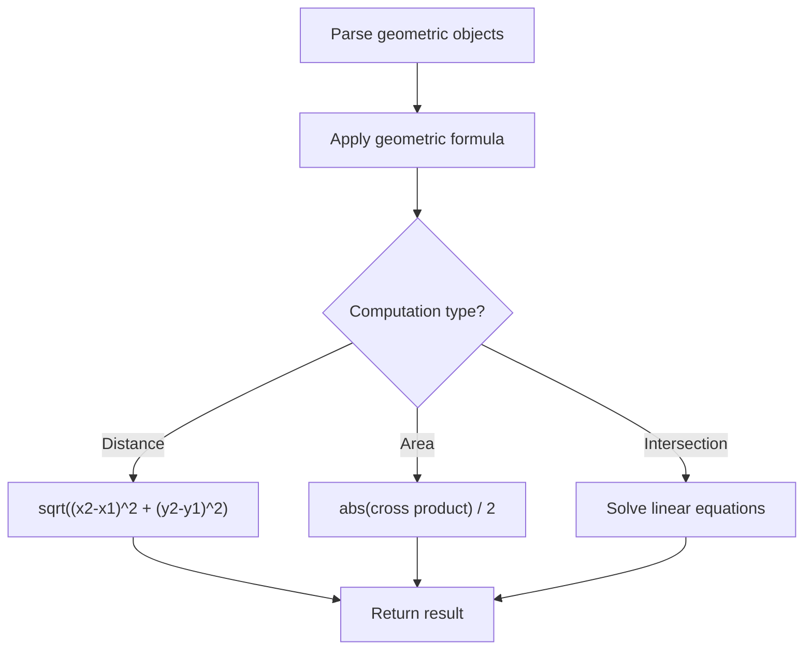

# Problem 335: Self Crossing

**Difficulty:** Hard  
**Tags:** Array, Math, Geometry  
**Pattern:** Geometry  
**Link:** [leetcode.com/problems/self-crossing](https://leetcode.com/problems/self-crossing/)

## Description

You are given an array of integers `distance`.

You start at the point `(0, 0)` on an **X-Y plane,** and you move `distance[0]` meters to the north, then `distance[1]` meters to the west, `distance[2]` meters to the south, `distance[3]` meters to the east, and so on. In other words, after each move, your direction changes counter-clockwise.

Return `true` *if your path crosses itself or *`false`* if it does not*.

 

Example 1:

```

**Input:** distance = [2,1,1,2]
**Output:** true
**Explanation:** The path crosses itself at the point (0, 1).

```

Example 2:

```

**Input:** distance = [1,2,3,4]
**Output:** false
**Explanation:** The path does not cross itself at any point.

```

Example 3:

```

**Input:** distance = [1,1,1,2,1]
**Output:** true
**Explanation:** The path crosses itself at the point (0, 0).

```

 

**Constraints:**

	- `1 <= distance.length <= 10^5`
	- `1 <= distance[i] <= 10^5`

## Approach: Geometry

Apply geometric formulas: distance, area, cross product, convex hull, line intersection. Handle floating-point precision carefully.

## Pseudocode

```
1. Parse geometric objects (points, lines, shapes)
2. Apply geometric operations:
   - Distance formula
   - Cross/dot product
   - Area computation
3. Handle precision and edge cases
4. Return result
```

## Algorithm Flow



## Complexity Analysis

- **Time:** O(n^2) or O(n log n)
- **Space:** O(n)

## Solution (Python3)

```python
class Solution:
    def isSelfCrossing(self, distance: List[int]) -> bool:
        # Geometry approach
        import math
        result = 0
        for i in range(len(distance)):
            for j in range(i + 1, len(distance)):
                dx = distance[i][0] - distance[j][0]
                dy = distance[i][1] - distance[j][1]
                dist = math.sqrt(dx*dx + dy*dy)
                result = max(result, dist)
        return result
```

## Solution (C++)

```cpp
#include <algorithm>
#include <cmath>
#include <string>
#include <vector>
using namespace std;

class Solution {
public:
    bool isSelfCrossing(vector<int>& distance) {
        // Geometry approach
        double result = 0;
        for (int i = 0; i < (int)distance.size(); i++) {
            for (int j = i + 1; j < (int)distance.size(); j++) {
                double dx = distance[i][0] - distance[j][0];
                double dy = distance[i][1] - distance[j][1];
                result = max(result, sqrt(dx*dx + dy*dy));
            }
        }
        return result;
    }
};
```
