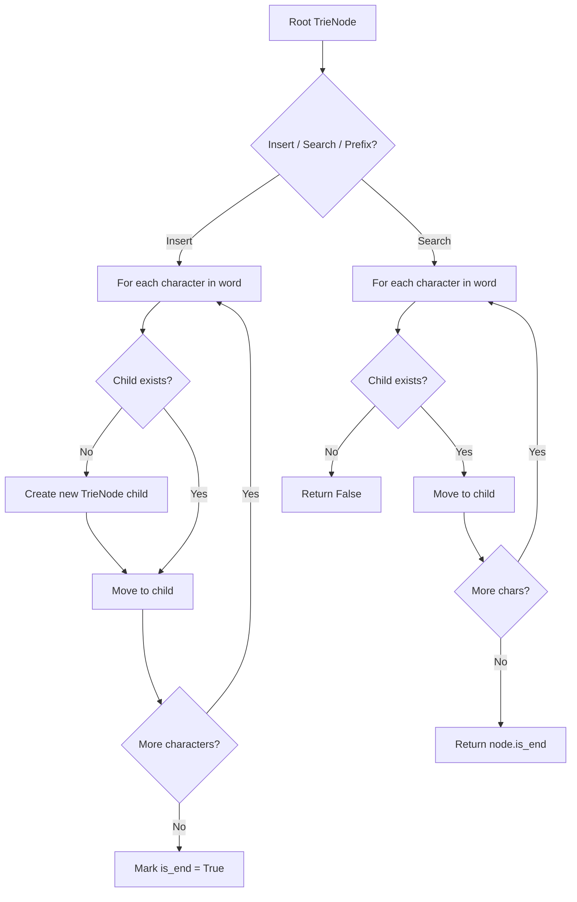
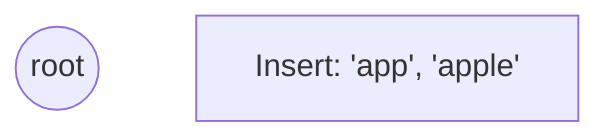
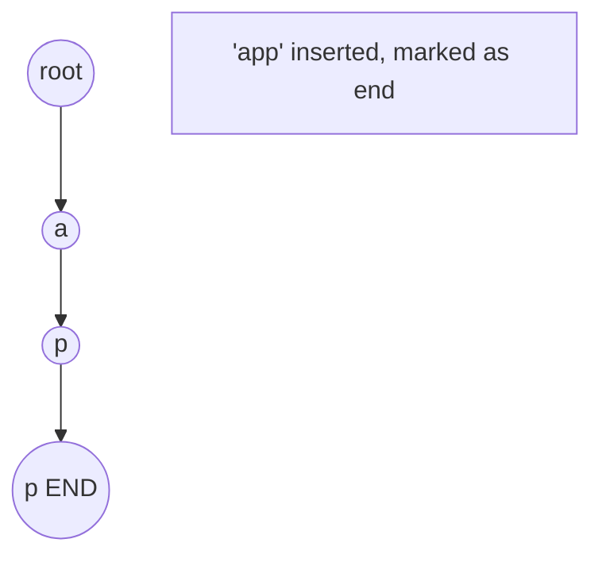
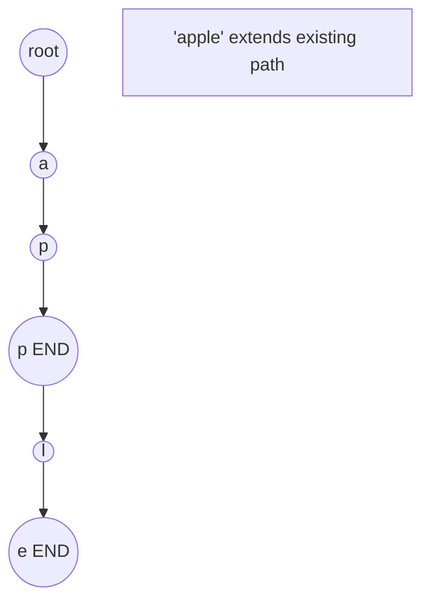
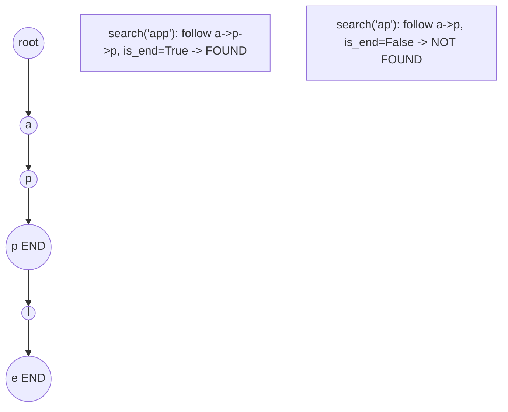

# Problem 336: Palindrome Pairs

**Difficulty:** Hard  
**Tags:** Array, Hash Table, String, Trie  
**Pattern:** Trie / Prefix Tree  
**Link:** [leetcode.com/problems/palindrome-pairs](https://leetcode.com/problems/palindrome-pairs/)

## Description

You are given a **0-indexed** array of **unique** strings `words`.

A **palindrome pair** is a pair of integers `(i, j)` such that:

	- `0 <= i, j < words.length`,
	- `i != j`, and
	- `words[i] + words[j]` (the concatenation of the two strings) is a palindrome.

Return *an array of all the **palindrome pairs** of *`words`.

You must write an algorithm with `O(sum of words[i].length)` runtime complexity.

 

Example 1:

```

**Input:** words = ["abcd","dcba","lls","s","sssll"]
**Output:** [[0,1],[1,0],[3,2],[2,4]]
**Explanation:** The palindromes are ["abcddcba","dcbaabcd","slls","llssssll"]

```

Example 2:

```

**Input:** words = ["bat","tab","cat"]
**Output:** [[0,1],[1,0]]
**Explanation:** The palindromes are ["battab","tabbat"]

```

Example 3:

```

**Input:** words = ["a",""]
**Output:** [[0,1],[1,0]]
**Explanation:** The palindromes are ["a","a"]

```

 

**Constraints:**

	- `1 <= words.length <= 5000`
	- `0 <= words[i].length <= 300`
	- `words[i]` consists of lowercase English letters.

## Approach: Trie / Prefix Tree

Build a trie (prefix tree) where each node represents a character. Insert words character by character, and search by following child pointers. Supports efficient prefix matching.

## Pseudocode

```
1. TrieNode: children = {}, is_end = False
2. Insert(word):
   - For each char: create child if absent, move to child
   - Mark last node as end
3. Search(word):
   - For each char: if child absent return False, move to child
   - Return node.is_end
4. StartsWith(prefix): same as search but return True at end
```

## Algorithm Flow



## Visual State Transitions

**Trie Insert and Search:**

**Frame 1: Empty trie**


**Frame 2: Insert 'app'**


**Frame 3: Insert 'apple'**


**Frame 4: Search 'app' = True, 'ap' = False**



## Complexity Analysis

- **Time:** O(L) per operation
- **Space:** O(N * L)

## Solution (Python3)

```python
class Solution:
    def palindromePairs(self, words: List[str]) -> List[List[int]]:
        # Trie-based approach
        trie = {}
        # Build trie from word list
        words = words if isinstance(words, list) else [words]
        for word in words:
            node = trie
            for ch in word:
                if ch not in node:
                    node[ch] = {}
                node = node[ch]
            node['#'] = True
        
        # Search in trie
        def search(word):
            node = trie
            for ch in word:
                if ch not in node:
                    return False
                node = node[ch]
            return '#' in node
        
        return []
```

## Solution (C++)

```cpp
#include <string>
#include <vector>
using namespace std;

class Solution {
public:
    vector<vector<int>> palindromePairs(vector<string>& words) {
        // Trie-based approach
        struct TrieNode {
            TrieNode* children[26] = {};
            bool isEnd = false;
        };
        TrieNode* root = new TrieNode();
        // Build trie
        for (auto& word : words) {
            TrieNode* node = root;
            for (char ch : word) {
                int idx = ch - 'a';
                if (!node->children[idx])
                    node->children[idx] = new TrieNode();
                node = node->children[idx];
            }
            node->isEnd = true;
        }
        return {};
    }
};
```
