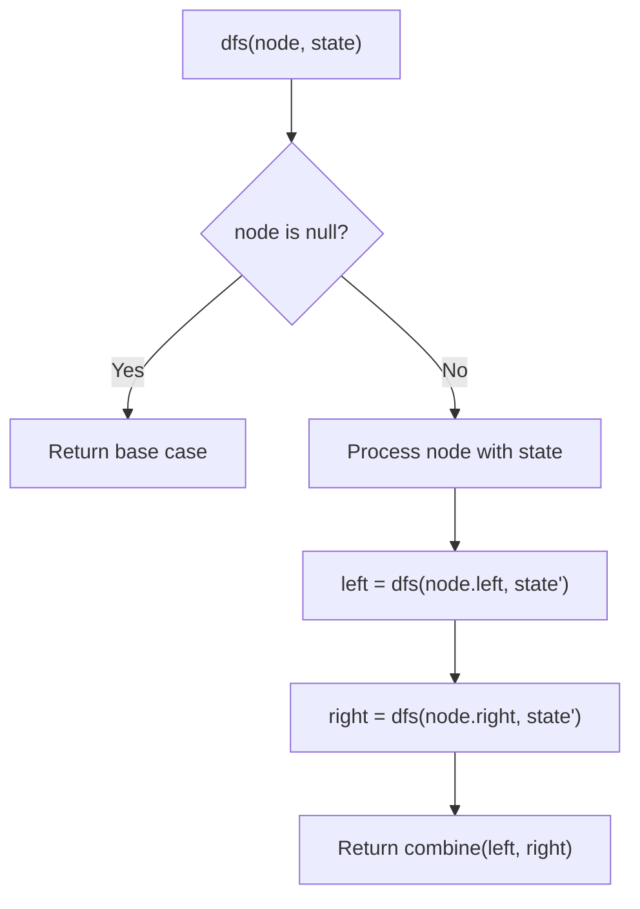
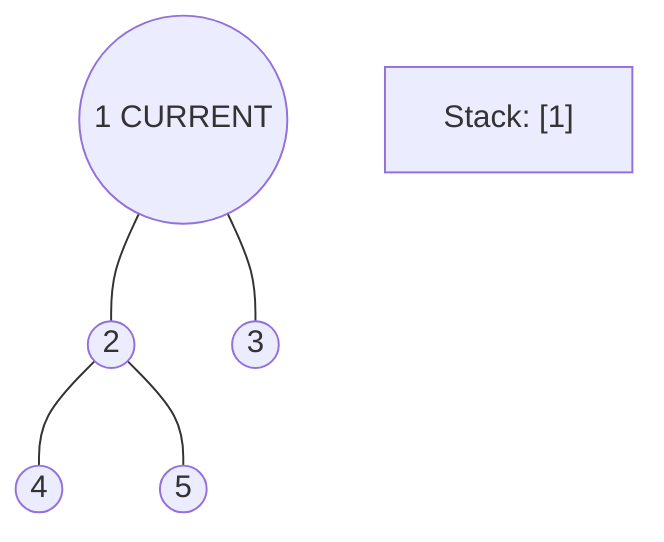
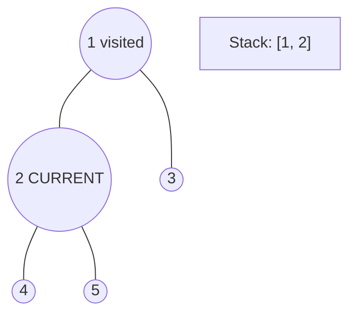
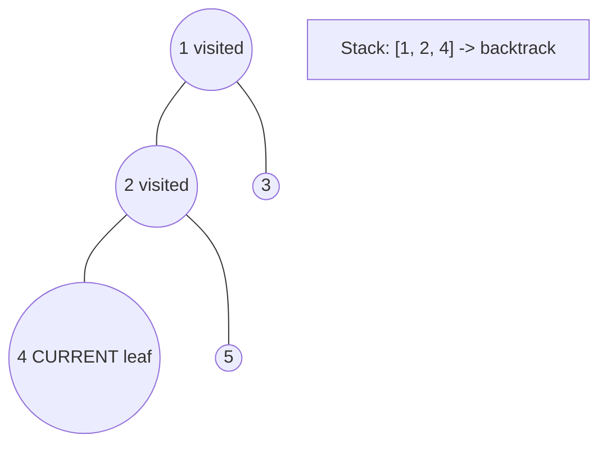
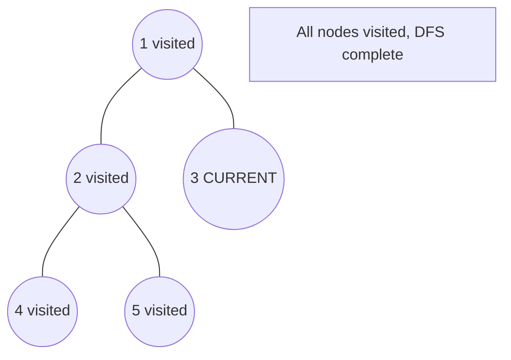

# Problem 337: House Robber III

**Difficulty:** Medium  
**Tags:** Dynamic Programming, Tree, Depth-First Search, Binary Tree  
**Pattern:** DFS Tree Traversal  
**Link:** [leetcode.com/problems/house-robber-iii](https://leetcode.com/problems/house-robber-iii/)

## Description

The thief has found himself a new place for his thievery again. There is only one entrance to this area, called `root`.

Besides the `root`, each house has one and only one parent house. After a tour, the smart thief realized that all houses in this place form a binary tree. It will automatically contact the police if **two directly-linked houses were broken into on the same night**.

Given the `root` of the binary tree, return *the maximum amount of money the thief can rob **without alerting the police***.

 

Example 1:

```

**Input:** root = [3,2,3,null,3,null,1]
**Output:** 7
**Explanation:** Maximum amount of money the thief can rob = 3 + 3 + 1 = 7.

```

Example 2:

```

**Input:** root = [3,4,5,1,3,null,1]
**Output:** 9
**Explanation:** Maximum amount of money the thief can rob = 4 + 5 = 9.

```

 

**Constraints:**

	- The number of nodes in the tree is in the range `[1, 10^4]`.
	- `0 <= Node.val <= 10^4`

## Approach: DFS Tree Traversal

Perform depth-first search on the tree. Recurse on left and right subtrees, combining results bottom-up. Track state (path, depth, sum) during traversal.

## Pseudocode

```
1. Define dfs(node, state):
   a. Base case: if null, return default
   b. Process node with current state
   c. left_result = dfs(node.left, updated_state)
   d. right_result = dfs(node.right, updated_state)
   e. Return combine(left_result, right_result)
2. Return dfs(root, initial_state)
```

## Algorithm Flow



## Visual State Transitions

**DFS Tree Traversal Step-by-Step:**

**Frame 1: Start at root**


**Frame 2: Go left - visit node 2**


**Frame 3: Go left - visit node 4 (leaf)**


**Frame 4: Backtrack, visit node 5, then node 3**



## Complexity Analysis

- **Time:** O(n)
- **Space:** O(h)

## Solution (Python3)

```python
class Solution:
    def rob(self, root: Optional[TreeNode]) -> int:
        # DFS on binary tree - O(n) time, O(h) space
        def dfs(node):
            if not node:
                return 0
            left = dfs(node.left)
            right = dfs(node.right)
            return 1 + max(left, right)
        
        result = dfs(root)
        return result
```

## Solution (C++)

```cpp
#include <algorithm>
#include <functional>
#include <string>
#include <vector>
using namespace std;

class Solution {
public:
    int rob(TreeNode* root) {
        // DFS on binary tree - O(n) time, O(h) space
        function<int(TreeNode*)> dfs = [&](TreeNode* node) -> int {
            if (!node) return 0;
            int left = dfs(node->left);
            int right = dfs(node->right);
            return 1 + max(left, right);
        };
        return dfs(root);
    }
};
```
