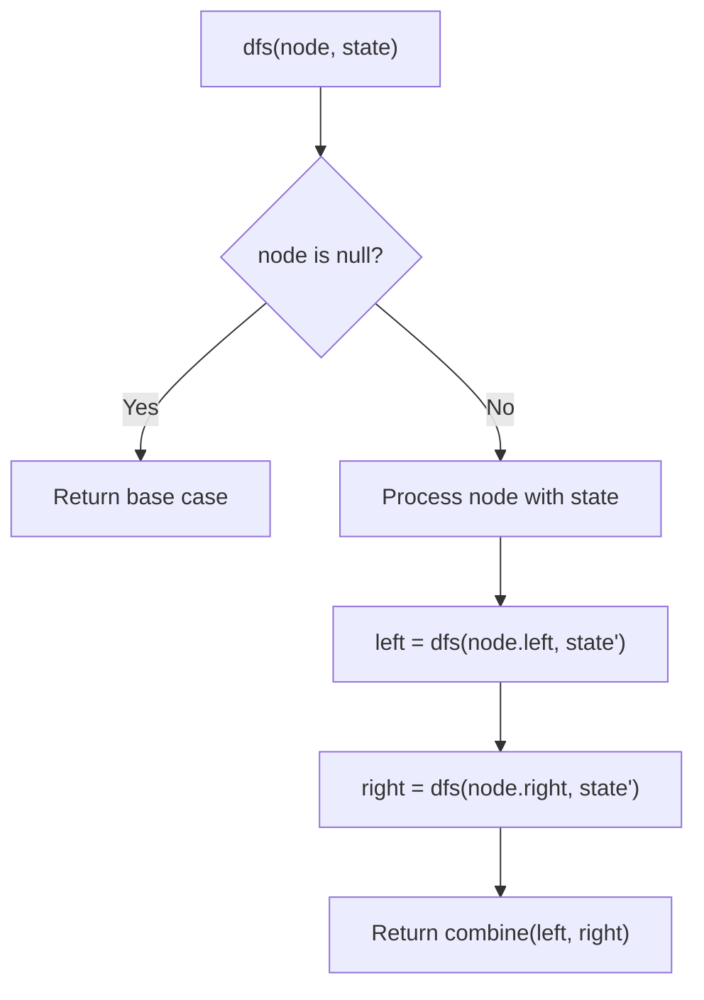
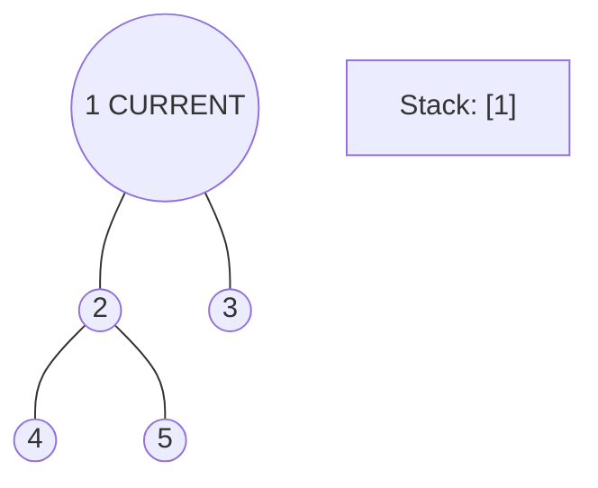
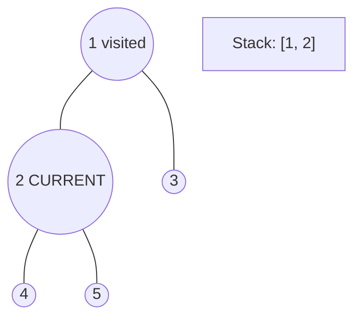
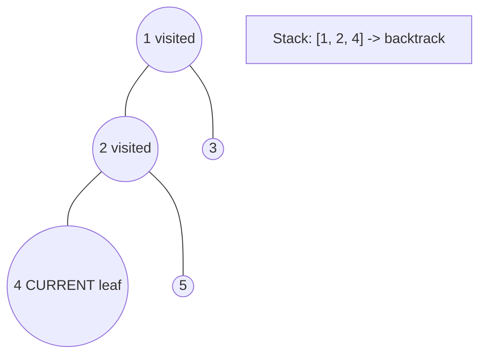
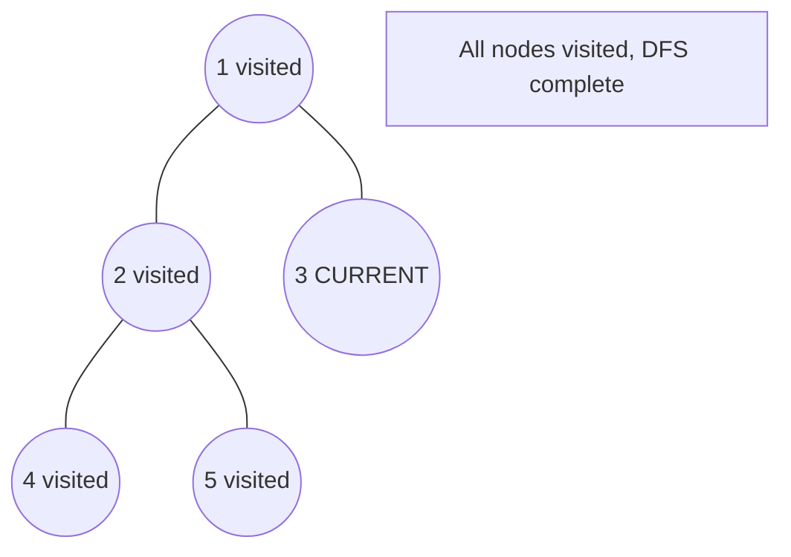

# Problem 341: Flatten Nested List Iterator

**Difficulty:** Medium  
**Tags:** Stack, Tree, Depth-First Search, Design, Queue, Iterator  
**Pattern:** DFS Tree Traversal  
**Link:** [leetcode.com/problems/flatten-nested-list-iterator](https://leetcode.com/problems/flatten-nested-list-iterator/)

## Description

You are given a nested list of integers `nestedList`. Each element is either an integer or a list whose elements may also be integers or other lists. Implement an iterator to flatten it.

Implement the `NestedIterator` class:

	- `NestedIterator(List<NestedInteger> nestedList)` Initializes the iterator with the nested list `nestedList`.
	- `int next()` Returns the next integer in the nested list.
	- `boolean hasNext()` Returns `true` if there are still some integers in the nested list and `false` otherwise.

Your code will be tested with the following pseudocode:

```

initialize iterator with nestedList
res = []
while iterator.hasNext()
    append iterator.next() to the end of res
return res

```

If `res` matches the expected flattened list, then your code will be judged as correct.

 

Example 1:

```

**Input:** nestedList = [[1,1],2,[1,1]]
**Output:** [1,1,2,1,1]
**Explanation:** By calling next repeatedly until hasNext returns false, the order of elements returned by next should be: [1,1,2,1,1].

```

Example 2:

```

**Input:** nestedList = [1,[4,[6]]]
**Output:** [1,4,6]
**Explanation:** By calling next repeatedly until hasNext returns false, the order of elements returned by next should be: [1,4,6].

```

 

**Constraints:**

	- `1 <= nestedList.length <= 500`
	- The values of the integers in the nested list is in the range `[-10^6, 10^6]`.

## Approach: DFS Tree Traversal

Perform depth-first search on the tree. Recurse on left and right subtrees, combining results bottom-up. Track state (path, depth, sum) during traversal.

## Pseudocode

```
1. Define dfs(node, state):
   a. Base case: if null, return default
   b. Process node with current state
   c. left_result = dfs(node.left, updated_state)
   d. right_result = dfs(node.right, updated_state)
   e. Return combine(left_result, right_result)
2. Return dfs(root, initial_state)
```

## Algorithm Flow



## Visual State Transitions

**DFS Tree Traversal Step-by-Step:**

**Frame 1: Start at root**


**Frame 2: Go left - visit node 2**


**Frame 3: Go left - visit node 4 (leaf)**


**Frame 4: Backtrack, visit node 5, then node 3**



## Complexity Analysis

- **Time:** O(n)
- **Space:** O(h)

## Solution (Python3)

```python
class NestedIterator:
    def __init__(self, nestedList: [NestedInteger]):
        # Initialize data structure
        self.nestedList = nestedList

    def next(self) -> int:
        return 0

    def hasNext(self) -> bool:
        return False

```

## Solution (C++)

```cpp
#include <algorithm>
#include <functional>
#include <string>
#include <vector>
using namespace std;

class NestedIterator {
public:
    NestedIterator([NestedInteger] nestedList) {
        // Initialize
    }

    int next() {
        return 0;
    }

    bool hasNext() {
        return false;
    }

};
```
