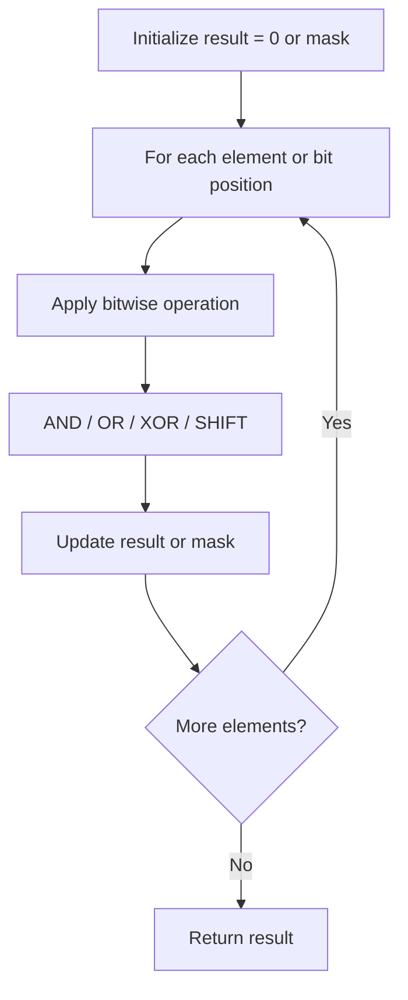

# Problem 342: Power of Four

**Difficulty:** Easy  
**Tags:** Math, Bit Manipulation, Recursion  
**Pattern:** Bit Manipulation  
**Link:** [leetcode.com/problems/power-of-four](https://leetcode.com/problems/power-of-four/)

## Description

Given an integer `n`, return *`true` if it is a power of four. Otherwise, return `false`*.

An integer `n` is a power of four, if there exists an integer `x` such that `n == 4^x`.

 

Example 1:

```
**Input:** n = 16
**Output:** true

```
Example 2:

```
**Input:** n = 5
**Output:** false

```
Example 3:

```
**Input:** n = 1
**Output:** true

```

 

**Constraints:**

	- `-2^31 <= n <= 2^31 - 1`

 

**Follow up:** Could you solve it without loops/recursion?

## Approach: Bit Manipulation

Operate on individual bits using bitwise operators (AND, OR, XOR, shift). Common tricks: x & (x-1) removes lowest set bit, x ^ x = 0, XOR all elements to find unique.

## Pseudocode

```
1. Apply bitwise operations:
   - XOR all elements to cancel paired bits
   - Use bitmask to track state
   - Shift and mask to extract/set individual bits
2. Return result
```

## Algorithm Flow



## Complexity Analysis

- **Time:** O(n) or O(log n)
- **Space:** O(1)

## Solution (Python3)

```python
class Solution:
    def isPowerOfFour(self, n: int) -> bool:
        # Bit manipulation - O(n) time, O(1) space
        result = 0
        for val in n:
            result ^= val
        return result
```

## Solution (C++)

```cpp
#include <string>
#include <vector>
using namespace std;

class Solution {
public:
    bool isPowerOfFour(int n) {
        // Bit manipulation - O(n) time, O(1) space
        int result = 0;
        for (int val : n) {
            result ^= val;
        }
        return result;
    }
};
```
