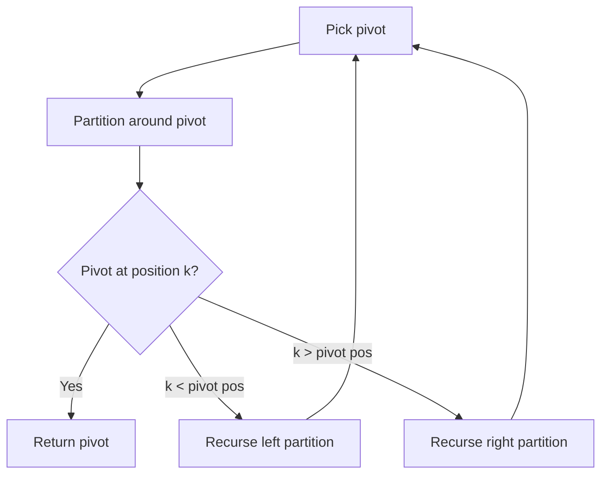

# Problem 347: Top K Frequent Elements

**Difficulty:** Medium  
**Tags:** Array, Hash Table, Divide and Conquer, Sorting, Heap (Priority Queue), Bucket Sort, Counting, Quickselect  
**Pattern:** Hash Map / Heap  
**Link:** [leetcode.com/problems/top-k-frequent-elements](https://leetcode.com/problems/top-k-frequent-elements/)

## Description

Given an integer array `nums` and an integer `k`, return *the* `k` *most frequent elements*. You may return the answer in **any order**.

 

Example 1:

**Input:** nums = [1,1,1,2,2,3], k = 2

**Output:** [1,2]

Example 2:

**Input:** nums = [1], k = 1

**Output:** [1]

Example 3:

**Input:** nums = [1,2,1,2,1,2,3,1,3,2], k = 2

**Output:** [1,2]

 

**Constraints:**

	- `1 <= nums.length <= 10^5`
	- `-10^4 <= nums[i] <= 10^4`
	- `k` is in the range `[1, the number of unique elements in the array]`.
	- It is **guaranteed** that the answer is **unique**.

 

**Follow up:** Your algorithm's time complexity must be better than `O(n log n)`, where n is the array's size.

## Approach: Hash Map / Heap

Count frequencies, return k most common elements.

## Pseudocode

```
1. Count frequencies
2. Return top k by frequency
```

## Algorithm Flow



## Complexity Analysis

- **Time:** O(n log k)
- **Space:** O(n)

## Solution (Python3)

```python
from collections import Counter

class Solution:
    def topKFrequent(self, nums: list[int], k: int) -> list[int]:
        count = Counter(nums)
        return [x for x, _ in count.most_common(k)]
```

## Solution (C++)

```cpp
#include <algorithm>
#include <string>
#include <vector>
using namespace std;

class Solution {
public:
    vector<int> topKFrequent(vector<int>& nums, int k) {
        // Quickselect - O(n) average time
        int k = k;
        nth_element(nums.begin(), nums.begin() + nums.size() - k, nums.end());
        return nums[nums.size() - k];
    }
};
```
