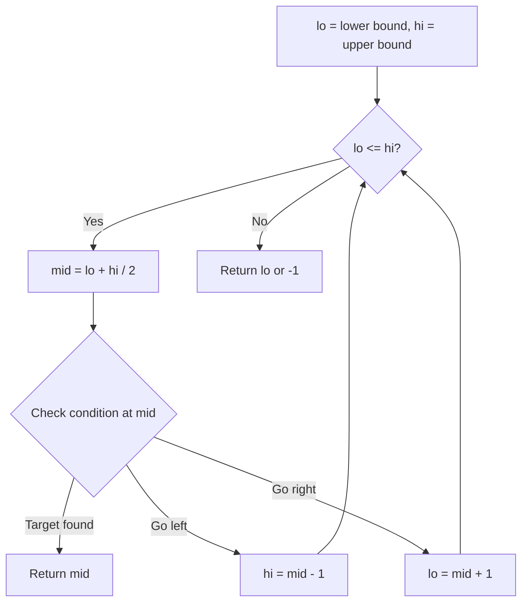
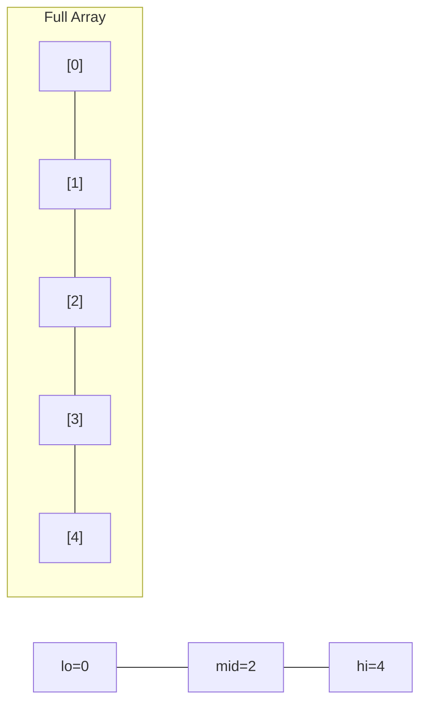
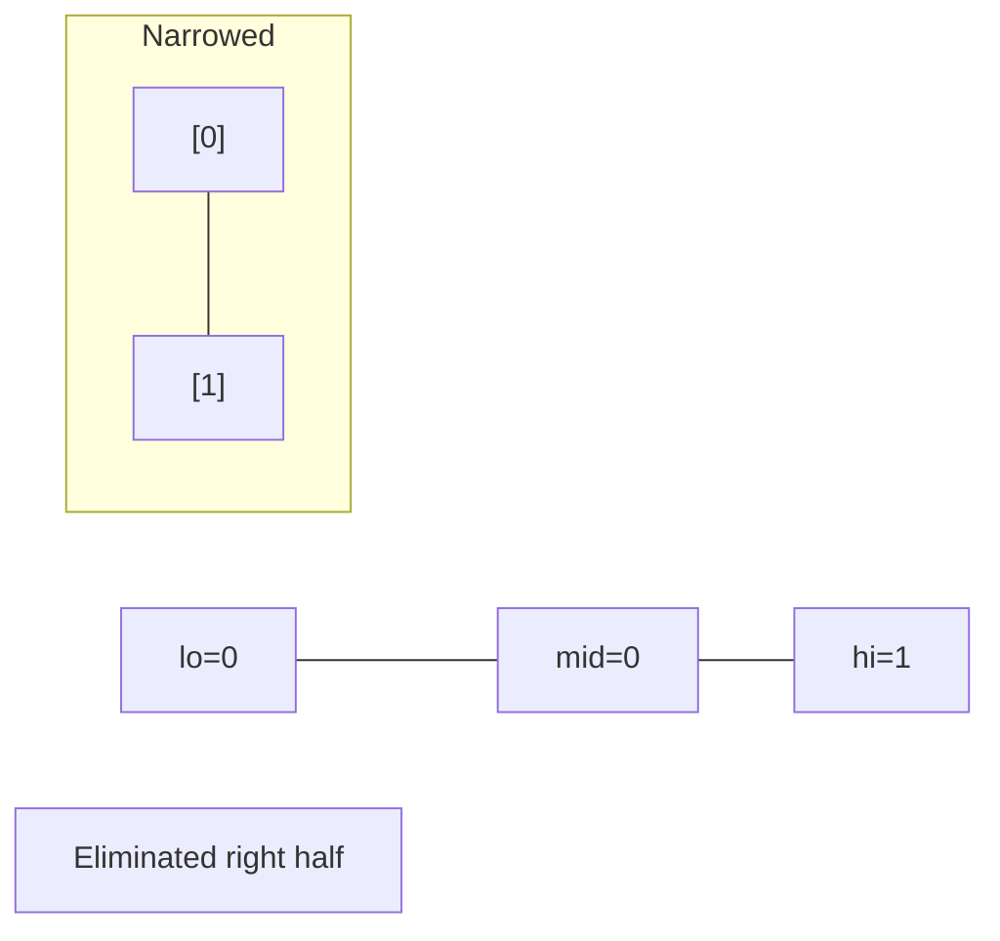
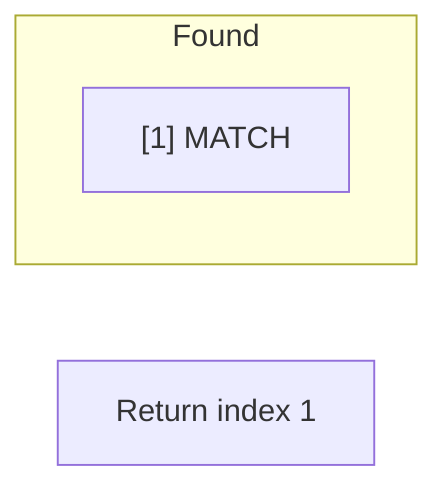

# Problem 350: Intersection of Two Arrays II

**Difficulty:** Easy  
**Tags:** Array, Hash Table, Two Pointers, Binary Search, Sorting  
**Pattern:** Binary Search  
**Link:** [leetcode.com/problems/intersection-of-two-arrays-ii](https://leetcode.com/problems/intersection-of-two-arrays-ii/)

## Description

Given two integer arrays `nums1` and `nums2`, return *an array of their intersection*. Each element in the result must appear as many times as it shows in both arrays and you may return the result in **any order**.

 

Example 1:

```

**Input:** nums1 = [1,2,2,1], nums2 = [2,2]
**Output:** [2,2]

```

Example 2:

```

**Input:** nums1 = [4,9,5], nums2 = [9,4,9,8,4]
**Output:** [4,9]
**Explanation:** [9,4] is also accepted.

```

 

**Constraints:**

	- `1 <= nums1.length, nums2.length <= 1000`
	- `0 <= nums1[i], nums2[i] <= 1000`

 

**Follow up:**

	- What if the given array is already sorted? How would you optimize your algorithm?
	- What if `nums1`'s size is small compared to `nums2`'s size? Which algorithm is better?
	- What if elements of `nums2` are stored on disk, and the memory is limited such that you cannot load all elements into the memory at once?

## Approach: Binary Search

Use binary search to halve the search space each iteration. Define the search range [lo, hi], compute mid, and decide which half to keep based on the problem's monotonic condition.

## Pseudocode

```
1. lo = lower_bound, hi = upper_bound
2. While lo <= hi (or lo < hi):
   a. mid = (lo + hi) // 2
   b. If condition(mid) is satisfied: record answer, search left half
   c. Else: search right half
3. Return answer
```

## Algorithm Flow



## Visual State Transitions

**Binary Search Step-by-Step:**

**Frame 1: Initial search space**


**Frame 2: Compare mid, narrow search**


**Frame 3: Found target**



## Complexity Analysis

- **Time:** O(log n)
- **Space:** O(1)

## Solution (Python3)

```python
class Solution:
    def intersect(self, nums1: List[int], nums2: List[int]) -> List[int]:
        # Binary search - O(log n) time, O(1) space
        lo, hi = 0, len(nums1) - 1
        while lo <= hi:
            mid = lo + (hi - lo) // 2
            if nums1[mid] == nums2:
                return mid
            elif nums1[mid] < nums2:
                lo = mid + 1
            else:
                hi = mid - 1
        return []
```

## Solution (C++)

```cpp
#include <string>
#include <vector>
using namespace std;

class Solution {
public:
    vector<int> intersect(vector<int>& nums1, vector<int>& nums2) {
        // Binary search - O(log n) time, O(1) space
        int lo = 0, hi = nums1.size() - 1;
        while (lo <= hi) {
            int mid = lo + (hi - lo) / 2;
            if (nums1[mid] == nums2) {
                return mid;
            } else if (nums1[mid] < nums2) {
                lo = mid + 1;
            } else {
                hi = mid - 1;
            }
        }
        return {};
    }
};
```
