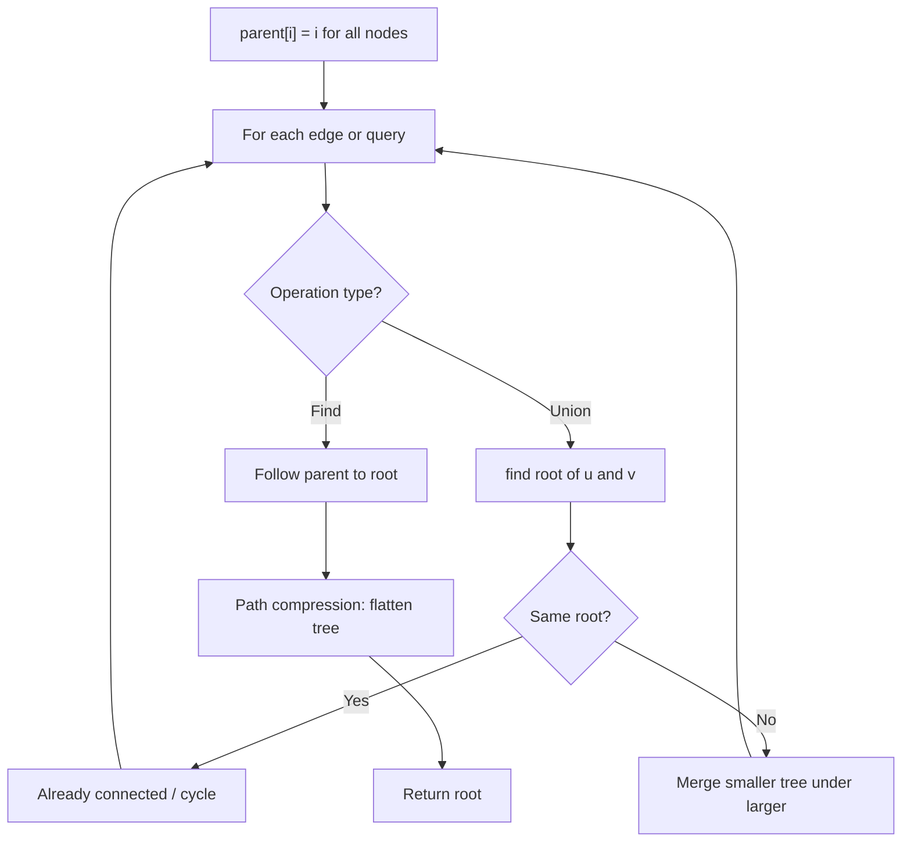
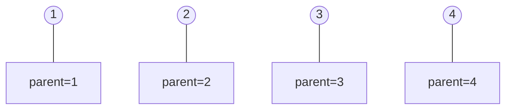
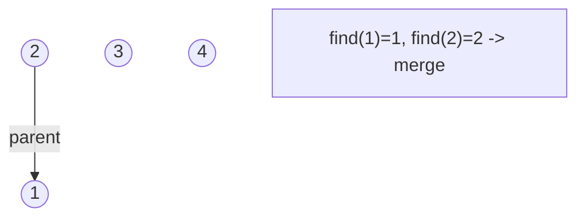
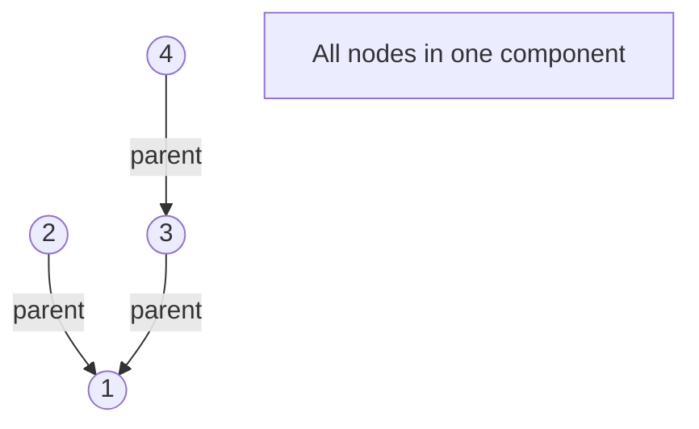
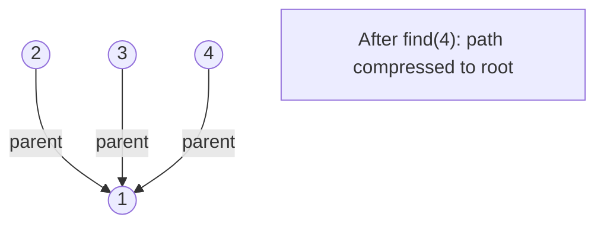

# Problem 352: Data Stream as Disjoint Intervals

**Difficulty:** Hard  
**Tags:** Hash Table, Binary Search, Union-Find, Design, Data Stream, Ordered Set  
**Pattern:** Union-Find / Disjoint Set  
**Link:** [leetcode.com/problems/data-stream-as-disjoint-intervals](https://leetcode.com/problems/data-stream-as-disjoint-intervals/)

## Description

Given a data stream input of non-negative integers `a1, a2, ..., an`, summarize the numbers seen so far as a list of disjoint intervals.

Implement the `SummaryRanges` class:

	- `SummaryRanges()` Initializes the object with an empty stream.
	- `void addNum(int value)` Adds the integer `value` to the stream.
	- `int[][] getIntervals()` Returns a summary of the integers in the stream currently as a list of disjoint intervals `[starti, endi]`. The answer should be sorted by `starti`.

 

Example 1:

```

**Input**
["SummaryRanges", "addNum", "getIntervals", "addNum", "getIntervals", "addNum", "getIntervals", "addNum", "getIntervals", "addNum", "getIntervals"]
[[], [1], [], [3], [], [7], [], [2], [], [6], []]
**Output**
[null, null, [[1, 1]], null, [[1, 1], [3, 3]], null, [[1, 1], [3, 3], [7, 7]], null, [[1, 3], [7, 7]], null, [[1, 3], [6, 7]]]

**Explanation**
SummaryRanges summaryRanges = new SummaryRanges();
summaryRanges.addNum(1);      // arr = [1]
summaryRanges.getIntervals(); // return [[1, 1]]
summaryRanges.addNum(3);      // arr = [1, 3]
summaryRanges.getIntervals(); // return [[1, 1], [3, 3]]
summaryRanges.addNum(7);      // arr = [1, 3, 7]
summaryRanges.getIntervals(); // return [[1, 1], [3, 3], [7, 7]]
summaryRanges.addNum(2);      // arr = [1, 2, 3, 7]
summaryRanges.getIntervals(); // return [[1, 3], [7, 7]]
summaryRanges.addNum(6);      // arr = [1, 2, 3, 6, 7]
summaryRanges.getIntervals(); // return [[1, 3], [6, 7]]

```

 

**Constraints:**

	- `0 <= value <= 10^4`
	- At most `3 * 10^4` calls will be made to `addNum` and `getIntervals`.
	- At most `10^2` calls will be made to `getIntervals`.

 

**Follow up:** What if there are lots of merges and the number of disjoint intervals is small compared to the size of the data stream?

## Approach: Union-Find / Disjoint Set

Use Union-Find with path compression and union by rank to efficiently manage connected components. Find(x) returns the root of x's component; Union(x,y) merges two components.

## Pseudocode

```
1. parent[i] = i for all nodes (each is its own set)
2. find(x): follow parent pointers to root (with path compression)
3. union(x, y): merge sets of x and y by rank
4. Process edges/operations:
   a. For each edge (u, v): union(u, v)
5. Answer queries using find()
```

## Algorithm Flow



## Visual State Transitions

**Union-Find Step-by-Step:**

**Frame 1: Initial - each node is own parent**


**Frame 2: Union(1,2) - merge components**


**Frame 3: Union(3,4) then Union(2,3)**


**Frame 4: Path compression on find(4)**



## Complexity Analysis

- **Time:** O(n * alpha(n))
- **Space:** O(n)

## Solution (Python3)

```python
class SummaryRanges:
    def __init__(self):
        # Initialize data structure
        pass

    def addNum(self, value: int) -> None:
        return None

    def getIntervals(self) -> List[List[int]]:
        return []

```

## Solution (C++)

```cpp
#include <functional>
#include <numeric>
#include <string>
#include <vector>
using namespace std;

class SummaryRanges {
public:
    SummaryRanges() {
        // Initialize
    }

    void addNum(int value) {
        return ;
    }

    vector<vector<int>> getIntervals() {
        return {};
    }

};
```
