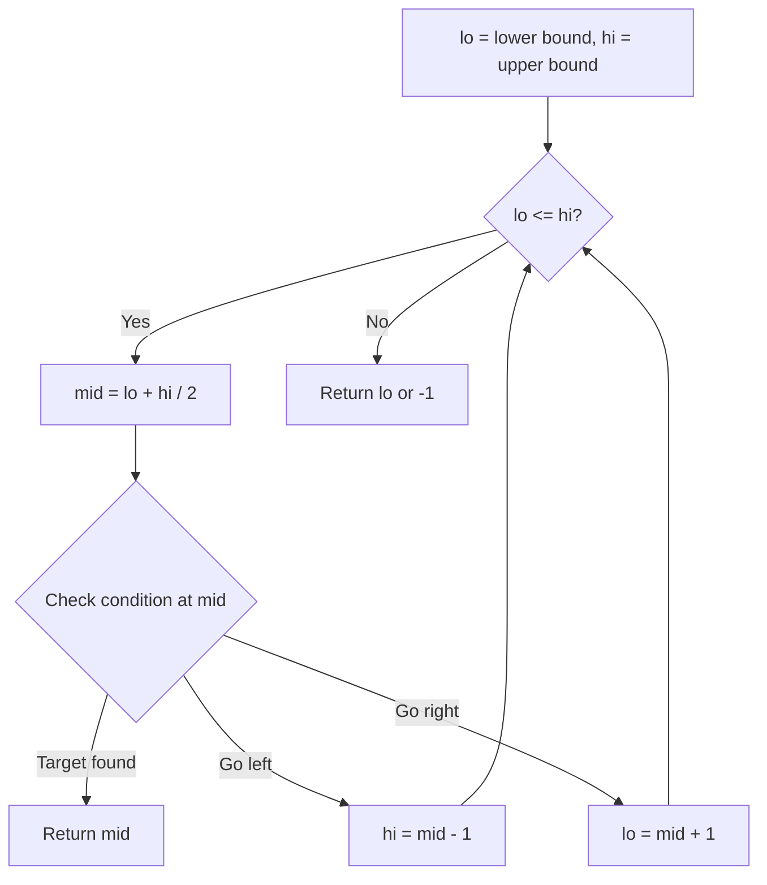
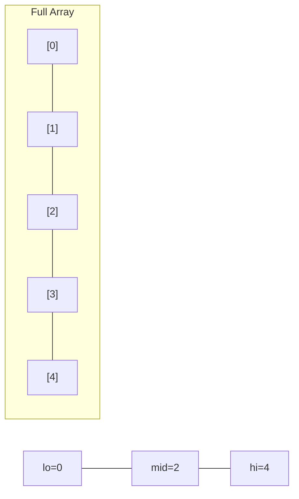
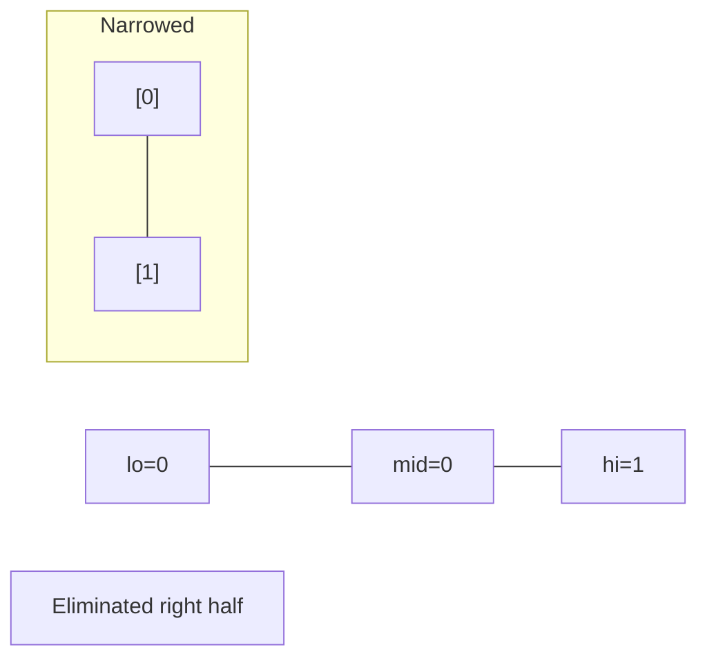
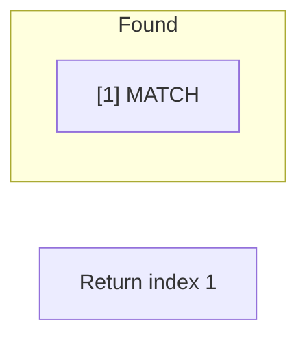

# Problem 354: Russian Doll Envelopes

**Difficulty:** Hard  
**Tags:** Array, Binary Search, Dynamic Programming, Sorting  
**Pattern:** Binary Search  
**Link:** [leetcode.com/problems/russian-doll-envelopes](https://leetcode.com/problems/russian-doll-envelopes/)

## Description

You are given a 2D array of integers `envelopes` where `envelopes[i] = [wi, hi]` represents the width and the height of an envelope.

One envelope can fit into another if and only if both the width and height of one envelope are greater than the other envelope's width and height.

Return *the maximum number of envelopes you can Russian doll (i.e., put one inside the other)*.

**Note:** You cannot rotate an envelope.

 

Example 1:

```

**Input:** envelopes = [[5,4],[6,4],[6,7],[2,3]]
**Output:** 3
**Explanation:** The maximum number of envelopes you can Russian doll is `3` ([2,3] => [5,4] => [6,7]).

```

Example 2:

```

**Input:** envelopes = [[1,1],[1,1],[1,1]]
**Output:** 1

```

 

**Constraints:**

	- `1 <= envelopes.length <= 10^5`
	- `envelopes[i].length == 2`
	- `1 <= wi, hi <= 10^5`

## Approach: Binary Search

Use binary search to halve the search space each iteration. Define the search range [lo, hi], compute mid, and decide which half to keep based on the problem's monotonic condition.

## Pseudocode

```
1. lo = lower_bound, hi = upper_bound
2. While lo <= hi (or lo < hi):
   a. mid = (lo + hi) // 2
   b. If condition(mid) is satisfied: record answer, search left half
   c. Else: search right half
3. Return answer
```

## Algorithm Flow



## Visual State Transitions

**Binary Search Step-by-Step:**

**Frame 1: Initial search space**


**Frame 2: Compare mid, narrow search**


**Frame 3: Found target**



## Complexity Analysis

- **Time:** O(log n)
- **Space:** O(1)

## Solution (Python3)

```python
class Solution:
    def maxEnvelopes(self, envelopes: List[List[int]]) -> int:
        # Binary search - O(log n) time, O(1) space
        lo, hi = 0, len(envelopes) - 1
        while lo <= hi:
            mid = lo + (hi - lo) // 2
            if envelopes[mid] == envelopes:
                return mid
            elif envelopes[mid] < envelopes:
                lo = mid + 1
            else:
                hi = mid - 1
        return 0
```

## Solution (C++)

```cpp
#include <string>
#include <vector>
using namespace std;

class Solution {
public:
    int maxEnvelopes(vector<vector<int>>& envelopes) {
        // Binary search - O(log n) time, O(1) space
        int lo = 0, hi = envelopes.size() - 1;
        while (lo <= hi) {
            int mid = lo + (hi - lo) / 2;
            if (envelopes[mid] == envelopes) {
                return mid;
            } else if (envelopes[mid] < envelopes) {
                lo = mid + 1;
            } else {
                hi = mid - 1;
            }
        }
        return 0;
    }
};
```
