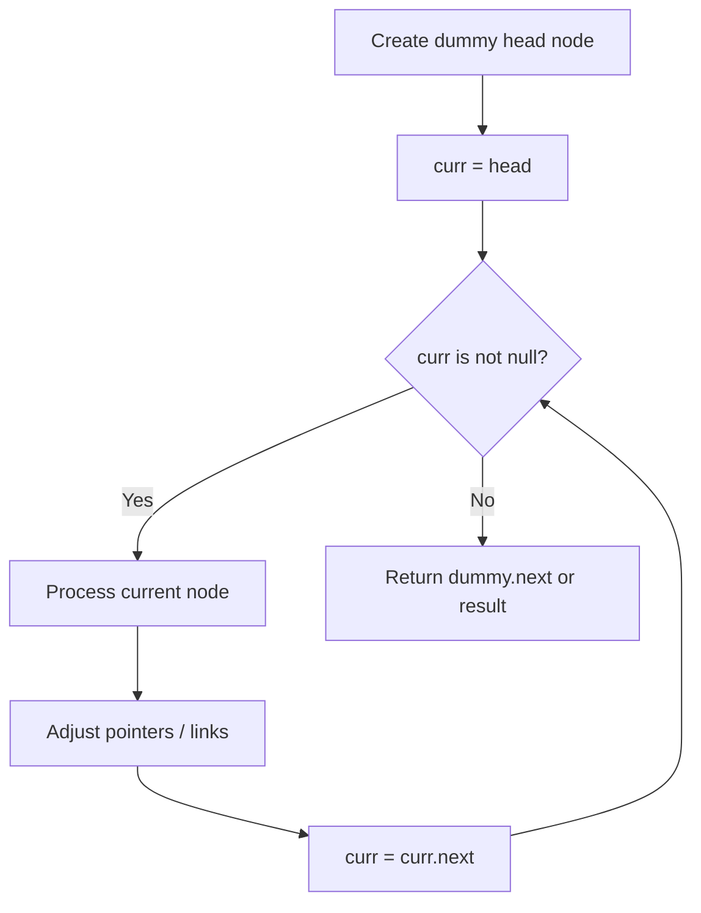
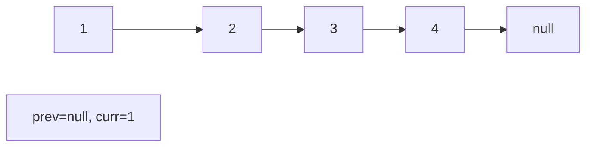
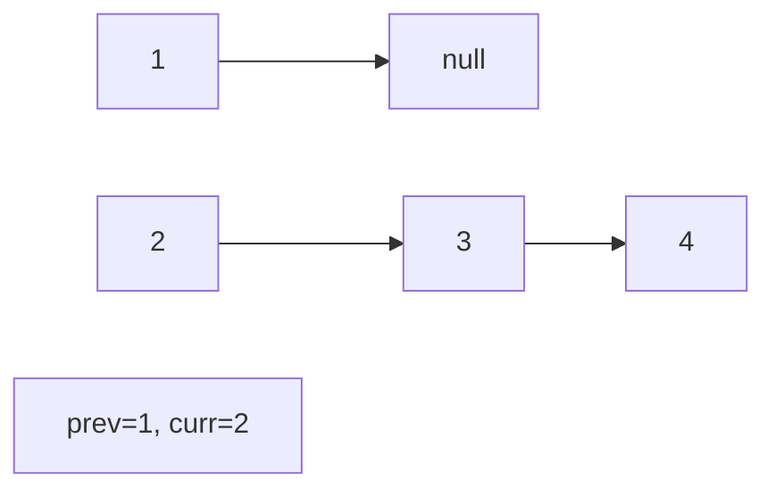
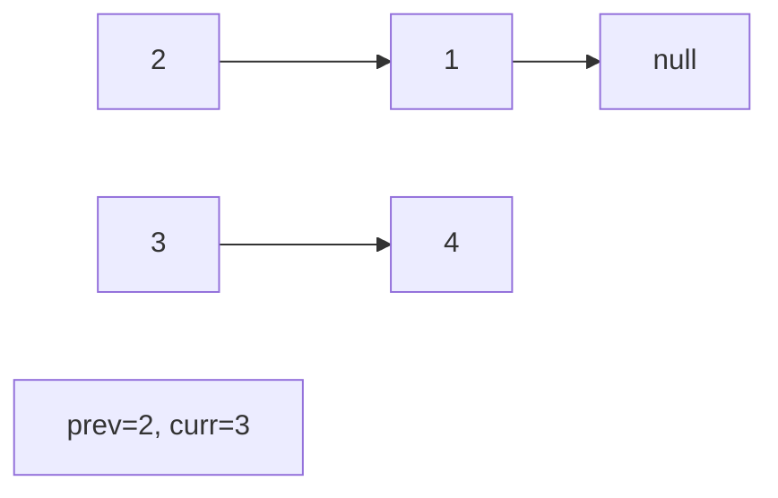
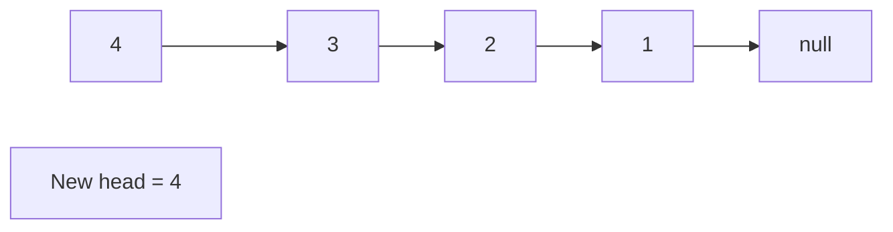

# Problem 355: Design Twitter

**Difficulty:** Medium  
**Tags:** Hash Table, Linked List, Design, Heap (Priority Queue)  
**Pattern:** Linked List  
**Link:** [leetcode.com/problems/design-twitter](https://leetcode.com/problems/design-twitter/)

## Description

Design a simplified version of Twitter where users can post tweets, follow/unfollow another user, and is able to see the `10` most recent tweets in the user's news feed.

Implement the `Twitter` class:

	- `Twitter()` Initializes your twitter object.
	- `void postTweet(int userId, int tweetId)` Composes a new tweet with ID `tweetId` by the user `userId`. Each call to this function will be made with a unique `tweetId`.
	- `List<Integer> getNewsFeed(int userId)` Retrieves the `10` most recent tweet IDs in the user's news feed. Each item in the news feed must be posted by users who the user followed or by the user themself. Tweets must be **ordered from most recent to least recent**.
	- `void follow(int followerId, int followeeId)` The user with ID `followerId` started following the user with ID `followeeId`.
	- `void unfollow(int followerId, int followeeId)` The user with ID `followerId` started unfollowing the user with ID `followeeId`.

 

Example 1:

```

**Input**
["Twitter", "postTweet", "getNewsFeed", "follow", "postTweet", "getNewsFeed", "unfollow", "getNewsFeed"]
[[], [1, 5], [1], [1, 2], [2, 6], [1], [1, 2], [1]]
**Output**
[null, null, [5], null, null, [6, 5], null, [5]]

**Explanation**
Twitter twitter = new Twitter();
twitter.postTweet(1, 5); // User 1 posts a new tweet (id = 5).
twitter.getNewsFeed(1);  // User 1's news feed should return a list with 1 tweet id -> [5]. return [5]
twitter.follow(1, 2);    // User 1 follows user 2.
twitter.postTweet(2, 6); // User 2 posts a new tweet (id = 6).
twitter.getNewsFeed(1);  // User 1's news feed should return a list with 2 tweet ids -> [6, 5]. Tweet id 6 should precede tweet id 5 because it is posted after tweet id 5.
twitter.unfollow(1, 2);  // User 1 unfollows user 2.
twitter.getNewsFeed(1);  // User 1's news feed should return a list with 1 tweet id -> [5], since user 1 is no longer following user 2.

```

 

**Constraints:**

	- `1 <= userId, followerId, followeeId <= 500`
	- `0 <= tweetId <= 10^4`
	- All the tweets have **unique** IDs.
	- At most `3 * 10^4` calls will be made to `postTweet`, `getNewsFeed`, `follow`, and `unfollow`.
	- A user cannot follow himself.

## Approach: Linked List

Traverse or manipulate the linked list using pointer techniques. Common patterns: dummy head node for edge cases, fast/slow pointers for cycle detection or middle finding, in-place reversal, and merge operations.

## Pseudocode

```
1. Create dummy head if needed
2. Initialize pointer(s) at head
3. Traverse / modify list:
   a. Process current node
   b. Adjust next pointers as needed
   c. Move to next node
4. Return dummy.next or result
```

## Algorithm Flow



## Visual State Transitions

**Linked List Operation (Reverse):**

**Frame 1: Initial list**


**Frame 2: Reverse first link**


**Frame 3: Reverse second link**


**Frame 4: Fully reversed**



## Complexity Analysis

- **Time:** O(n)
- **Space:** O(1)

## Solution (Python3)

```python
class Twitter:
    def __init__(self):
        # Initialize data structure
        pass

    def postTweet(self, userId: int, tweetId: int) -> None:
        return None

    def getNewsFeed(self, userId: int) -> List[int]:
        return []

    def follow(self, followerId: int, followeeId: int) -> None:
        return None

    def unfollow(self, followerId: int, followeeId: int) -> None:
        return None

```

## Solution (C++)

```cpp
#include <string>
#include <vector>
using namespace std;

class Twitter {
public:
    Twitter() {
        // Initialize
    }

    void postTweet(int userId, int tweetId) {
        return ;
    }

    vector<int> getNewsFeed(int userId) {
        return {};
    }

    void follow(int followerId, int followeeId) {
        return ;
    }

    void unfollow(int followerId, int followeeId) {
        return ;
    }

};
```
