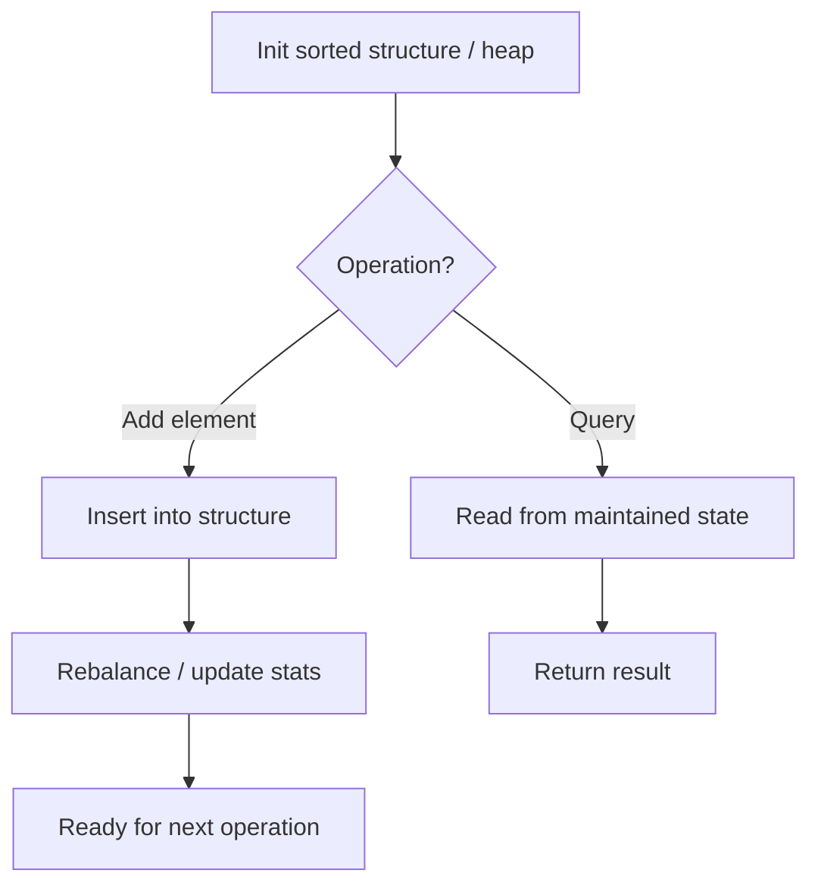

# Problem 359: Logger Rate Limiter

**Difficulty:** Easy  
**Tags:** Hash Table, Design, Data Stream  
**Pattern:** Data Stream Design  
**Link:** [leetcode.com/problems/logger-rate-limiter](https://leetcode.com/problems/logger-rate-limiter/)

## Description

*(Premium problem -- description requires LeetCode subscription)*

## Approach: Data Stream Design

Design for streaming data: elements arrive one at a time and queries must be answered efficiently. Use sorted structures, heaps, or running aggregations.

## Pseudocode

```
1. Initialize: sorted list, heap, or aggregation state
2. addNum(val):
   - Insert into sorted structure
   - Update running stats
3. query():
   - Read from maintained state
   - Return in O(1) or O(log n)
```

## Algorithm Flow



## Complexity Analysis

- **Time:** O(log n) per operation
- **Space:** O(n)

## Solution (Python3)

```python
class Solution:
    pass
```

## Solution (C++)

```cpp
class Solution {
public:
    // Design problem stub
};
```
