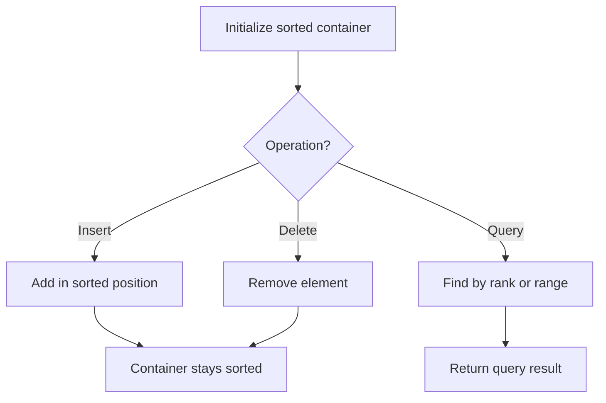

# Problem 363: Max Sum of Rectangle No Larger Than K

**Difficulty:** Hard  
**Tags:** Array, Binary Search, Matrix, Prefix Sum, Ordered Set  
**Pattern:** Ordered Set / SortedList  
**Link:** [leetcode.com/problems/max-sum-of-rectangle-no-larger-than-k](https://leetcode.com/problems/max-sum-of-rectangle-no-larger-than-k/)

## Description

Given an `m x n` matrix `matrix` and an integer `k`, return *the max sum of a rectangle in the matrix such that its sum is no larger than* `k`.

It is **guaranteed** that there will be a rectangle with a sum no larger than `k`.

 

Example 1:

```

**Input:** matrix = [[1,0,1],[0,-2,3]], k = 2
**Output:** 2
**Explanation:** Because the sum of the blue rectangle [[0, 1], [-2, 3]] is 2, and 2 is the max number no larger than k (k = 2).

```

Example 2:

```

**Input:** matrix = [[2,2,-1]], k = 3
**Output:** 3

```

 

**Constraints:**

	- `m == matrix.length`
	- `n == matrix[i].length`
	- `1 <= m, n <= 100`
	- `-100 <= matrix[i][j] <= 100`
	- `-10^5 <= k <= 10^5`

 

**Follow up:** What if the number of rows is much larger than the number of columns?

## Approach: Ordered Set / SortedList

Maintain elements in sorted order for efficient insertion, deletion, and rank queries. Use balanced BST, skip list, or sorted container.

## Pseudocode

```
1. Initialize sorted container
2. For each operation:
   - Insert: add element in sorted position O(log n)
   - Delete: remove element O(log n)
   - Query: find kth element, count, or range O(log n)
3. Return results
```

## Algorithm Flow



## Complexity Analysis

- **Time:** O(n log n)
- **Space:** O(n)

## Solution (Python3)

```python
class Solution:
    def maxSumSubmatrix(self, matrix: List[List[int]], k: int) -> int:
        # Ordered set / SortedList - O(n log n) time
        from sortedcontainers import SortedList
        sl = SortedList()
        result = 0
        for val in matrix:
            pos = sl.bisect_left(val)
            if pos < len(sl):
                result = max(result, sl[pos] - val)
            sl.add(val)
        return result
```

## Solution (C++)

```cpp
#include <algorithm>
#include <set>
#include <string>
#include <vector>
using namespace std;

class Solution {
public:
    int maxSumSubmatrix(vector<vector<int>>& matrix, int k) {
        // Ordered set - O(n log n) time
        set<int> ordered;
        int result = 0;
        for (int val : matrix) {
            auto it = ordered.lower_bound(val);
            if (it != ordered.end()) {
                result = max(result, *it - val);
            }
            ordered.insert(val);
        }
        return result;
    }
};
```
