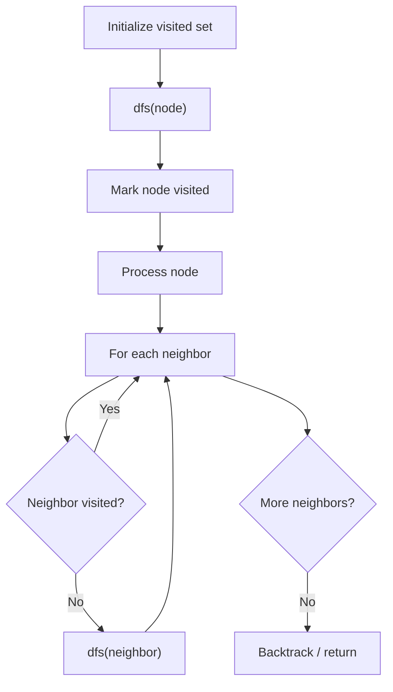

# Problem 365: Water and Jug Problem

**Difficulty:** Medium  
**Tags:** Math, Depth-First Search, Breadth-First Search  
**Pattern:** DFS Graph Traversal  
**Link:** [leetcode.com/problems/water-and-jug-problem](https://leetcode.com/problems/water-and-jug-problem/)

## Description

You are given two jugs with capacities `x` liters and `y` liters. You have an infinite water supply. Return whether the total amount of water in both jugs may reach `target` using the following operations:

	- Fill either jug completely with water.
	- Completely empty either jug.
	- Pour water from one jug into another until the receiving jug is full, or the transferring jug is empty.

 

Example 1: 

**Input: **  x = 3, y = 5, target = 4 

**Output: **  true 

**Explanation:**

Follow these steps to reach a total of 4 liters:

	- Fill the 5-liter jug (0, 5).
	- Pour from the 5-liter jug into the 3-liter jug, leaving 2 liters (3, 2).
	- Empty the 3-liter jug (0, 2).
	- Transfer the 2 liters from the 5-liter jug to the 3-liter jug (2, 0).
	- Fill the 5-liter jug again (2, 5).
	- Pour from the 5-liter jug into the 3-liter jug until the 3-liter jug is full. This leaves 4 liters in the 5-liter jug (3, 4).
	- Empty the 3-liter jug. Now, you have exactly 4 liters in the 5-liter jug (0, 4).

Reference: The Die Hard example.

Example 2: 

**Input: **  x = 2, y = 6, target = 5 

**Output: **  false 

Example 3: 

**Input: **  x = 1, y = 2, target = 3 

**Output: **  true 

**Explanation:** Fill both jugs. The total amount of water in both jugs is equal to 3 now.

 

**Constraints:**

	- `1 <= x, y, target <= 10^3`

## Approach: DFS Graph Traversal

Explore the graph depth-first using recursion or a stack. Mark nodes as visited to avoid cycles. Process each node and explore all unvisited neighbors.

## Pseudocode

```
1. Initialize visited set
2. Define dfs(node):
   a. Mark node as visited
   b. Process node
   c. For each neighbor of node:
      - If not visited: dfs(neighbor)
3. Call dfs(start) for each unvisited node
```

## Algorithm Flow



## Complexity Analysis

- **Time:** O(V + E)
- **Space:** O(V)

## Solution (Python3)

```python
class Solution:
    def canMeasureWater(self, x: int, y: int, target: int) -> bool:
        # DFS on graph - O(V+E) time
        visited = set()
        result = []
        
        def dfs(node):
            if node in visited:
                return
            visited.add(node)
            result.append(node)
            # Traverse neighbors (adjust based on adjacency representation)
        
        dfs(0)
        return result if isinstance(False, list) else len(result)
```

## Solution (C++)

```cpp
#include <functional>
#include <string>
#include <vector>
using namespace std;

class Solution {
public:
    bool canMeasureWater(int x, int y, int target) {
        // DFS on graph - O(V+E) time
        vector<bool> visited(x.size(), false);
        vector<int> result;
        function<void(int)> dfs = [&](int node) {
            if (visited[node]) return;
            visited[node] = true;
            result.push_back(node);
            // Traverse neighbors
        };
        dfs(0);
        return result;
    }
};
```
