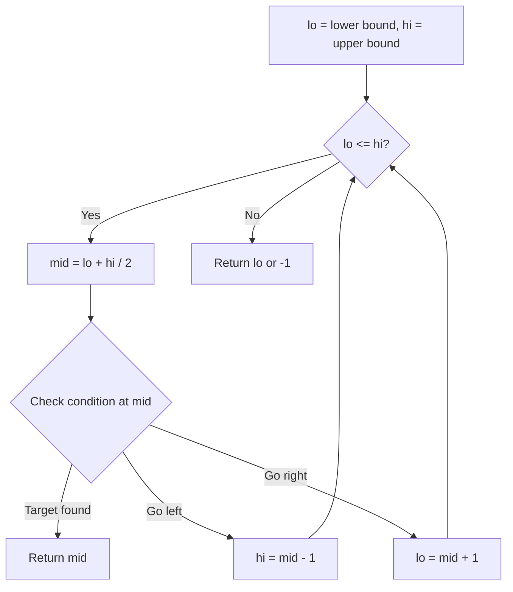
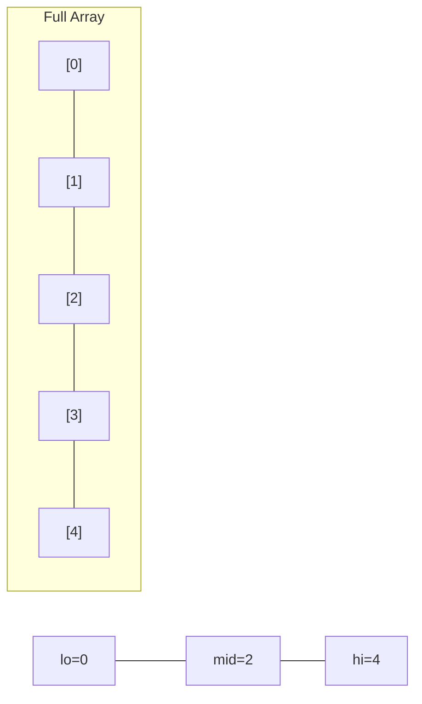
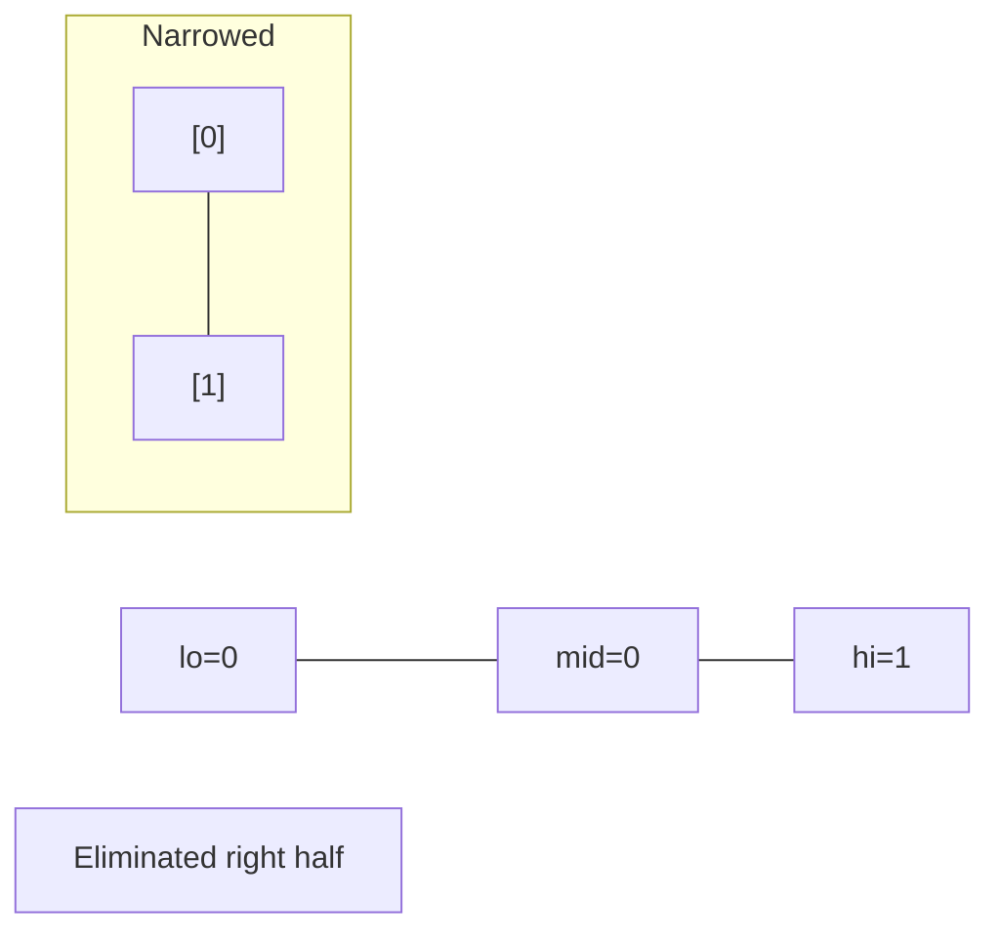
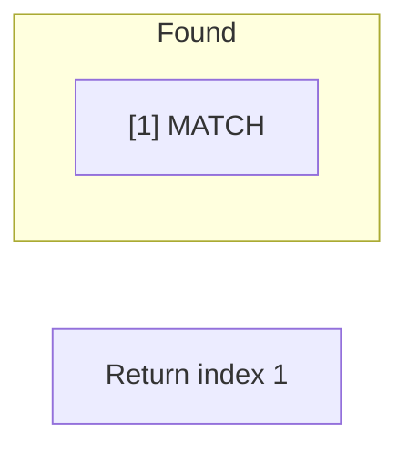

# Problem 367: Valid Perfect Square

**Difficulty:** Easy  
**Tags:** Math, Binary Search  
**Pattern:** Binary Search  
**Link:** [leetcode.com/problems/valid-perfect-square](https://leetcode.com/problems/valid-perfect-square/)

## Description

Given a positive integer num, return `true` *if* `num` *is a perfect square or* `false` *otherwise*.

A **perfect square** is an integer that is the square of an integer. In other words, it is the product of some integer with itself.

You must not use any built-in library function, such as `sqrt`.

 

Example 1:

```

**Input:** num = 16
**Output:** true
**Explanation:** We return true because 4 * 4 = 16 and 4 is an integer.

```

Example 2:

```

**Input:** num = 14
**Output:** false
**Explanation:** We return false because 3.742 * 3.742 = 14 and 3.742 is not an integer.

```

 

**Constraints:**

	- `1 <= num <= 2^31 - 1`

## Approach: Binary Search

Use binary search to halve the search space each iteration. Define the search range [lo, hi], compute mid, and decide which half to keep based on the problem's monotonic condition.

## Pseudocode

```
1. lo = lower_bound, hi = upper_bound
2. While lo <= hi (or lo < hi):
   a. mid = (lo + hi) // 2
   b. If condition(mid) is satisfied: record answer, search left half
   c. Else: search right half
3. Return answer
```

## Algorithm Flow



## Visual State Transitions

**Binary Search Step-by-Step:**

**Frame 1: Initial search space**


**Frame 2: Compare mid, narrow search**


**Frame 3: Found target**



## Complexity Analysis

- **Time:** O(log n)
- **Space:** O(1)

## Solution (Python3)

```python
class Solution:
    def isPerfectSquare(self, num: int) -> bool:
        # Binary search - O(log n) time, O(1) space
        lo, hi = 0, len(num) - 1
        while lo <= hi:
            mid = lo + (hi - lo) // 2
            if num[mid] == num:
                return mid
            elif num[mid] < num:
                lo = mid + 1
            else:
                hi = mid - 1
        return False
```

## Solution (C++)

```cpp
#include <string>
#include <vector>
using namespace std;

class Solution {
public:
    bool isPerfectSquare(int num) {
        // Binary search - O(log n) time, O(1) space
        int lo = 0, hi = num.size() - 1;
        while (lo <= hi) {
            int mid = lo + (hi - lo) / 2;
            if (num[mid] == num) {
                return mid;
            } else if (num[mid] < num) {
                lo = mid + 1;
            } else {
                hi = mid - 1;
            }
        }
        return false;
    }
};
```
