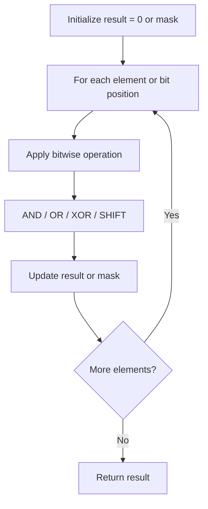

# Problem 371: Sum of Two Integers

**Difficulty:** Medium  
**Tags:** Math, Bit Manipulation  
**Pattern:** Bit Manipulation  
**Link:** [leetcode.com/problems/sum-of-two-integers](https://leetcode.com/problems/sum-of-two-integers/)

## Description

Given two integers `a` and `b`, return *the sum of the two integers without using the operators* `+` *and* `-`.

 

Example 1:

```
**Input:** a = 1, b = 2
**Output:** 3

```
Example 2:

```
**Input:** a = 2, b = 3
**Output:** 5

```

 

**Constraints:**

	- `-1000 <= a, b <= 1000`

## Approach: Bit Manipulation

Operate on individual bits using bitwise operators (AND, OR, XOR, shift). Common tricks: x & (x-1) removes lowest set bit, x ^ x = 0, XOR all elements to find unique.

## Pseudocode

```
1. Apply bitwise operations:
   - XOR all elements to cancel paired bits
   - Use bitmask to track state
   - Shift and mask to extract/set individual bits
2. Return result
```

## Algorithm Flow



## Complexity Analysis

- **Time:** O(n) or O(log n)
- **Space:** O(1)

## Solution (Python3)

```python
class Solution:
    def getSum(self, a: int, b: int) -> int:
        # Bit manipulation - O(n) time, O(1) space
        result = 0
        for val in a:
            result ^= val
        return result
```

## Solution (C++)

```cpp
#include <string>
#include <vector>
using namespace std;

class Solution {
public:
    int getSum(int a, int b) {
        // Bit manipulation - O(n) time, O(1) space
        int result = 0;
        for (int val : a) {
            result ^= val;
        }
        return result;
    }
};
```
