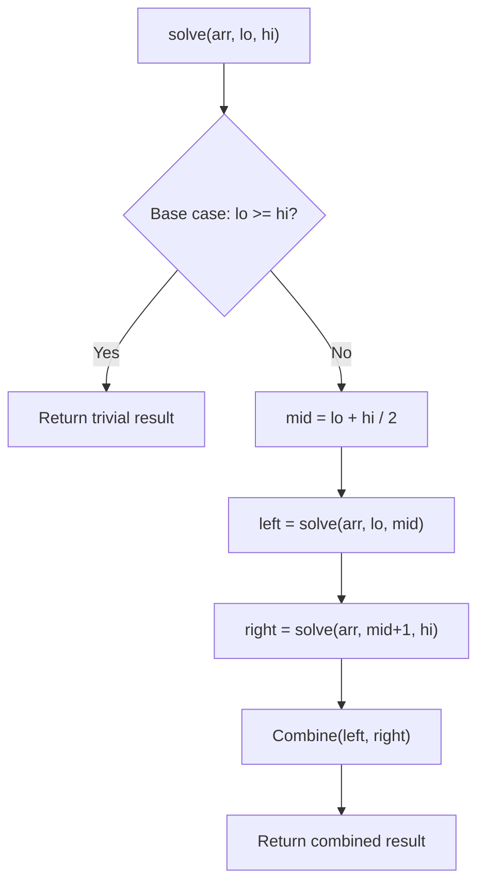

# Problem 372: Super Pow

**Difficulty:** Medium  
**Tags:** Math, Divide and Conquer  
**Pattern:** Divide and Conquer  
**Link:** [leetcode.com/problems/super-pow](https://leetcode.com/problems/super-pow/)

## Description

Your task is to calculate `a^b` mod `1337` where `a` is a positive integer and `b` is an extremely large positive integer given in the form of an array.

 

Example 1:

```

**Input:** a = 2, b = [3]
**Output:** 8

```

Example 2:

```

**Input:** a = 2, b = [1,0]
**Output:** 1024

```

Example 3:

```

**Input:** a = 1, b = [4,3,3,8,5,2]
**Output:** 1

```

 

**Constraints:**

	- `1 <= a <= 2^31 - 1`
	- `1 <= b.length <= 2000`
	- `0 <= b[i] <= 9`
	- `b` does not contain leading zeros.

## Approach: Divide and Conquer

Split the problem into smaller subproblems, solve them recursively, and combine the results. The key is the merge/combine step.

## Pseudocode

```
1. Base case: if input size <= 1, return trivial answer
2. Divide: split input into two halves
3. Conquer: recursively solve left and right
4. Combine: merge solutions from left and right
5. Return combined result
```

## Algorithm Flow



## Complexity Analysis

- **Time:** O(n log n)
- **Space:** O(n)

## Solution (Python3)

```python
class Solution:
    def superPow(self, a: int, b: List[int]) -> int:
        # Divide and conquer approach - O(n log n) time
        def solve(left, right):
            if left >= right:
                return a[left] if left < len(a) else 0
            mid = (left + right) // 2
            left_result = solve(left, mid)
            right_result = solve(mid + 1, right)
            return max(left_result, right_result)  # merge step
        
        return solve(0, len(a) - 1) if a else 0
```

## Solution (C++)

```cpp
#include <algorithm>
#include <functional>
#include <string>
#include <vector>
using namespace std;

class Solution {
public:
    int superPow(int a, vector<int>& b) {
        // Divide and conquer - O(n log n) time
        function<int(int, int)> solve = [&](int left, int right) -> int {
            if (left >= right) return left < (int)a.size() ? a[left] : 0;
            int mid = (left + right) / 2;
            int leftRes = solve(left, mid);
            int rightRes = solve(mid + 1, right);
            return max(leftRes, rightRes);
        };
        return a.empty() ? 0 : solve(0, a.size() - 1);
    }
};
```
