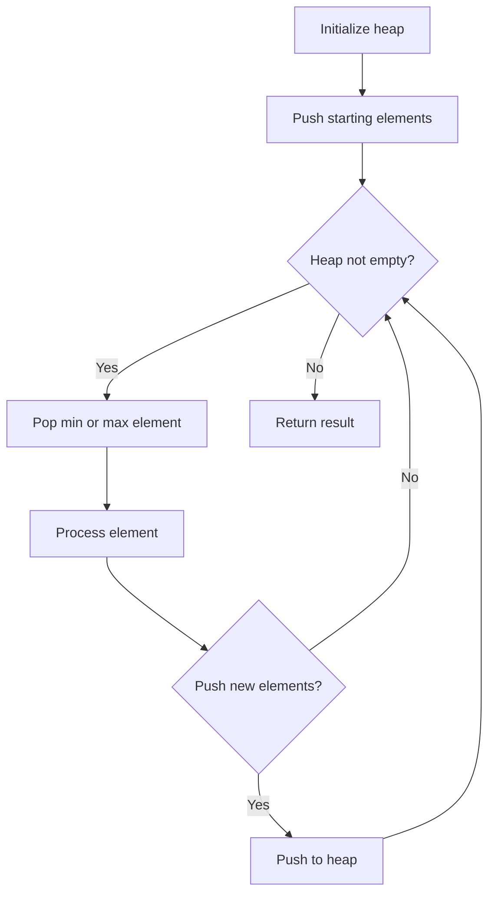
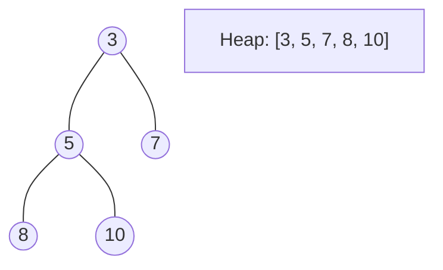
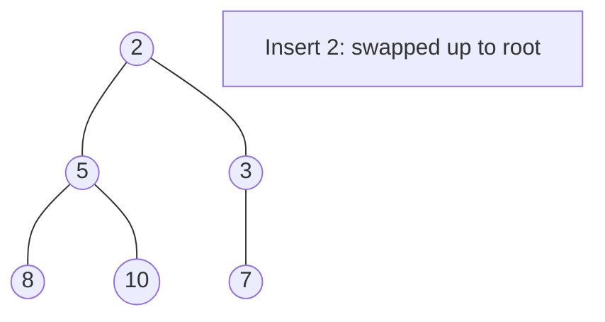
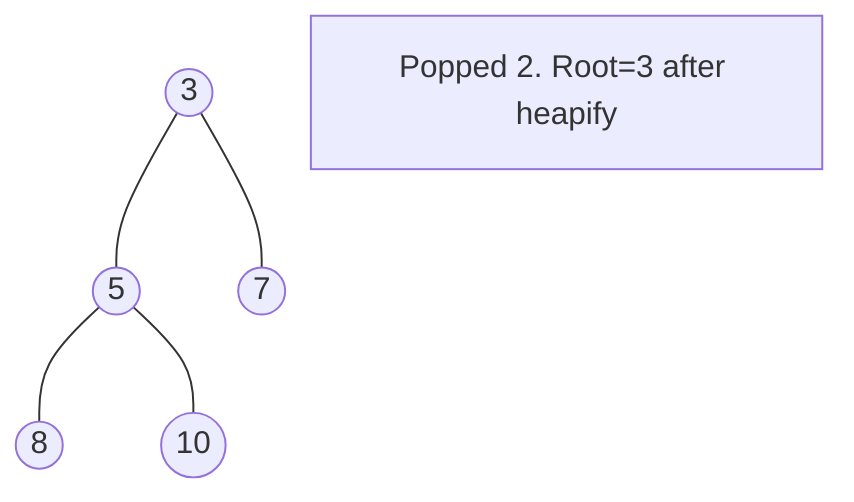

# Problem 373: Find K Pairs with Smallest Sums

**Difficulty:** Medium  
**Tags:** Array, Heap (Priority Queue)  
**Pattern:** Heap / Priority Queue  
**Link:** [leetcode.com/problems/find-k-pairs-with-smallest-sums](https://leetcode.com/problems/find-k-pairs-with-smallest-sums/)

## Description

You are given two integer arrays `nums1` and `nums2` sorted in **non-decreasing order** and an integer `k`.

Define a pair `(u, v)` which consists of one element from the first array and one element from the second array.

Return *the* `k` *pairs* `(u1, v1), (u2, v2), ..., (uk, vk)` *with the smallest sums*.

 

Example 1:

```

**Input:** nums1 = [1,7,11], nums2 = [2,4,6], k = 3
**Output:** [[1,2],[1,4],[1,6]]
**Explanation:** The first 3 pairs are returned from the sequence: [1,2],[1,4],[1,6],[7,2],[7,4],[11,2],[7,6],[11,4],[11,6]

```

Example 2:

```

**Input:** nums1 = [1,1,2], nums2 = [1,2,3], k = 2
**Output:** [[1,1],[1,1]]
**Explanation:** The first 2 pairs are returned from the sequence: [1,1],[1,1],[1,2],[2,1],[1,2],[2,2],[1,3],[1,3],[2,3]

```

 

**Constraints:**

	- `1 <= nums1.length, nums2.length <= 10^5`
	- `-10^9 <= nums1[i], nums2[i] <= 10^9`
	- `nums1` and `nums2` both are sorted in **non-decreasing order**.
	- `1 <= k <= 10^4`
	- `k <= nums1.length * nums2.length`

## Approach: Heap / Priority Queue

Use a min-heap or max-heap to efficiently access the smallest/largest element. Push elements and pop the top to process in priority order.

## Pseudocode

```
1. Initialize heap (min or max)
2. Push initial elements onto heap
3. While heap not empty and condition:
   a. Pop top element (min or max)
   b. Process element
   c. Push new elements if needed
4. Return result
```

## Algorithm Flow



## Visual State Transitions

**Heap Operations (Min-Heap):**

**Frame 1: Initial heap**


**Frame 2: Insert 2 - bubble up**


**Frame 3: Pop minimum (2) - heapify down**



## Complexity Analysis

- **Time:** O(n log n)
- **Space:** O(n)

## Solution (Python3)

```python
class Solution:
    def kSmallestPairs(self, nums1: List[int], nums2: List[int], k: int) -> List[List[int]]:
        # Heap/Priority Queue - O(n log k) time
        import heapq
        if not nums1:
            return []
        # Min heap (negate for max heap)
        heap = []
        for val in nums1:
            heapq.heappush(heap, val)
            if len(heap) > (nums2 if isinstance(nums2, int) else len(nums1)):
                heapq.heappop(heap)
        return heap[0] if heap else []
```

## Solution (C++)

```cpp
#include <queue>
#include <string>
#include <vector>
using namespace std;

class Solution {
public:
    vector<vector<int>> kSmallestPairs(vector<int>& nums1, vector<int>& nums2, int k) {
        // Heap/Priority Queue - O(n log k) time
        priority_queue<int, vector<int>, greater<int>> pq;
        for (int val : nums1) {
            pq.push(val);
            if ((int)pq.size() > nums2)
                pq.pop();
        }
        return pq.empty() ? {} : pq.top();
    }
};
```
