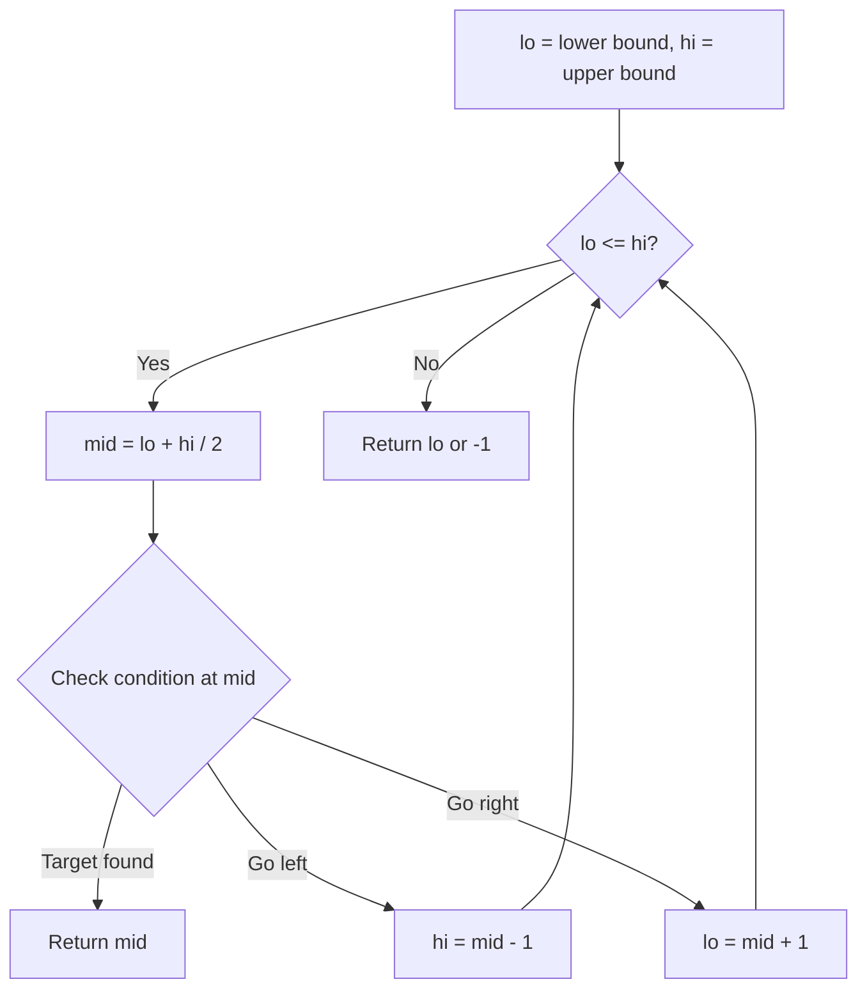
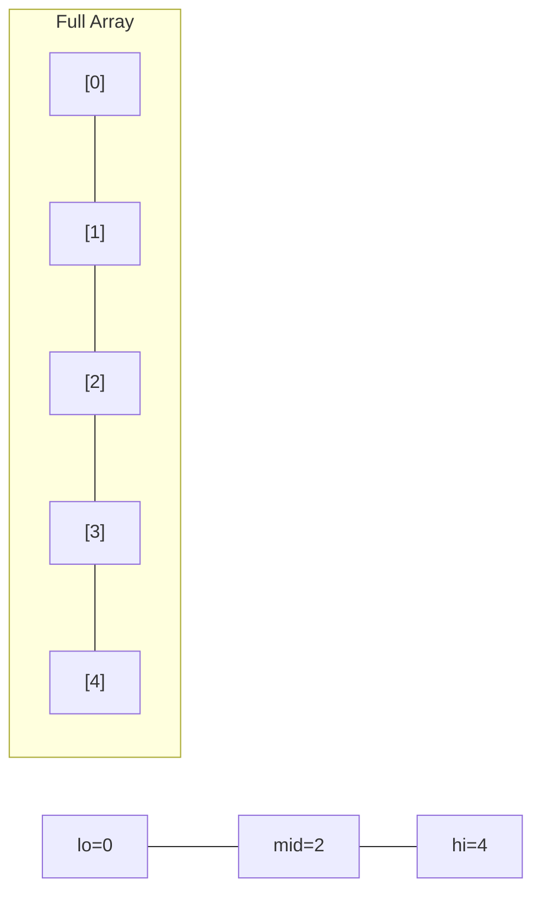
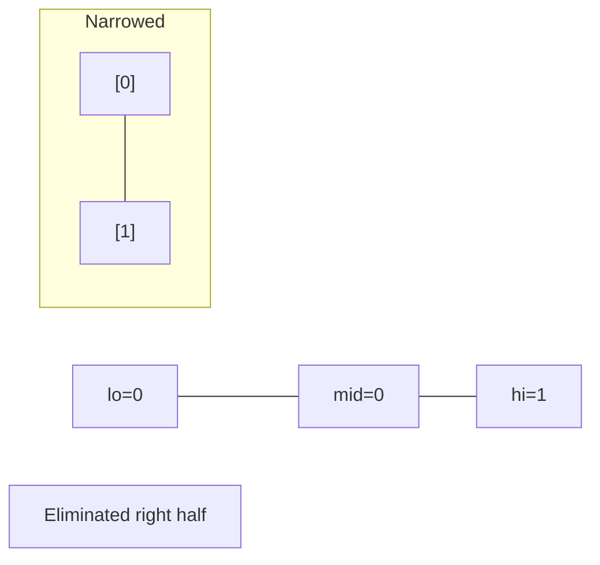
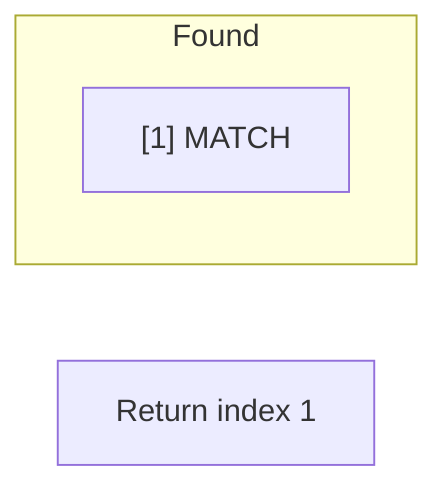

# Problem 374: Guess Number Higher or Lower

**Difficulty:** Easy  
**Tags:** Binary Search, Interactive  
**Pattern:** Binary Search  
**Link:** [leetcode.com/problems/guess-number-higher-or-lower](https://leetcode.com/problems/guess-number-higher-or-lower/)

## Description

We are playing the Guess Game. The game is as follows:

I pick a number from `1` to `n`. You have to guess which number I picked (the number I picked stays the same throughout the game).

Every time you guess wrong, I will tell you whether the number I picked is higher or lower than your guess.

You call a pre-defined API `int guess(int num)`, which returns three possible results:

	- `-1`: Your guess is higher than the number I picked (i.e. `num > pick`).
	- `1`: Your guess is lower than the number I picked (i.e. `num < pick`).
	- `0`: your guess is equal to the number I picked (i.e. `num == pick`).

Return *the number that I picked*.

 

Example 1:

```

**Input:** n = 10, pick = 6
**Output:** 6

```

Example 2:

```

**Input:** n = 1, pick = 1
**Output:** 1

```

Example 3:

```

**Input:** n = 2, pick = 1
**Output:** 1

```

 

**Constraints:**

	- `1 <= n <= 2^31 - 1`
	- `1 <= pick <= n`

## Approach: Binary Search

Use binary search to halve the search space each iteration. Define the search range [lo, hi], compute mid, and decide which half to keep based on the problem's monotonic condition.

## Pseudocode

```
1. lo = lower_bound, hi = upper_bound
2. While lo <= hi (or lo < hi):
   a. mid = (lo + hi) // 2
   b. If condition(mid) is satisfied: record answer, search left half
   c. Else: search right half
3. Return answer
```

## Algorithm Flow



## Visual State Transitions

**Binary Search Step-by-Step:**

**Frame 1: Initial search space**


**Frame 2: Compare mid, narrow search**


**Frame 3: Found target**



## Complexity Analysis

- **Time:** O(log n)
- **Space:** O(1)

## Solution (Python3)

```python
class Solution:
    def guessNumber(self, n: int) -> int:
        # Binary search - O(log n) time, O(1) space
        lo, hi = 0, len(n) - 1
        while lo <= hi:
            mid = lo + (hi - lo) // 2
            if n[mid] == n:
                return mid
            elif n[mid] < n:
                lo = mid + 1
            else:
                hi = mid - 1
        return 0
```

## Solution (C++)

```cpp
#include <string>
#include <vector>
using namespace std;

class Solution {
public:
    int guessNumber(int n) {
        // Binary search - O(log n) time, O(1) space
        int lo = 0, hi = n.size() - 1;
        while (lo <= hi) {
            int mid = lo + (hi - lo) / 2;
            if (n[mid] == n) {
                return mid;
            } else if (n[mid] < n) {
                lo = mid + 1;
            } else {
                hi = mid - 1;
            }
        }
        return 0;
    }
};
```
