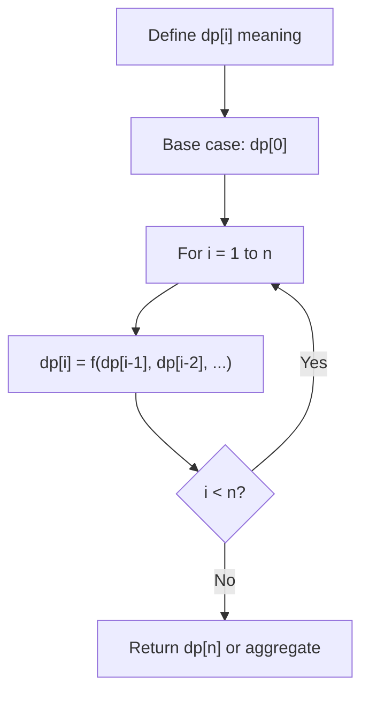
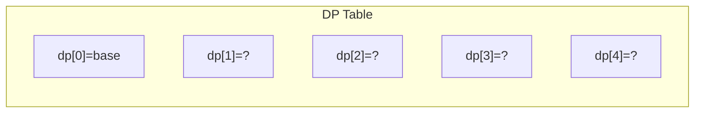
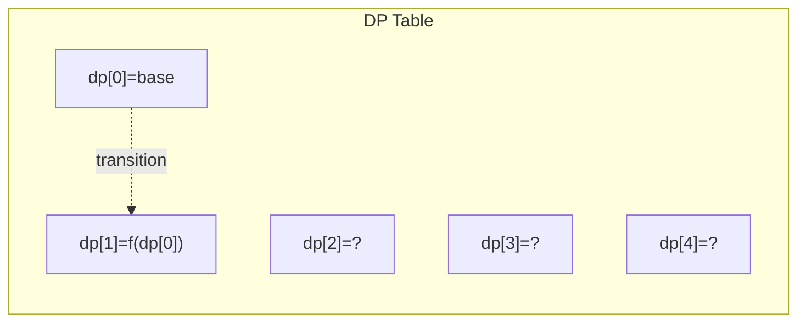
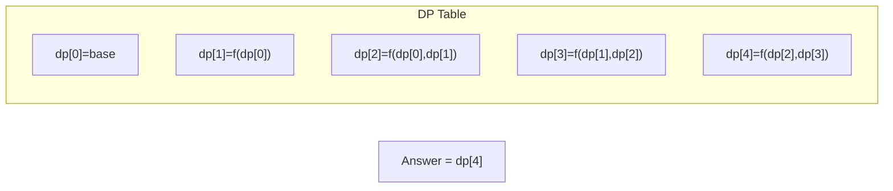

# Problem 375: Guess Number Higher or Lower II

**Difficulty:** Medium  
**Tags:** Math, Dynamic Programming, Game Theory  
**Pattern:** Dynamic Programming (1D)  
**Link:** [leetcode.com/problems/guess-number-higher-or-lower-ii](https://leetcode.com/problems/guess-number-higher-or-lower-ii/)

## Description

We are playing the Guessing Game. The game will work as follows:

	- I pick a number between `1` and `n`.
	- You guess a number.
	- If you guess the right number, **you win the game**.
	- If you guess the wrong number, then I will tell you whether the number I picked is **higher or lower**, and you will continue guessing.
	- Every time you guess a wrong number `x`, you will pay `x` dollars. If you run out of money, **you lose the game**.

Given a particular `n`, return *the minimum amount of money you need to **guarantee a win regardless of what number I pick***.

 

Example 1:

```

**Input:** n = 10
**Output:** 16
**Explanation:** The winning strategy is as follows:
- The range is [1,10]. Guess 7.
    - If this is my number, your total is $0. Otherwise, you pay $7.
    - If my number is higher, the range is [8,10]. Guess 9.
        - If this is my number, your total is $7. Otherwise, you pay $9.
        - If my number is higher, it must be 10. Guess 10. Your total is $7 + $9 = $16.
        - If my number is lower, it must be 8. Guess 8. Your total is $7 + $9 = $16.
    - If my number is lower, the range is [1,6]. Guess 3.
        - If this is my number, your total is $7. Otherwise, you pay $3.
        - If my number is higher, the range is [4,6]. Guess 5.
            - If this is my number, your total is $7 + $3 = $10. Otherwise, you pay $5.
            - If my number is higher, it must be 6. Guess 6. Your total is $7 + $3 + $5 = $15.
            - If my number is lower, it must be 4. Guess 4. Your total is $7 + $3 + $5 = $15.
        - If my number is lower, the range is [1,2]. Guess 1.
            - If this is my number, your total is $7 + $3 = $10. Otherwise, you pay $1.
            - If my number is higher, it must be 2. Guess 2. Your total is $7 + $3 + $1 = $11.
The worst case in all these scenarios is that you pay $16. Hence, you only need $16 to guarantee a win.

```

Example 2:

```

**Input:** n = 1
**Output:** 0
**Explanation:** There is only one possible number, so you can guess 1 and not have to pay anything.

```

Example 3:

```

**Input:** n = 2
**Output:** 1
**Explanation:** There are two possible numbers, 1 and 2.
- Guess 1.
    - If this is my number, your total is $0. Otherwise, you pay $1.
    - If my number is higher, it must be 2. Guess 2. Your total is $1.
The worst case is that you pay $1.

```

 

**Constraints:**

	- `1 <= n <= 200`

## Approach: Dynamic Programming (1D)

Break the problem into overlapping subproblems. Define dp[i] as the optimal value for the subproblem ending at or considering index i. Build the solution bottom-up, using previously computed dp values.

## Pseudocode

```
1. Define dp[i] = optimal value for subproblem i
2. Base case: dp[0] = initial value
3. For i from 1 to n:
   a. dp[i] = recurrence(dp[i-1], dp[i-2], ...)
4. Return dp[n] or max/min of dp
```

## Algorithm Flow



## Visual State Transitions

**1D Dynamic Programming Table Build:**

**Frame 1: Initialize base cases**


**Frame 2: Fill dp[1] from dp[0]**


**Frame 3: Fill remaining cells**



## Complexity Analysis

- **Time:** O(n)
- **Space:** O(n)

## Solution (Python3)

```python
class Solution:
    def getMoneyAmount(self, n: int) -> int:
        # Dynamic programming (1D) - O(n) time, O(n) space
        if not n:
            return 0
        n = len(n) if isinstance(n, list) else n
        dp = [0] * (n + 1)
        dp[0] = 1  # base case
        for i in range(1, n + 1):
            dp[i] = dp[i-1]  # transition (customize per problem)
            if i >= 2:
                dp[i] += dp[i-2]
        return dp[n]
```

## Solution (C++)

```cpp
#include <string>
#include <vector>
using namespace std;

class Solution {
public:
    int getMoneyAmount(int n) {
        // Dynamic programming (1D) - O(n) time, O(n) space
        int n = n;
        if (n <= 0) return 0;
        vector<int> dp(n + 1, 0);
        dp[0] = 1;
        for (int i = 1; i <= n; i++) {
            dp[i] = dp[i-1];
            if (i >= 2) dp[i] += dp[i-2];
        }
        return dp[n];
    }
};
```
