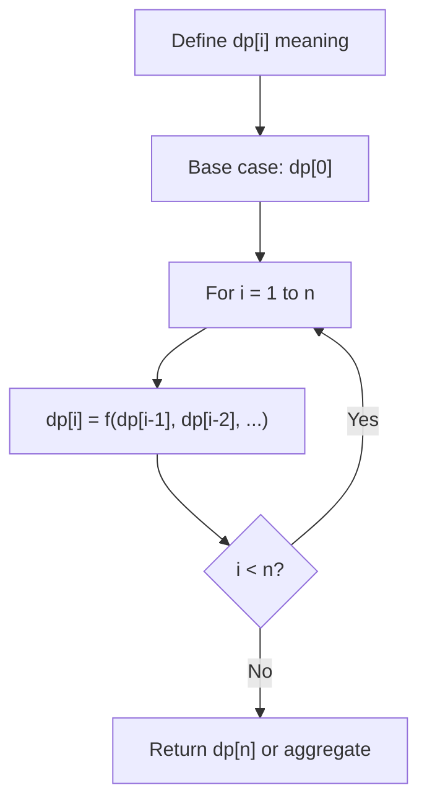
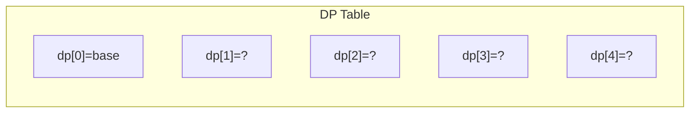
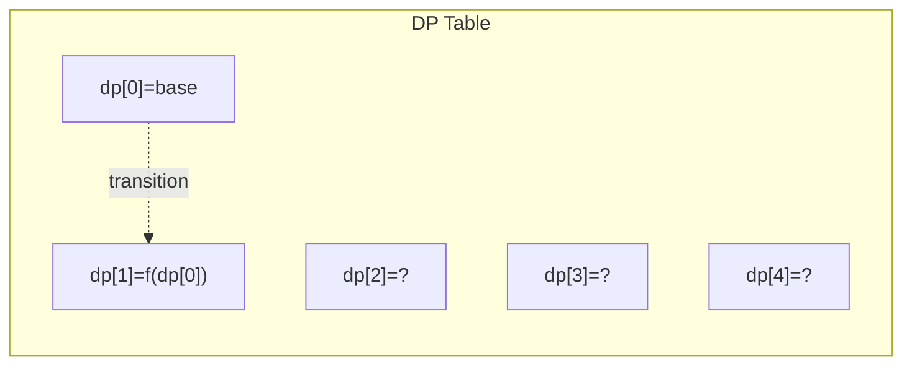
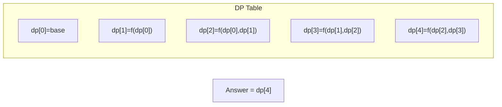

# Problem 376: Wiggle Subsequence

**Difficulty:** Medium  
**Tags:** Array, Dynamic Programming, Greedy  
**Pattern:** Dynamic Programming (1D)  
**Link:** [leetcode.com/problems/wiggle-subsequence](https://leetcode.com/problems/wiggle-subsequence/)

## Description

A **wiggle sequence** is a sequence where the differences between successive numbers strictly alternate between positive and negative. The first difference (if one exists) may be either positive or negative. A sequence with one element and a sequence with two non-equal elements are trivially wiggle sequences.

	- For example, `[1, 7, 4, 9, 2, 5]` is a **wiggle sequence** because the differences `(6, -3, 5, -7, 3)` alternate between positive and negative.
	- In contrast, `[1, 4, 7, 2, 5]` and `[1, 7, 4, 5, 5]` are not wiggle sequences. The first is not because its first two differences are positive, and the second is not because its last difference is zero.

A **subsequence** is obtained by deleting some elements (possibly zero) from the original sequence, leaving the remaining elements in their original order.

Given an integer array `nums`, return *the length of the longest **wiggle subsequence** of *`nums`.

 

Example 1:

```

**Input:** nums = [1,7,4,9,2,5]
**Output:** 6
**Explanation:** The entire sequence is a wiggle sequence with differences (6, -3, 5, -7, 3).

```

Example 2:

```

**Input:** nums = [1,17,5,10,13,15,10,5,16,8]
**Output:** 7
**Explanation:** There are several subsequences that achieve this length.
One is [1, 17, 10, 13, 10, 16, 8] with differences (16, -7, 3, -3, 6, -8).

```

Example 3:

```

**Input:** nums = [1,2,3,4,5,6,7,8,9]
**Output:** 2

```

 

**Constraints:**

	- `1 <= nums.length <= 1000`
	- `0 <= nums[i] <= 1000`

 

**Follow up:** Could you solve this in `O(n)` time?

## Approach: Dynamic Programming (1D)

Break the problem into overlapping subproblems. Define dp[i] as the optimal value for the subproblem ending at or considering index i. Build the solution bottom-up, using previously computed dp values.

## Pseudocode

```
1. Define dp[i] = optimal value for subproblem i
2. Base case: dp[0] = initial value
3. For i from 1 to n:
   a. dp[i] = recurrence(dp[i-1], dp[i-2], ...)
4. Return dp[n] or max/min of dp
```

## Algorithm Flow



## Visual State Transitions

**1D Dynamic Programming Table Build:**

**Frame 1: Initialize base cases**


**Frame 2: Fill dp[1] from dp[0]**


**Frame 3: Fill remaining cells**



## Complexity Analysis

- **Time:** O(n)
- **Space:** O(n)

## Solution (Python3)

```python
class Solution:
    def wiggleMaxLength(self, nums: List[int]) -> int:
        # Dynamic programming (1D) - O(n) time, O(n) space
        if not nums:
            return 0
        n = len(nums) if isinstance(nums, list) else nums
        dp = [0] * (n + 1)
        dp[0] = 1  # base case
        for i in range(1, n + 1):
            dp[i] = dp[i-1]  # transition (customize per problem)
            if i >= 2:
                dp[i] += dp[i-2]
        return dp[n]
```

## Solution (C++)

```cpp
#include <string>
#include <vector>
using namespace std;

class Solution {
public:
    int wiggleMaxLength(vector<int>& nums) {
        // Dynamic programming (1D) - O(n) time, O(n) space
        int n = nums;
        if (n <= 0) return 0;
        vector<int> dp(n + 1, 0);
        dp[0] = 1;
        for (int i = 1; i <= n; i++) {
            dp[i] = dp[i-1];
            if (i >= 2) dp[i] += dp[i-2];
        }
        return dp[n];
    }
};
```
