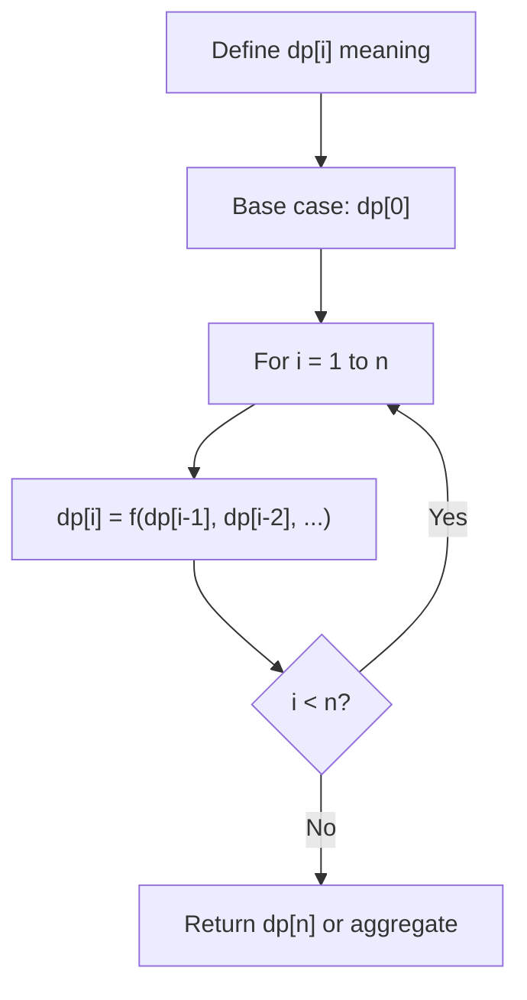
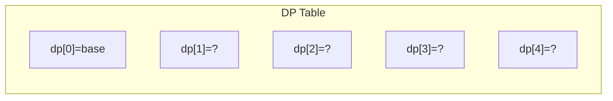
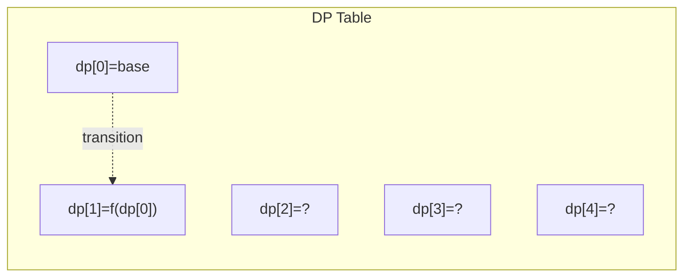
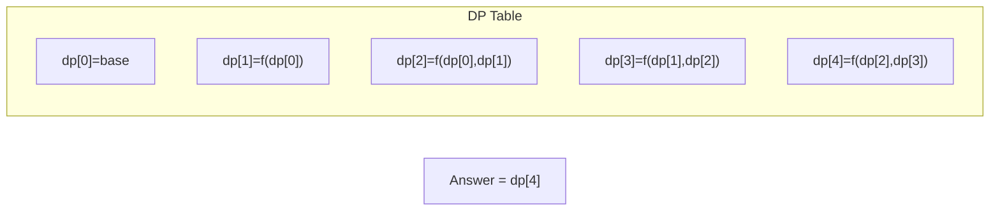

# Problem 377: Combination Sum IV

**Difficulty:** Medium  
**Tags:** Array, Dynamic Programming  
**Pattern:** Dynamic Programming (1D)  
**Link:** [leetcode.com/problems/combination-sum-iv](https://leetcode.com/problems/combination-sum-iv/)

## Description

Given an array of **distinct** integers `nums` and a target integer `target`, return *the number of possible combinations that add up to* `target`.

The test cases are generated so that the answer can fit in a **32-bit** integer.

 

Example 1:

```

**Input:** nums = [1,2,3], target = 4
**Output:** 7
**Explanation:**
The possible combination ways are:
(1, 1, 1, 1)
(1, 1, 2)
(1, 2, 1)
(1, 3)
(2, 1, 1)
(2, 2)
(3, 1)
Note that different sequences are counted as different combinations.

```

Example 2:

```

**Input:** nums = [9], target = 3
**Output:** 0

```

 

**Constraints:**

	- `1 <= nums.length <= 200`
	- `1 <= nums[i] <= 1000`
	- All the elements of `nums` are **unique**.
	- `1 <= target <= 1000`

 

**Follow up:** What if negative numbers are allowed in the given array? How does it change the problem? What limitation we need to add to the question to allow negative numbers?

## Approach: Dynamic Programming (1D)

Break the problem into overlapping subproblems. Define dp[i] as the optimal value for the subproblem ending at or considering index i. Build the solution bottom-up, using previously computed dp values.

## Pseudocode

```
1. Define dp[i] = optimal value for subproblem i
2. Base case: dp[0] = initial value
3. For i from 1 to n:
   a. dp[i] = recurrence(dp[i-1], dp[i-2], ...)
4. Return dp[n] or max/min of dp
```

## Algorithm Flow



## Visual State Transitions

**1D Dynamic Programming Table Build:**

**Frame 1: Initialize base cases**


**Frame 2: Fill dp[1] from dp[0]**


**Frame 3: Fill remaining cells**



## Complexity Analysis

- **Time:** O(n)
- **Space:** O(n)

## Solution (Python3)

```python
class Solution:
    def combinationSum4(self, nums: List[int], target: int) -> int:
        # Dynamic programming (1D) - O(n) time, O(n) space
        if not nums:
            return 0
        n = len(nums) if isinstance(nums, list) else nums
        dp = [0] * (n + 1)
        dp[0] = 1  # base case
        for i in range(1, n + 1):
            dp[i] = dp[i-1]  # transition (customize per problem)
            if i >= 2:
                dp[i] += dp[i-2]
        return dp[n]
```

## Solution (C++)

```cpp
#include <string>
#include <vector>
using namespace std;

class Solution {
public:
    int combinationSum4(vector<int>& nums, int target) {
        // Dynamic programming (1D) - O(n) time, O(n) space
        int n = nums;
        if (n <= 0) return 0;
        vector<int> dp(n + 1, 0);
        dp[0] = 1;
        for (int i = 1; i <= n; i++) {
            dp[i] = dp[i-1];
            if (i >= 2) dp[i] += dp[i-2];
        }
        return dp[n];
    }
};
```
