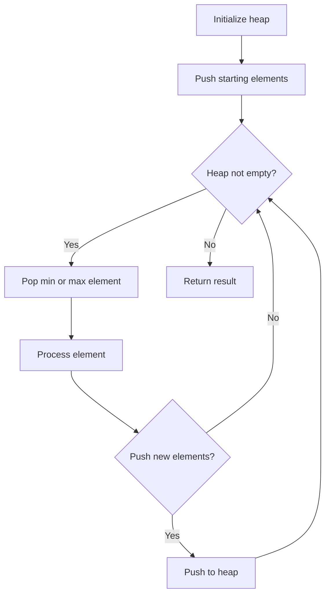
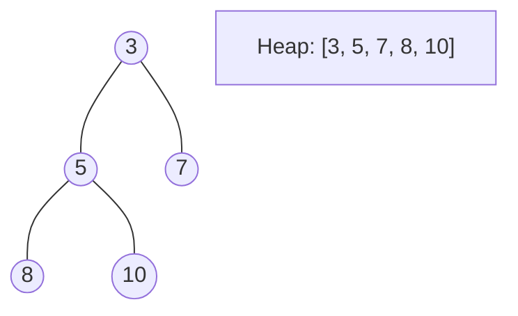
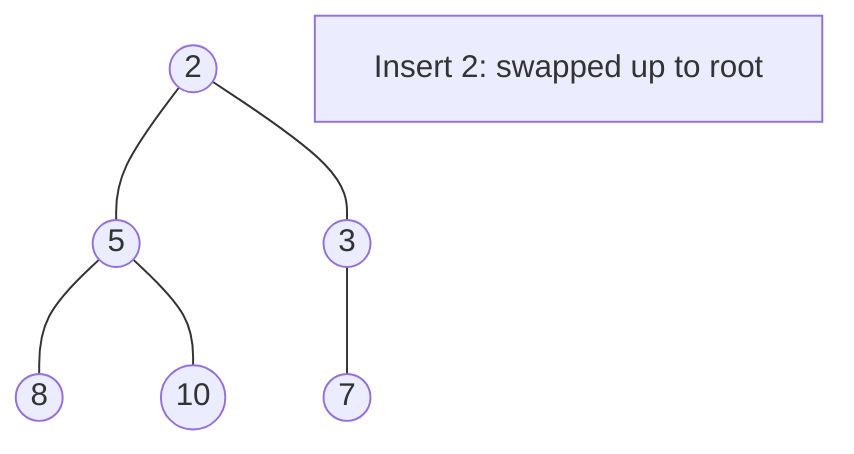
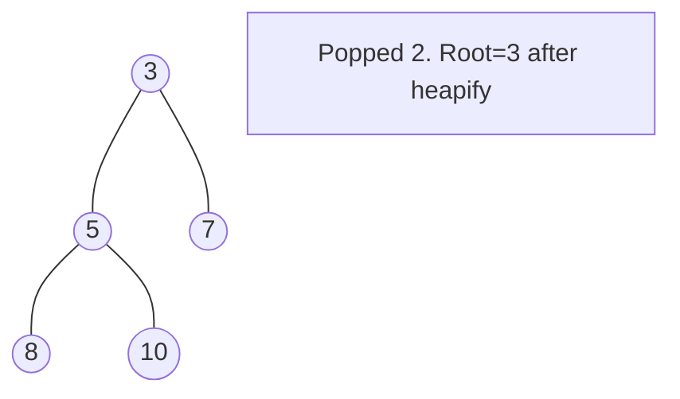

# Problem 378: Kth Smallest Element in a Sorted Matrix

**Difficulty:** Medium  
**Tags:** Array, Binary Search, Sorting, Heap (Priority Queue), Matrix  
**Pattern:** Heap / Priority Queue  
**Link:** [leetcode.com/problems/kth-smallest-element-in-a-sorted-matrix](https://leetcode.com/problems/kth-smallest-element-in-a-sorted-matrix/)

## Description

Given an `n x n` `matrix` where each of the rows and columns is sorted in ascending order, return *the* `k^th` *smallest element in the matrix*.

Note that it is the `k^th` smallest element **in the sorted order**, not the `k^th` **distinct** element.

You must find a solution with a memory complexity better than `O(n^2)`.

 

Example 1:

```

**Input:** matrix = [[1,5,9],[10,11,13],[12,13,15]], k = 8
**Output:** 13
**Explanation:** The elements in the matrix are [1,5,9,10,11,12,13,**13**,15], and the 8th smallest number is 13

```

Example 2:

```

**Input:** matrix = [[-5]], k = 1
**Output:** -5

```

 

**Constraints:**

	- `n == matrix.length == matrix[i].length`
	- `1 <= n <= 300`
	- `-10^9 <= matrix[i][j] <= 10^9`
	- All the rows and columns of `matrix` are **guaranteed** to be sorted in **non-decreasing order**.
	- `1 <= k <= n^2`

 

**Follow up:**

	- Could you solve the problem with a constant memory (i.e., `O(1)` memory complexity)?
	- Could you solve the problem in `O(n)` time complexity? The solution may be too advanced for an interview but you may find reading this paper fun.

## Approach: Heap / Priority Queue

Use a min-heap or max-heap to efficiently access the smallest/largest element. Push elements and pop the top to process in priority order.

## Pseudocode

```
1. Initialize heap (min or max)
2. Push initial elements onto heap
3. While heap not empty and condition:
   a. Pop top element (min or max)
   b. Process element
   c. Push new elements if needed
4. Return result
```

## Algorithm Flow



## Visual State Transitions

**Heap Operations (Min-Heap):**

**Frame 1: Initial heap**


**Frame 2: Insert 2 - bubble up**


**Frame 3: Pop minimum (2) - heapify down**



## Complexity Analysis

- **Time:** O(n log n)
- **Space:** O(n)

## Solution (Python3)

```python
class Solution:
    def kthSmallest(self, matrix: List[List[int]], k: int) -> int:
        # Heap/Priority Queue - O(n log k) time
        import heapq
        if not matrix:
            return 0
        # Min heap (negate for max heap)
        heap = []
        for val in matrix:
            heapq.heappush(heap, val)
            if len(heap) > (k if isinstance(k, int) else len(matrix)):
                heapq.heappop(heap)
        return heap[0] if heap else 0
```

## Solution (C++)

```cpp
#include <queue>
#include <string>
#include <vector>
using namespace std;

class Solution {
public:
    int kthSmallest(vector<vector<int>>& matrix, int k) {
        // Heap/Priority Queue - O(n log k) time
        priority_queue<int, vector<int>, greater<int>> pq;
        for (int val : matrix) {
            pq.push(val);
            if ((int)pq.size() > k)
                pq.pop();
        }
        return pq.empty() ? 0 : pq.top();
    }
};
```
