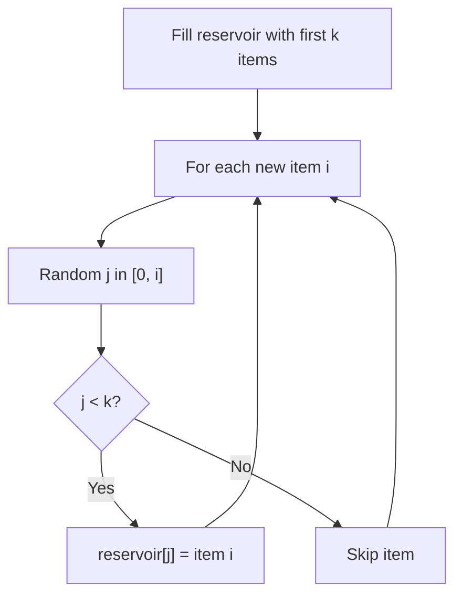

# Problem 382: Linked List Random Node

**Difficulty:** Medium  
**Tags:** Linked List, Math, Reservoir Sampling, Randomized  
**Pattern:** Reservoir Sampling  
**Link:** [leetcode.com/problems/linked-list-random-node](https://leetcode.com/problems/linked-list-random-node/)

## Description

Given a singly linked list, return a random node's value from the linked list. Each node must have the **same probability** of being chosen.

Implement the `Solution` class:

	- `Solution(ListNode head)` Initializes the object with the head of the singly-linked list `head`.
	- `int getRandom()` Chooses a node randomly from the list and returns its value. All the nodes of the list should be equally likely to be chosen.

 

Example 1:

```

**Input**
["Solution", "getRandom", "getRandom", "getRandom", "getRandom", "getRandom"]
[[[1, 2, 3]], [], [], [], [], []]
**Output**
[null, 1, 3, 2, 2, 3]

**Explanation**
Solution solution = new Solution([1, 2, 3]);
solution.getRandom(); // return 1
solution.getRandom(); // return 3
solution.getRandom(); // return 2
solution.getRandom(); // return 2
solution.getRandom(); // return 3
// getRandom() should return either 1, 2, or 3 randomly. Each element should have equal probability of returning.

```

 

**Constraints:**

	- The number of nodes in the linked list will be in the range `[1, 10^4]`.
	- `-10^4 <= Node.val <= 10^4`
	- At most `10^4` calls will be made to `getRandom`.

 

**Follow up:**

	- What if the linked list is extremely large and its length is unknown to you?
	- Could you solve this efficiently without using extra space?

## Approach: Reservoir Sampling

Select k random items from a stream of unknown length with uniform probability. Keep a reservoir of k items; replace items with decreasing probability.

## Pseudocode

```
1. Fill reservoir with first k items
2. For each subsequent item i (i >= k):
   a. Generate random j in [0, i]
   b. If j < k: replace reservoir[j] with item i
3. Return reservoir
```

## Algorithm Flow



## Complexity Analysis

- **Time:** O(n)
- **Space:** O(k)

## Solution (Python3)

```python
class Solution:
    def __init__(self, head: Optional[ListNode]):
        # Initialize data structure
        self.head = head

    def getRandom(self) -> int:
        return 0

```

## Solution (C++)

```cpp
#include <cstdlib>
#include <ctime>
#include <string>
#include <vector>
using namespace std;

class Solution {
public:
    Solution(ListNode* head) {
        // Initialize
    }

    int getRandom() {
        return 0;
    }

};
```
