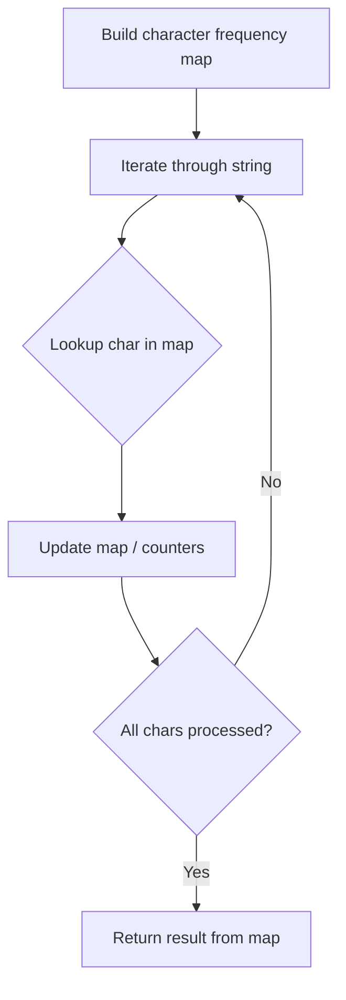

# Problem 383: Ransom Note

**Difficulty:** Easy  
**Tags:** Hash Table, String, Counting  
**Pattern:** Hash Map String Processing  
**Link:** [leetcode.com/problems/ransom-note](https://leetcode.com/problems/ransom-note/)

## Description

Given two strings `ransomNote` and `magazine`, return `true`* if *`ransomNote`* can be constructed by using the letters from *`magazine`* and *`false`* otherwise*.

Each letter in `magazine` can only be used once in `ransomNote`.

 

Example 1:

```
**Input:** ransomNote = "a", magazine = "b"
**Output:** false

```
Example 2:

```
**Input:** ransomNote = "aa", magazine = "ab"
**Output:** false

```
Example 3:

```
**Input:** ransomNote = "aa", magazine = "aab"
**Output:** true

```

 

**Constraints:**

	- `1 <= ransomNote.length, magazine.length <= 10^5`
	- `ransomNote` and `magazine` consist of lowercase English letters.

## Approach: Hash Map String Processing

Use a hash map to count character frequencies or map characters/strings for O(1) lookups. Process the string in one or two passes.

## Pseudocode

```
1. Build frequency map / char-to-index map
2. Iterate through string:
   a. Look up character in map
   b. Update counts or mappings
3. Return result based on map state
```

## Algorithm Flow



## Complexity Analysis

- **Time:** O(n)
- **Space:** O(n)

## Solution (Python3)

```python
class Solution:
    def canConstruct(self, ransomNote: str, magazine: str) -> bool:
        # Hash map for string/character frequency - O(n) time
        freq = {}
        for ch in ransomNote:
            freq[ch] = freq.get(ch, 0) + 1
        # Process frequency map
        for ch, cnt in freq.items():
            if cnt == 1:
                return ransomNote.index(ch)
        return False
```

## Solution (C++)

```cpp
#include <string>
#include <unordered_map>
#include <vector>
using namespace std;

class Solution {
public:
    bool canConstruct(string& ransomNote, string& magazine) {
        // Hash map for string/character frequency - O(n) time
        unordered_map<char, int> freq;
        for (char ch : ransomNote) {
            freq[ch]++;
        }
        // Process frequency map
        for (int i = 0; i < ransomNote.size(); i++) {
            if (freq[ransomNote[i]] == 1) return i;
        }
        return false;
    }
};
```
