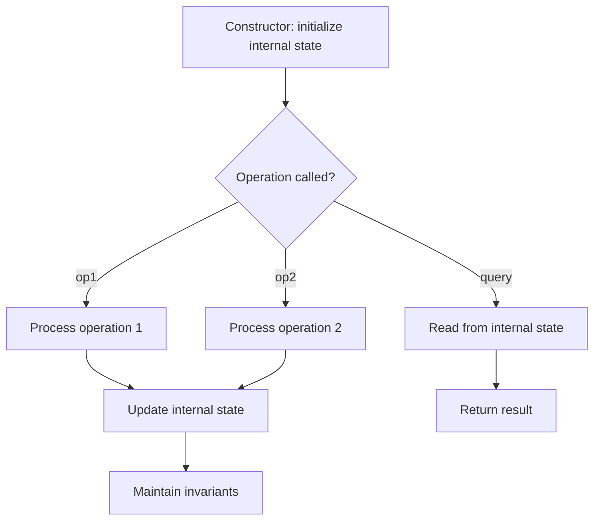

# Problem 384: Shuffle an Array

**Difficulty:** Medium  
**Tags:** Array, Math, Design, Randomized  
**Pattern:** Design  
**Link:** [leetcode.com/problems/shuffle-an-array](https://leetcode.com/problems/shuffle-an-array/)

## Description

Given an integer array `nums`, design an algorithm to randomly shuffle the array. All permutations of the array should be **equally likely** as a result of the shuffling.

Implement the `Solution` class:

	- `Solution(int[] nums)` Initializes the object with the integer array `nums`.
	- `int[] reset()` Resets the array to its original configuration and returns it.
	- `int[] shuffle()` Returns a random shuffling of the array.

 

Example 1:

```

**Input**
["Solution", "shuffle", "reset", "shuffle"]
[[[1, 2, 3]], [], [], []]
**Output**
[null, [3, 1, 2], [1, 2, 3], [1, 3, 2]]

**Explanation**
Solution solution = new Solution([1, 2, 3]);
solution.shuffle();    // Shuffle the array [1,2,3] and return its result.
                       // Any permutation of [1,2,3] must be equally likely to be returned.
                       // Example: return [3, 1, 2]
solution.reset();      // Resets the array back to its original configuration [1,2,3]. Return [1, 2, 3]
solution.shuffle();    // Returns the random shuffling of array [1,2,3]. Example: return [1, 3, 2]

```

 

**Constraints:**

	- `1 <= nums.length <= 50`
	- `-10^6 <= nums[i] <= 10^6`
	- All the elements of `nums` are **unique**.
	- At most `10^4` calls **in total** will be made to `reset` and `shuffle`.

## Approach: Design

Design a data structure or system that supports specific operations efficiently. Choose appropriate underlying data structures (hash map, linked list, heap, etc.).

## Pseudocode

```
1. Choose data structures for internal state
2. Implement constructor: initialize state
3. Implement each operation:
   - Maintain invariants
   - Optimize for target time complexity
4. Handle edge cases
```

## Algorithm Flow



## Complexity Analysis

- **Time:** O(1) per operation
- **Space:** O(n)

## Solution (Python3)

```python
class Solution:
    def __init__(self, nums: List[int]):
        # Initialize data structure
        self.nums = nums

    def reset(self) -> List[int]:
        return []

    def shuffle(self) -> List[int]:
        return []

```

## Solution (C++)

```cpp
#include <string>
#include <vector>
using namespace std;

class Solution {
public:
    Solution(vector<int>& nums) {
        // Initialize
    }

    vector<int> reset() {
        return {};
    }

    vector<int> shuffle() {
        return {};
    }

};
```
