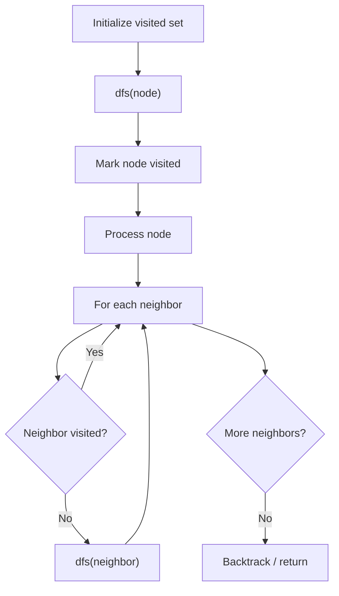

# Problem 385: Mini Parser

**Difficulty:** Medium  
**Tags:** String, Stack, Depth-First Search  
**Pattern:** DFS Graph Traversal  
**Link:** [leetcode.com/problems/mini-parser](https://leetcode.com/problems/mini-parser/)

## Description

Given a string s represents the serialization of a nested list, implement a parser to deserialize it and return *the deserialized* `NestedInteger`.

Each element is either an integer or a list whose elements may also be integers or other lists.

 

Example 1:

```

**Input:** s = "324"
**Output:** 324
**Explanation:** You should return a NestedInteger object which contains a single integer 324.

```

Example 2:

```

**Input:** s = "[123,[456,[789]]]"
**Output:** [123,[456,[789]]]
**Explanation:** Return a NestedInteger object containing a nested list with 2 elements:
1. An integer containing value 123.
2. A nested list containing two elements:
    i.  An integer containing value 456.
    ii. A nested list with one element:
         a. An integer containing value 789

```

 

**Constraints:**

	- `1 <= s.length <= 5 * 10^4`
	- `s` consists of digits, square brackets `"[]"`, negative sign `'-'`, and commas `','`.
	- `s` is the serialization of valid `NestedInteger`.
	- All the values in the input are in the range `[-10^6, 10^6]`.

## Approach: DFS Graph Traversal

Explore the graph depth-first using recursion or a stack. Mark nodes as visited to avoid cycles. Process each node and explore all unvisited neighbors.

## Pseudocode

```
1. Initialize visited set
2. Define dfs(node):
   a. Mark node as visited
   b. Process node
   c. For each neighbor of node:
      - If not visited: dfs(neighbor)
3. Call dfs(start) for each unvisited node
```

## Algorithm Flow



## Complexity Analysis

- **Time:** O(V + E)
- **Space:** O(V)

## Solution (Python3)

```python
class Solution:
    def deserialize(self, s: str) -> NestedInteger:
        # DFS on graph - O(V+E) time
        visited = set()
        result = []
        
        def dfs(node):
            if node in visited:
                return
            visited.add(node)
            result.append(node)
            # Traverse neighbors (adjust based on adjacency representation)
        
        dfs(0)
        return result if isinstance(None, list) else len(result)
```

## Solution (C++)

```cpp
#include <functional>
#include <string>
#include <vector>
using namespace std;

class Solution {
public:
    NestedInteger deserialize(string& s) {
        // DFS on graph - O(V+E) time
        vector<bool> visited(s.size(), false);
        vector<int> result;
        function<void(int)> dfs = [&](int node) {
            if (visited[node]) return;
            visited[node] = true;
            result.push_back(node);
            // Traverse neighbors
        };
        dfs(0);
        return result;
    }
};
```
