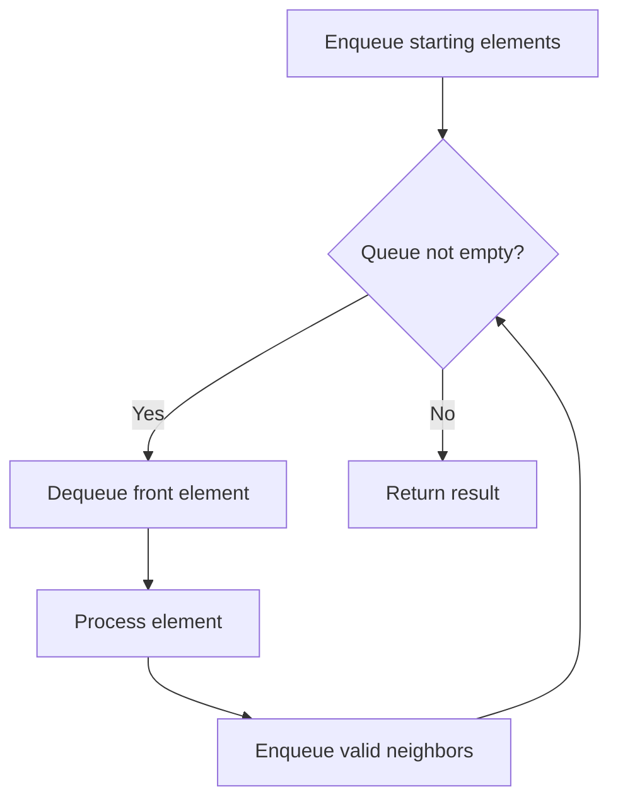

# Problem 387: First Unique Character in a String

**Difficulty:** Easy  
**Tags:** Hash Table, String, Queue, Counting  
**Pattern:** Queue / BFS  
**Link:** [leetcode.com/problems/first-unique-character-in-a-string](https://leetcode.com/problems/first-unique-character-in-a-string/)

## Description

Given a string `s`, find the **first** non-repeating character in it and return its index. If it **does not** exist, return `-1`.

 

Example 1:

**Input:** s = "leetcode"

**Output:** 0

**Explanation:**

The character `'l'` at index 0 is the first character that does not occur at any other index.

Example 2:

**Input:** s = "loveleetcode"

**Output:** 2

Example 3:

**Input:** s = "aabb"

**Output:** -1

 

**Constraints:**

	- `1 <= s.length <= 10^5`
	- `s` consists of only lowercase English letters.

## Approach: Queue / BFS

Use a queue (FIFO) for level-order or breadth-first processing. Enqueue starting elements, then process level by level.

## Pseudocode

```
1. Initialize queue with starting element(s)
2. While queue is not empty:
   a. Dequeue front element
   b. Process element
   c. Enqueue valid neighbors/children
3. Return result
```

## Algorithm Flow



## Complexity Analysis

- **Time:** O(n)
- **Space:** O(n)

## Solution (Python3)

```python
class Solution:
    def firstUniqChar(self, s: str) -> int:
        # Queue-based approach - O(n) time
        from collections import deque
        queue = deque()
        for val in s:
            queue.append(val)
        result = []
        while queue:
            result.append(queue.popleft())
        return result
```

## Solution (C++)

```cpp
#include <queue>
#include <string>
#include <vector>
using namespace std;

class Solution {
public:
    int firstUniqChar(string& s) {
        // Queue-based approach - O(n) time
        queue<int> q;
        for (int val : s) {
            q.push(val);
        }
        vector<int> result;
        while (!q.empty()) {
            result.push_back(q.front());
            q.pop();
        }
        return result;
    }
};
```
