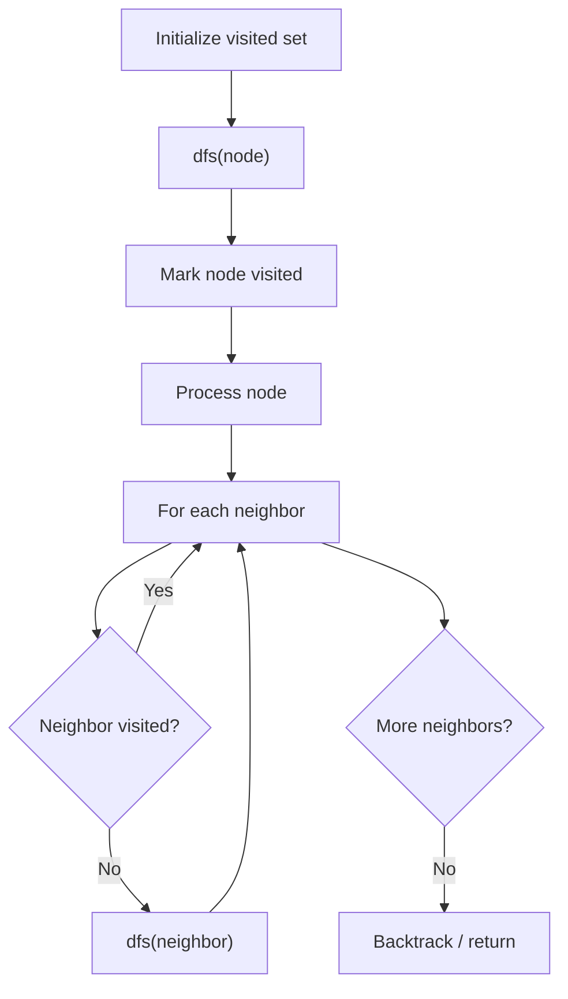

# Problem 388: Longest Absolute File Path

**Difficulty:** Medium  
**Tags:** String, Stack, Depth-First Search  
**Pattern:** DFS Graph Traversal  
**Link:** [leetcode.com/problems/longest-absolute-file-path](https://leetcode.com/problems/longest-absolute-file-path/)

## Description

Suppose we have a file system that stores both files and directories. An example of one system is represented in the following picture:

Here, we have `dir` as the only directory in the root. `dir` contains two subdirectories, `subdir1` and `subdir2`. `subdir1` contains a file `file1.ext` and subdirectory `subsubdir1`. `subdir2` contains a subdirectory `subsubdir2`, which contains a file `file2.ext`.

In text form, it looks like this (with ⟶ representing the tab character):

```

dir
⟶ subdir1
⟶ ⟶ file1.ext
⟶ ⟶ subsubdir1
⟶ subdir2
⟶ ⟶ subsubdir2
⟶ ⟶ ⟶ file2.ext

```

If we were to write this representation in code, it will look like this: `"dir\n\tsubdir1\n\t\tfile1.ext\n\t\tsubsubdir1\n\tsubdir2\n\t\tsubsubdir2\n\t\t\tfile2.ext"`. Note that the `'\n'` and `'\t'` are the new-line and tab characters.

Every file and directory has a unique **absolute path** in the file system, which is the order of directories that must be opened to reach the file/directory itself, all concatenated by `'/'s`. Using the above example, the **absolute path** to `file2.ext` is `"dir/subdir2/subsubdir2/file2.ext"`. Each directory name consists of letters, digits, and/or spaces. Each file name is of the form `name.extension`, where `name` and `extension` consist of letters, digits, and/or spaces.

Given a string `input` representing the file system in the explained format, return *the length of the **longest absolute path** to a **file** in the abstracted file system*. If there is no file in the system, return `0`.

**Note** that the testcases are generated such that the file system is valid and no file or directory name has length 0.

 

Example 1:

```

**Input:** input = "dir\n\tsubdir1\n\tsubdir2\n\t\tfile.ext"
**Output:** 20
**Explanation:** We have only one file, and the absolute path is "dir/subdir2/file.ext" of length 20.

```

Example 2:

```

**Input:** input = "dir\n\tsubdir1\n\t\tfile1.ext\n\t\tsubsubdir1\n\tsubdir2\n\t\tsubsubdir2\n\t\t\tfile2.ext"
**Output:** 32
**Explanation:** We have two files:
"dir/subdir1/file1.ext" of length 21
"dir/subdir2/subsubdir2/file2.ext" of length 32.
We return 32 since it is the longest absolute path to a file.

```

Example 3:

```

**Input:** input = "a"
**Output:** 0
**Explanation:** We do not have any files, just a single directory named "a".

```

 

**Constraints:**

	- `1 <= input.length <= 10^4`
	- `input` may contain lowercase or uppercase English letters, a new line character `'\n'`, a tab character `'\t'`, a dot `'.'`, a space `' '`, and digits.
	- All file and directory names have **positive** length.

## Approach: DFS Graph Traversal

Explore the graph depth-first using recursion or a stack. Mark nodes as visited to avoid cycles. Process each node and explore all unvisited neighbors.

## Pseudocode

```
1. Initialize visited set
2. Define dfs(node):
   a. Mark node as visited
   b. Process node
   c. For each neighbor of node:
      - If not visited: dfs(neighbor)
3. Call dfs(start) for each unvisited node
```

## Algorithm Flow



## Complexity Analysis

- **Time:** O(V + E)
- **Space:** O(V)

## Solution (Python3)

```python
class Solution:
    def lengthLongestPath(self, input: str) -> int:
        # DFS on graph - O(V+E) time
        visited = set()
        result = []
        
        def dfs(node):
            if node in visited:
                return
            visited.add(node)
            result.append(node)
            # Traverse neighbors (adjust based on adjacency representation)
        
        dfs(0)
        return result if isinstance(0, list) else len(result)
```

## Solution (C++)

```cpp
#include <functional>
#include <string>
#include <vector>
using namespace std;

class Solution {
public:
    int lengthLongestPath(string& input) {
        // DFS on graph - O(V+E) time
        vector<bool> visited(input.size(), false);
        vector<int> result;
        function<void(int)> dfs = [&](int node) {
            if (visited[node]) return;
            visited[node] = true;
            result.push_back(node);
            // Traverse neighbors
        };
        dfs(0);
        return result;
    }
};
```
