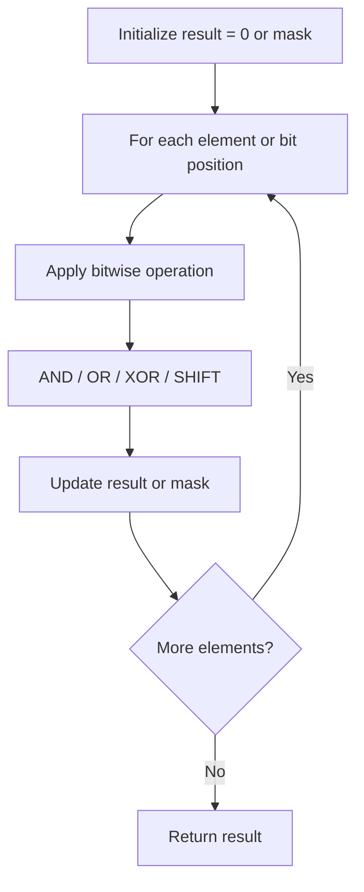

# Problem 389: Find the Difference

**Difficulty:** Easy  
**Tags:** Hash Table, String, Bit Manipulation, Sorting  
**Pattern:** Bit Manipulation  
**Link:** [leetcode.com/problems/find-the-difference](https://leetcode.com/problems/find-the-difference/)

## Description

You are given two strings `s` and `t`.

String `t` is generated by random shuffling string `s` and then add one more letter at a random position.

Return the letter that was added to `t`.

 

Example 1:

```

**Input:** s = "abcd", t = "abcde"
**Output:** "e"
**Explanation:** 'e' is the letter that was added.

```

Example 2:

```

**Input:** s = "", t = "y"
**Output:** "y"

```

 

**Constraints:**

	- `0 <= s.length <= 1000`
	- `t.length == s.length + 1`
	- `s` and `t` consist of lowercase English letters.

## Approach: Bit Manipulation

Operate on individual bits using bitwise operators (AND, OR, XOR, shift). Common tricks: x & (x-1) removes lowest set bit, x ^ x = 0, XOR all elements to find unique.

## Pseudocode

```
1. Apply bitwise operations:
   - XOR all elements to cancel paired bits
   - Use bitmask to track state
   - Shift and mask to extract/set individual bits
2. Return result
```

## Algorithm Flow



## Complexity Analysis

- **Time:** O(n) or O(log n)
- **Space:** O(1)

## Solution (Python3)

```python
class Solution:
    def findTheDifference(self, s: str, t: str) -> str:
        # Bit manipulation - O(n) time, O(1) space
        result = 0
        for val in s:
            result ^= val
        return result
```

## Solution (C++)

```cpp
#include <string>
#include <vector>
using namespace std;

class Solution {
public:
    string findTheDifference(string& s, string& t) {
        // Bit manipulation - O(n) time, O(1) space
        int result = 0;
        for (int val : s) {
            result ^= val;
        }
        return result;
    }
};
```
