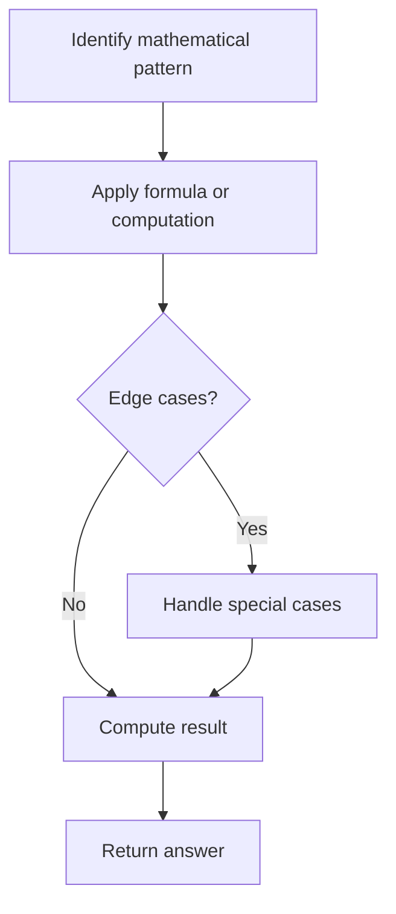

# Problem 390: Elimination Game

**Difficulty:** Medium  
**Tags:** Math, Recursion  
**Pattern:** Math  
**Link:** [leetcode.com/problems/elimination-game](https://leetcode.com/problems/elimination-game/)

## Description

You have a list `arr` of all integers in the range `[1, n]` sorted in a strictly increasing order. Apply the following algorithm on `arr`:

	- Starting from left to right, remove the first number and every other number afterward until you reach the end of the list.
	- Repeat the previous step again, but this time from right to left, remove the rightmost number and every other number from the remaining numbers.
	- Keep repeating the steps again, alternating left to right and right to left, until a single number remains.

Given the integer `n`, return *the last number that remains in* `arr`.

 

Example 1:

```

**Input:** n = 9
**Output:** 6
**Explanation:**
arr = [1, 2, 3, 4, 5, 6, 7, 8, 9]
arr = [2, 4, 6, 8]
arr = [2, 6]
arr = [6]

```

Example 2:

```

**Input:** n = 1
**Output:** 1

```

 

**Constraints:**

	- `1 <= n <= 10^9`

## Approach: Math

Apply mathematical properties, formulas, or number-theoretic concepts. Look for patterns, modular arithmetic, or closed-form solutions.

## Pseudocode

```
1. Identify the mathematical pattern or formula
2. Apply computation:
   - Modular arithmetic for large numbers
   - GCD/LCM for divisibility
   - Sieve for primes
3. Handle edge cases
4. Return result
```

## Algorithm Flow



## Complexity Analysis

- **Time:** O(n) or O(sqrt(n))
- **Space:** O(1)

## Solution (Python3)

```python
class Solution:
    def lastRemaining(self, n: int) -> int:
        # Mathematical approach
        result = 0
        x = n
        while x != 0:
            result = result * 10 + x % 10
            x //= 10 if isinstance(x, int) else 1
        return result
```

## Solution (C++)

```cpp
#include <string>
#include <vector>
using namespace std;

class Solution {
public:
    int lastRemaining(int n) {
        // Mathematical approach
        long long result = 0;
        int x = n;
        while (x != 0) {
            result = result * 10 + x % 10;
            x /= 10;
        }
        return (int)result;
    }
};
```
