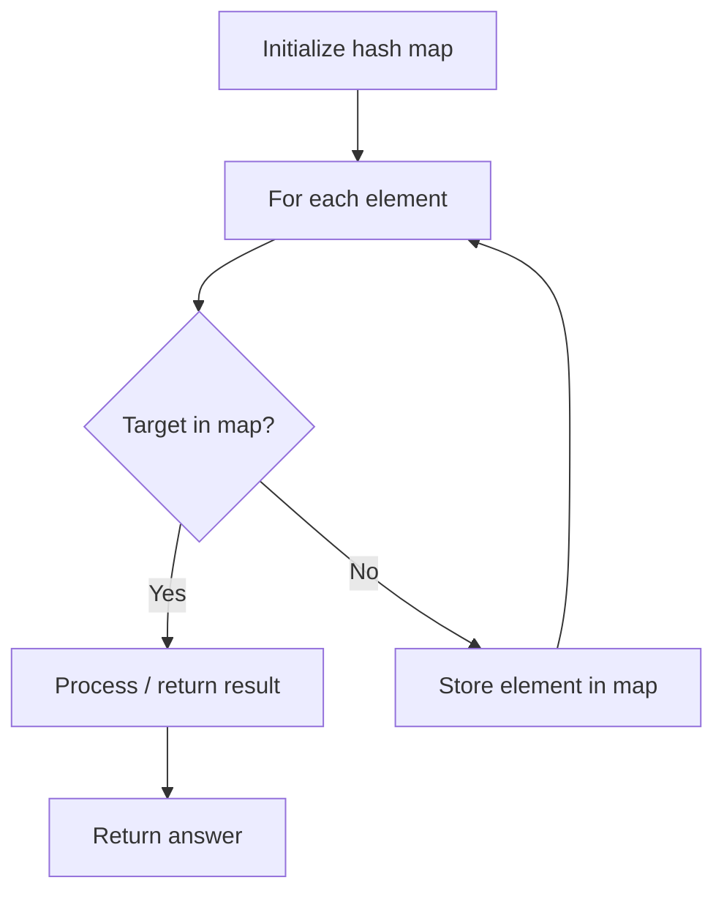

# Problem 391: Perfect Rectangle

**Difficulty:** Hard  
**Tags:** Array, Hash Table, Math, Geometry, Sweep Line  
**Pattern:** Hash Map Lookup  
**Link:** [leetcode.com/problems/perfect-rectangle](https://leetcode.com/problems/perfect-rectangle/)

## Description

Given an array `rectangles` where `rectangles[i] = [xi, yi, ai, bi]` represents an axis-aligned rectangle. The bottom-left point of the rectangle is `(xi, yi)` and the top-right point of it is `(ai, bi)`.

Return `true` *if all the rectangles together form an exact cover of a rectangular region*.

 

Example 1:

```

**Input:** rectangles = [[1,1,3,3],[3,1,4,2],[3,2,4,4],[1,3,2,4],[2,3,3,4]]
**Output:** true
**Explanation:** All 5 rectangles together form an exact cover of a rectangular region.

```

Example 2:

```

**Input:** rectangles = [[1,1,2,3],[1,3,2,4],[3,1,4,2],[3,2,4,4]]
**Output:** false
**Explanation:** Because there is a gap between the two rectangular regions.

```

Example 3:

```

**Input:** rectangles = [[1,1,3,3],[3,1,4,2],[1,3,2,4],[2,2,4,4]]
**Output:** false
**Explanation:** Because two of the rectangles overlap with each other.

```

 

**Constraints:**

	- `1 <= rectangles.length <= 2 * 10^4`
	- `rectangles[i].length == 4`
	- `-10^5 <= xi < ai <= 10^5`
	- `-10^5 <= yi < bi <= 10^5`

## Approach: Hash Map Lookup

Use a hash map (dictionary) to store elements for O(1) lookup. Iterate through the input, checking membership or counting frequencies in the map.

## Pseudocode

```
1. Initialize hash map
2. Iterate through elements:
   a. Check if target/complement exists in map
   b. If found: process result
   c. Otherwise: store element in map
3. Return result
```

## Algorithm Flow



## Complexity Analysis

- **Time:** O(n)
- **Space:** O(n)

## Solution (Python3)

```python
class Solution:
    def isRectangleCover(self, rectangles: List[List[int]]) -> bool:
        # Hash map approach - O(n) time, O(n) space
        seen = {}
        for i, val in enumerate(rectangles):
            complement = rectangles - val
            if complement in seen:
                return [seen[complement], i]
            seen[val] = i
        return False
```

## Solution (C++)

```cpp
#include <string>
#include <unordered_map>
#include <vector>
using namespace std;

class Solution {
public:
    bool isRectangleCover(vector<vector<int>>& rectangles) {
        // Hash map approach - O(n) time, O(n) space
        unordered_map<int, int> seen;
        for (int i = 0; i < rectangles.size(); i++) {
            int complement = rectangles - rectangles[i];
            if (seen.count(complement)) {
                return {seen[complement], i};
            }
            seen[rectangles[i]] = i;
        }
        return false;
    }
};
```
