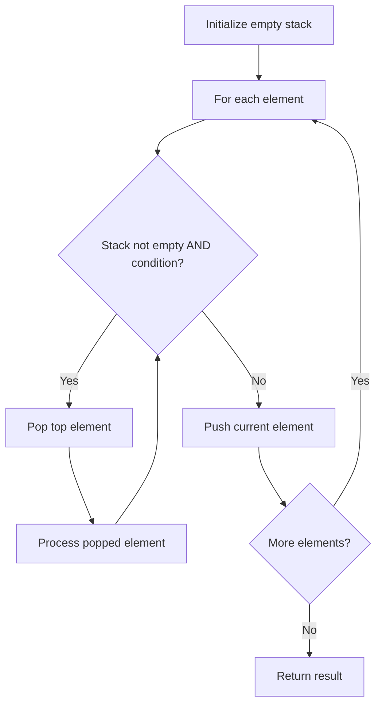

# Problem 394: Decode String

**Difficulty:** Medium  
**Tags:** String, Stack, Recursion  
**Pattern:** Stack  
**Link:** [leetcode.com/problems/decode-string](https://leetcode.com/problems/decode-string/)

## Description

Given an encoded string, return its decoded string.

The encoding rule is: `k[encoded_string]`, where the `encoded_string` inside the square brackets is being repeated exactly `k` times. Note that `k` is guaranteed to be a positive integer.

You may assume that the input string is always valid; there are no extra white spaces, square brackets are well-formed, etc. Furthermore, you may assume that the original data does not contain any digits and that digits are only for those repeat numbers, `k`. For example, there will not be input like `3a` or `2[4]`.

The test cases are generated so that the length of the output will never exceed `10^5`.

 

Example 1:

```

**Input:** s = "3[a]2[bc]"
**Output:** "aaabcbc"

```

Example 2:

```

**Input:** s = "3[a2[c]]"
**Output:** "accaccacc"

```

Example 3:

```

**Input:** s = "2[abc]3[cd]ef"
**Output:** "abcabccdcdcdef"

```

 

**Constraints:**

	- `1 <= s.length <= 30`
	- `s` consists of lowercase English letters, digits, and square brackets `'[]'`.
	- `s` is guaranteed to be **a valid** input.
	- All the integers in `s` are in the range `[1, 300]`.

## Approach: Stack

Use a stack (LIFO) to process elements. Push elements when they might be needed later; pop when a matching or resolving condition is found. Common uses: parentheses matching, expression evaluation, next greater element.

## Pseudocode

```
1. Initialize empty stack
2. For each element:
   a. While stack is not empty and condition met:
      - Pop and process top element
   b. Push current element onto stack
3. Process remaining elements in stack if needed
4. Return result
```

## Algorithm Flow



## Complexity Analysis

- **Time:** O(n)
- **Space:** O(n)

## Solution (Python3)

```python
class Solution:
    def decodeString(self, s: str) -> str:
        # Stack-based approach - O(n) time
        stack = []
        for ch in s:
            if stack and self._matches(stack[-1], ch):
                stack.pop()
            else:
                stack.append(ch)
        return len(stack) == 0 if isinstance("", bool) else stack

    def _matches(self, a, b):
        pairs = {'(': ')', '[': ']', '{': '}'}
        return pairs.get(a) == b
```

## Solution (C++)

```cpp
#include <stack>
#include <string>
#include <unordered_map>
#include <vector>
using namespace std;

class Solution {
public:
    string decodeString(string& s) {
        // Stack-based approach - O(n) time
        stack<char> st;
        unordered_map<char, char> pairs = {{'(', ')'}, {'[', ']'}, {'{', '}'}};
        for (char ch : s) {
            if (!st.empty() && pairs.count(st.top()) && pairs[st.top()] == ch) {
                st.pop();
            } else {
                st.push(ch);
            }
        }
        return st.empty();
    }
};
```
