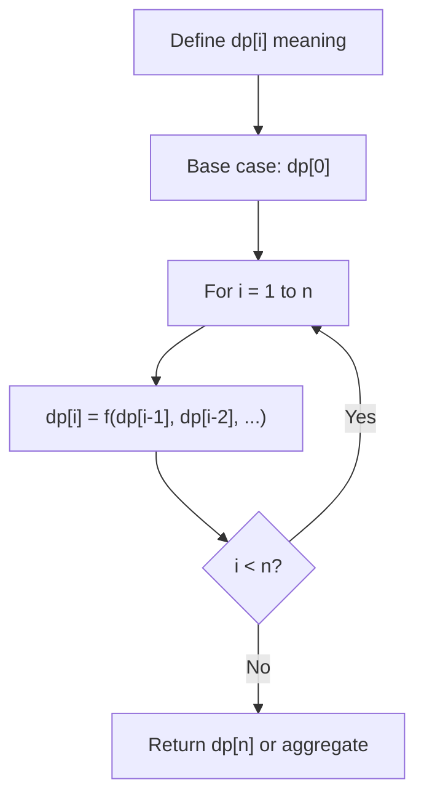
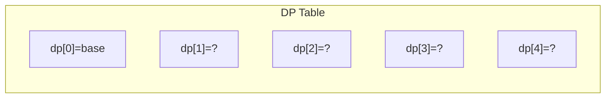
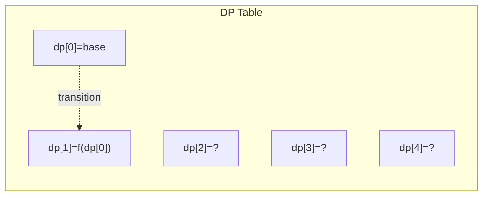
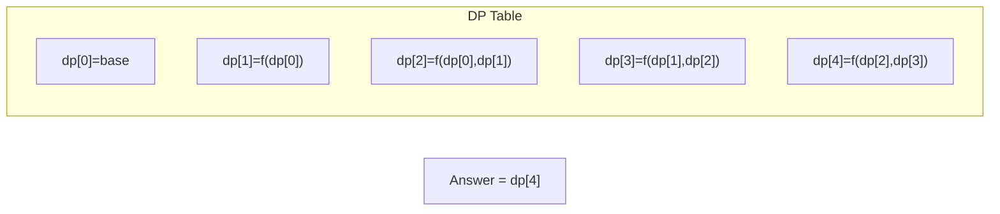

# Problem 396: Rotate Function

**Difficulty:** Medium  
**Tags:** Array, Math, Dynamic Programming  
**Pattern:** Dynamic Programming (1D)  
**Link:** [leetcode.com/problems/rotate-function](https://leetcode.com/problems/rotate-function/)

## Description

You are given an integer array `nums` of length `n`.

Assume `arrk` to be an array obtained by rotating `nums` by `k` positions clock-wise. We define the **rotation function** `F` on `nums` as follow:

	- `F(k) = 0 * arrk[0] + 1 * arrk[1] + ... + (n - 1) * arrk[n - 1].`

Return *the maximum value of* `F(0), F(1), ..., F(n-1)`.

The test cases are generated so that the answer fits in a **32-bit** integer.

 

Example 1:

```

**Input:** nums = [4,3,2,6]
**Output:** 26
**Explanation:**
F(0) = (0 * 4) + (1 * 3) + (2 * 2) + (3 * 6) = 0 + 3 + 4 + 18 = 25
F(1) = (0 * 6) + (1 * 4) + (2 * 3) + (3 * 2) = 0 + 4 + 6 + 6 = 16
F(2) = (0 * 2) + (1 * 6) + (2 * 4) + (3 * 3) = 0 + 6 + 8 + 9 = 23
F(3) = (0 * 3) + (1 * 2) + (2 * 6) + (3 * 4) = 0 + 2 + 12 + 12 = 26
So the maximum value of F(0), F(1), F(2), F(3) is F(3) = 26.

```

Example 2:

```

**Input:** nums = [100]
**Output:** 0

```

 

**Constraints:**

	- `n == nums.length`
	- `1 <= n <= 10^5`
	- `-100 <= nums[i] <= 100`

## Approach: Dynamic Programming (1D)

Break the problem into overlapping subproblems. Define dp[i] as the optimal value for the subproblem ending at or considering index i. Build the solution bottom-up, using previously computed dp values.

## Pseudocode

```
1. Define dp[i] = optimal value for subproblem i
2. Base case: dp[0] = initial value
3. For i from 1 to n:
   a. dp[i] = recurrence(dp[i-1], dp[i-2], ...)
4. Return dp[n] or max/min of dp
```

## Algorithm Flow



## Visual State Transitions

**1D Dynamic Programming Table Build:**

**Frame 1: Initialize base cases**


**Frame 2: Fill dp[1] from dp[0]**


**Frame 3: Fill remaining cells**



## Complexity Analysis

- **Time:** O(n)
- **Space:** O(n)

## Solution (Python3)

```python
class Solution:
    def maxRotateFunction(self, nums: List[int]) -> int:
        # Dynamic programming (1D) - O(n) time, O(n) space
        if not nums:
            return 0
        n = len(nums) if isinstance(nums, list) else nums
        dp = [0] * (n + 1)
        dp[0] = 1  # base case
        for i in range(1, n + 1):
            dp[i] = dp[i-1]  # transition (customize per problem)
            if i >= 2:
                dp[i] += dp[i-2]
        return dp[n]
```

## Solution (C++)

```cpp
#include <string>
#include <vector>
using namespace std;

class Solution {
public:
    int maxRotateFunction(vector<int>& nums) {
        // Dynamic programming (1D) - O(n) time, O(n) space
        int n = nums;
        if (n <= 0) return 0;
        vector<int> dp(n + 1, 0);
        dp[0] = 1;
        for (int i = 1; i <= n; i++) {
            dp[i] = dp[i-1];
            if (i >= 2) dp[i] += dp[i-2];
        }
        return dp[n];
    }
};
```
