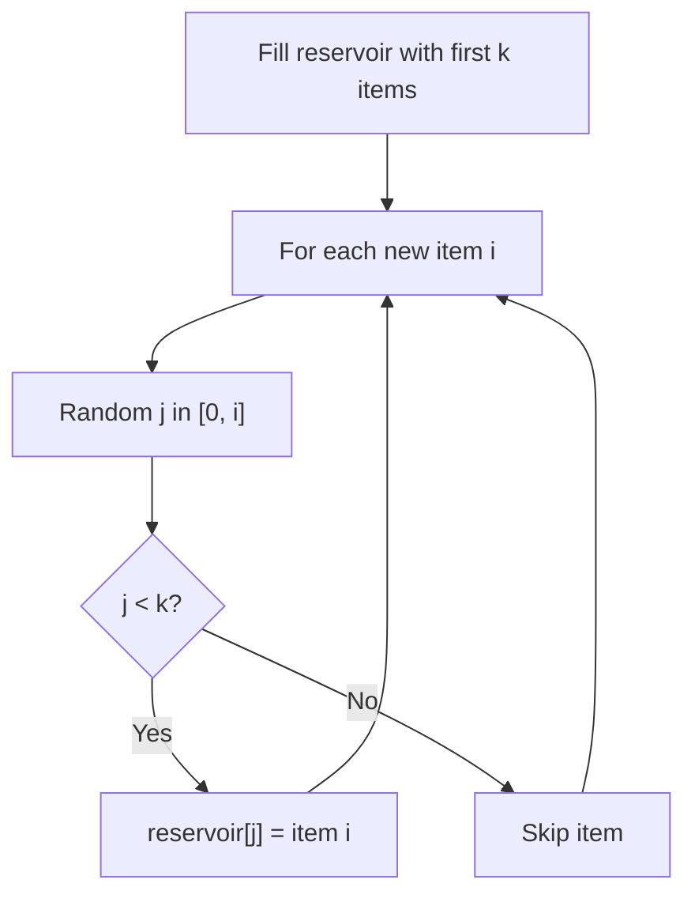

# Problem 398: Random Pick Index

**Difficulty:** Medium  
**Tags:** Hash Table, Math, Reservoir Sampling, Randomized  
**Pattern:** Reservoir Sampling  
**Link:** [leetcode.com/problems/random-pick-index](https://leetcode.com/problems/random-pick-index/)

## Description

Given an integer array `nums` with possible **duplicates**, randomly output the index of a given `target` number. You can assume that the given target number must exist in the array.

Implement the `Solution` class:

	- `Solution(int[] nums)` Initializes the object with the array `nums`.
	- `int pick(int target)` Picks a random index `i` from `nums` where `nums[i] == target`. If there are multiple valid i's, then each index should have an equal probability of returning.

 

Example 1:

```

**Input**
["Solution", "pick", "pick", "pick"]
[[[1, 2, 3, 3, 3]], [3], [1], [3]]
**Output**
[null, 4, 0, 2]

**Explanation**
Solution solution = new Solution([1, 2, 3, 3, 3]);
solution.pick(3); // It should return either index 2, 3, or 4 randomly. Each index should have equal probability of returning.
solution.pick(1); // It should return 0. Since in the array only nums[0] is equal to 1.
solution.pick(3); // It should return either index 2, 3, or 4 randomly. Each index should have equal probability of returning.

```

 

**Constraints:**

	- `1 <= nums.length <= 2 * 10^4`
	- `-2^31 <= nums[i] <= 2^31 - 1`
	- `target` is an integer from `nums`.
	- At most `10^4` calls will be made to `pick`.

## Approach: Reservoir Sampling

Select k random items from a stream of unknown length with uniform probability. Keep a reservoir of k items; replace items with decreasing probability.

## Pseudocode

```
1. Fill reservoir with first k items
2. For each subsequent item i (i >= k):
   a. Generate random j in [0, i]
   b. If j < k: replace reservoir[j] with item i
3. Return reservoir
```

## Algorithm Flow



## Complexity Analysis

- **Time:** O(n)
- **Space:** O(k)

## Solution (Python3)

```python
class Solution:
    def __init__(self, nums: List[int]):
        # Initialize data structure
        self.nums = nums

    def pick(self, target: int) -> int:
        return 0

```

## Solution (C++)

```cpp
#include <cstdlib>
#include <ctime>
#include <string>
#include <vector>
using namespace std;

class Solution {
public:
    Solution(vector<int>& nums) {
        // Initialize
    }

    int pick(int target) {
        return 0;
    }

};
```
