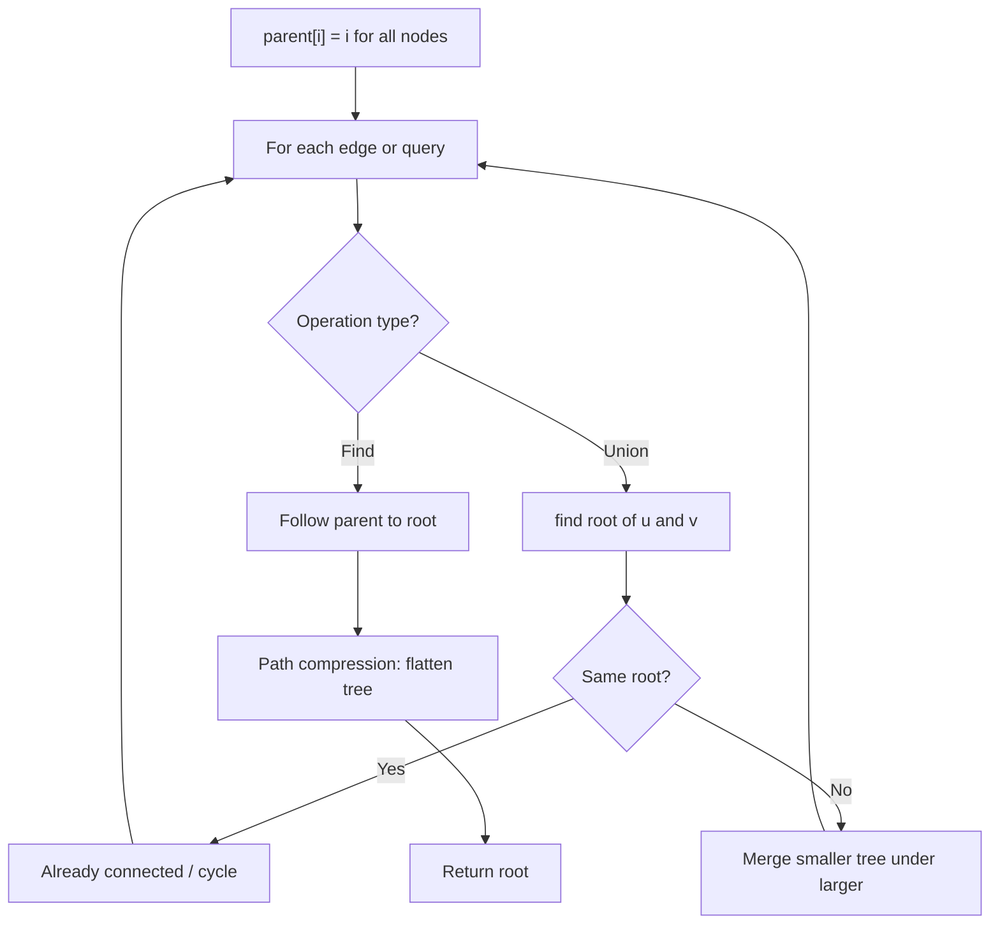
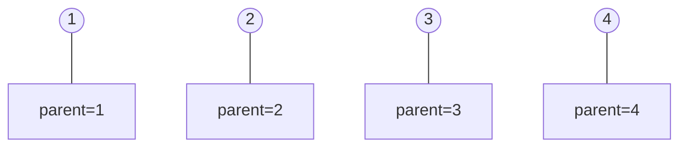
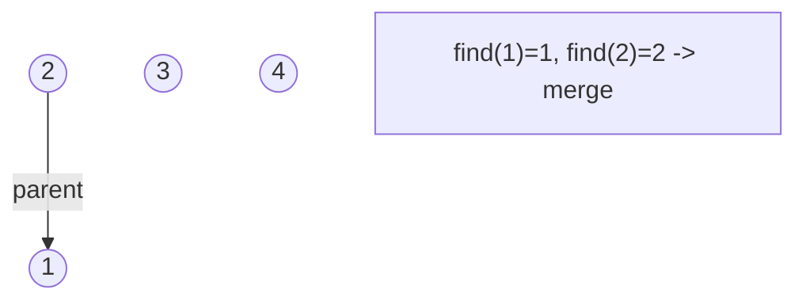
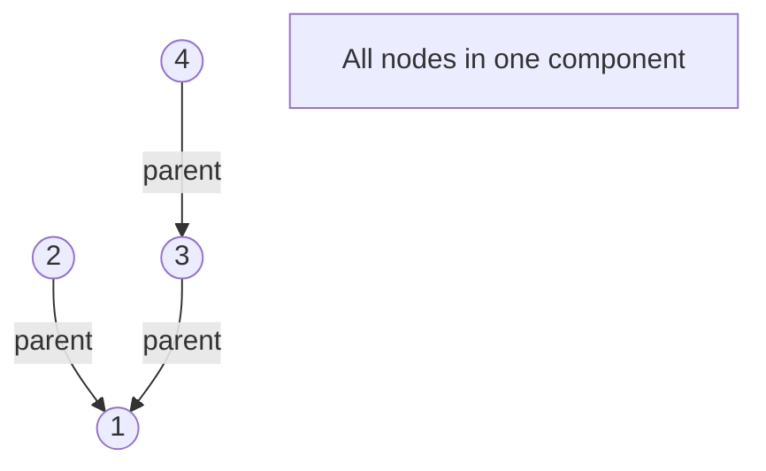
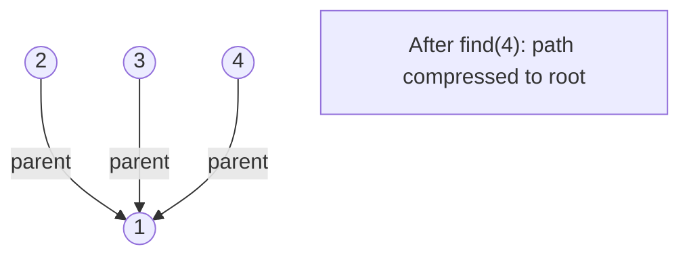

# Problem 399: Evaluate Division

**Difficulty:** Medium  
**Tags:** Array, String, Depth-First Search, Breadth-First Search, Union-Find, Graph Theory, Shortest Path  
**Pattern:** Union-Find / Disjoint Set  
**Link:** [leetcode.com/problems/evaluate-division](https://leetcode.com/problems/evaluate-division/)

## Description

You are given an array of variable pairs `equations` and an array of real numbers `values`, where `equations[i] = [Ai, Bi]` and `values[i]` represent the equation `Ai / Bi = values[i]`. Each `Ai` or `Bi` is a string that represents a single variable.

You are also given some `queries`, where `queries[j] = [Cj, Dj]` represents the `j^th` query where you must find the answer for `Cj / Dj = ?`.

Return *the answers to all queries*. If a single answer cannot be determined, return `-1.0`.

**Note:** The input is always valid. You may assume that evaluating the queries will not result in division by zero and that there is no contradiction.

**Note: **The variables that do not occur in the list of equations are undefined, so the answer cannot be determined for them.

 

Example 1:

```

**Input:** equations = [["a","b"],["b","c"]], values = [2.0,3.0], queries = [["a","c"],["b","a"],["a","e"],["a","a"],["x","x"]]
**Output:** [6.00000,0.50000,-1.00000,1.00000,-1.00000]
**Explanation:** 
Given: *a / b = 2.0*, *b / c = 3.0*
queries are: *a / c = ?*, *b / a = ?*, *a / e = ?*, *a / a = ?*, *x / x = ? *
return: [6.0, 0.5, -1.0, 1.0, -1.0 ]
note: x is undefined => -1.0
```

Example 2:

```

**Input:** equations = [["a","b"],["b","c"],["bc","cd"]], values = [1.5,2.5,5.0], queries = [["a","c"],["c","b"],["bc","cd"],["cd","bc"]]
**Output:** [3.75000,0.40000,5.00000,0.20000]

```

Example 3:

```

**Input:** equations = [["a","b"]], values = [0.5], queries = [["a","b"],["b","a"],["a","c"],["x","y"]]
**Output:** [0.50000,2.00000,-1.00000,-1.00000]

```

 

**Constraints:**

	- `1 <= equations.length <= 20`
	- `equations[i].length == 2`
	- `1 <= Ai.length, Bi.length <= 5`
	- `values.length == equations.length`
	- `0.0 < values[i] <= 20.0`
	- `1 <= queries.length <= 20`
	- `queries[i].length == 2`
	- `1 <= Cj.length, Dj.length <= 5`
	- `Ai, Bi, Cj, Dj` consist of lower case English letters and digits.

## Approach: Union-Find / Disjoint Set

Use Union-Find with path compression and union by rank to efficiently manage connected components. Find(x) returns the root of x's component; Union(x,y) merges two components.

## Pseudocode

```
1. parent[i] = i for all nodes (each is its own set)
2. find(x): follow parent pointers to root (with path compression)
3. union(x, y): merge sets of x and y by rank
4. Process edges/operations:
   a. For each edge (u, v): union(u, v)
5. Answer queries using find()
```

## Algorithm Flow



## Visual State Transitions

**Union-Find Step-by-Step:**

**Frame 1: Initial - each node is own parent**


**Frame 2: Union(1,2) - merge components**


**Frame 3: Union(3,4) then Union(2,3)**


**Frame 4: Path compression on find(4)**



## Complexity Analysis

- **Time:** O(n * alpha(n))
- **Space:** O(n)

## Solution (Python3)

```python
class Solution:
    def calcEquation(self, equations: List[List[str]], values: List[float], queries: List[List[str]]) -> List[float]:
        # Union Find (Disjoint Set Union) - O(n * alpha(n))
        parent = list(range(len(equations) + 1 if isinstance(equations, list) else equations + 1))
        rank = [0] * len(parent)
        
        def find(x):
            if parent[x] != x:
                parent[x] = find(parent[x])
            return parent[x]
        
        def union(x, y):
            px, py = find(x), find(y)
            if px == py:
                return False
            if rank[px] < rank[py]:
                px, py = py, px
            parent[py] = px
            if rank[px] == rank[py]:
                rank[px] += 1
            return True
        
        components = len(parent)
        # Process edges/connections
        return components
```

## Solution (C++)

```cpp
#include <functional>
#include <numeric>
#include <string>
#include <vector>
using namespace std;

class Solution {
public:
    vector<double> calcEquation(vector<vector<string>>& equations, vector<double>& values, vector<vector<string>>& queries) {
        // Union Find (DSU) - O(n * alpha(n))
        int n = equations.size();
        vector<int> parent(n + 1), rnk(n + 1, 0);
        iota(parent.begin(), parent.end(), 0);
        function<int(int)> find = [&](int x) -> int {
            return parent[x] == x ? x : parent[x] = find(parent[x]);
        };
        auto unite = [&](int x, int y) -> bool {
            int px = find(x), py = find(y);
            if (px == py) return false;
            if (rnk[px] < rnk[py]) swap(px, py);
            parent[py] = px;
            if (rnk[px] == rnk[py]) rnk[px]++;
            return true;
        };
        int components = n;
        return components;
    }
};
```
