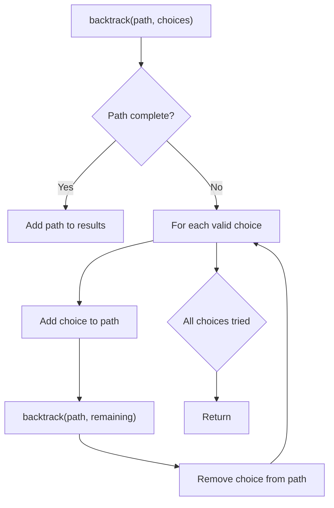
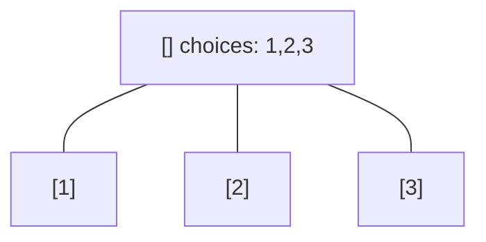
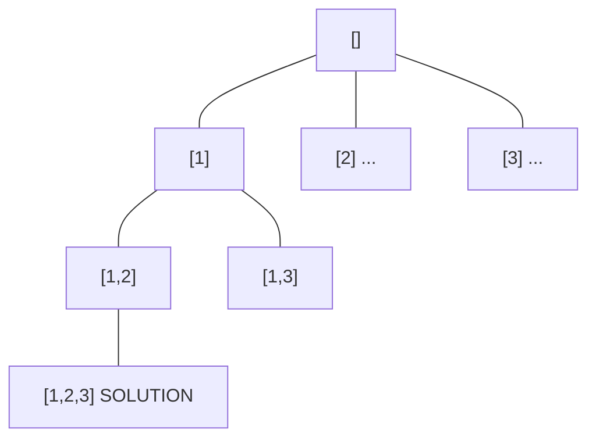
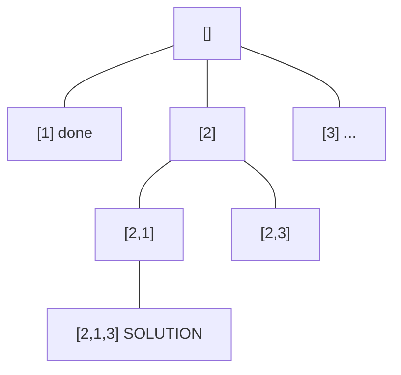
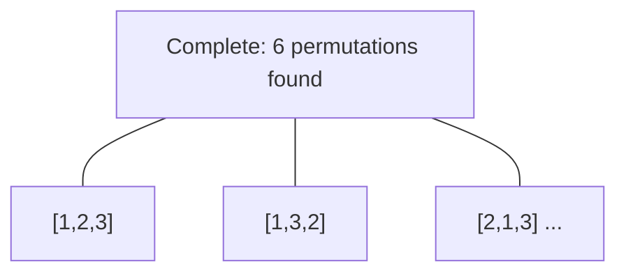

# Problem 401: Binary Watch

**Difficulty:** Easy  
**Tags:** Backtracking, Bit Manipulation  
**Pattern:** Backtracking  
**Link:** [leetcode.com/problems/binary-watch](https://leetcode.com/problems/binary-watch/)

## Description

A binary watch has 4 LEDs on the top to represent the hours (0-11), and 6 LEDs on the bottom to represent the minutes (0-59). Each LED represents a zero or one, with the least significant bit on the right.

	- For example, the below binary watch reads `"4:51"`.

Given an integer `turnedOn` which represents the number of LEDs that are currently on (ignoring the PM), return *all possible times the watch could represent*. You may return the answer in **any order**.

The hour must not contain a leading zero.

	- For example, `"01:00"` is not valid. It should be `"1:00"`.

The minute must consist of two digits and may contain a leading zero.

	- For example, `"10:2"` is not valid. It should be `"10:02"`.

 

Example 1:

```
**Input:** turnedOn = 1
**Output:** ["0:01","0:02","0:04","0:08","0:16","0:32","1:00","2:00","4:00","8:00"]

```
Example 2:

```
**Input:** turnedOn = 9
**Output:** []

```

 

**Constraints:**

	- `0 <= turnedOn <= 10`

## Approach: Backtracking

Explore all possible solutions by building candidates incrementally. At each step, make a choice and recurse. If the choice leads to a dead end, undo the choice (backtrack) and try the next option.

## Pseudocode

```
1. Define backtrack(path, choices):
   a. If path is a complete solution: add to results
   b. For each choice in choices:
      - If choice is valid:
        * Add choice to path
        * backtrack(path, remaining_choices)
        * Remove choice from path (backtrack)
2. Call backtrack([], all_choices)
```

## Algorithm Flow



## Visual State Transitions

**Backtracking Decision Tree:**

**Frame 1: Root - start with empty path**


**Frame 2: Explore branch [1]**


**Frame 3: Backtrack, explore [2]**


**Frame 4: All solutions found**



## Complexity Analysis

- **Time:** O(k^n) or O(n!)
- **Space:** O(n)

## Solution (Python3)

```python
class Solution:
    def readBinaryWatch(self, turnedOn: int) -> List[str]:
        # Backtracking - O(2^n) or O(n!) time
        result = []
        
        def backtrack(path, start):
            result.append(path[:])
            for i in range(start, len(turnedOn)):
                path.append(turnedOn[i])
                backtrack(path, i + 1)
                path.pop()
        
        backtrack([], 0)
        return result
```

## Solution (C++)

```cpp
#include <functional>
#include <string>
#include <vector>
using namespace std;

class Solution {
public:
    vector<string> readBinaryWatch(int turnedOn) {
        // Backtracking - O(2^n) or O(n!) time
        vector<vector<int>> result;
        vector<int> path;
        function<void(int)> backtrack = [&](int start) {
            result.push_back(path);
            for (int i = start; i < (int)turnedOn.size(); i++) {
                path.push_back(turnedOn[i]);
                backtrack(i + 1);
                path.pop_back();
            }
        };
        backtrack(0);
        return result;
    }
};
```
