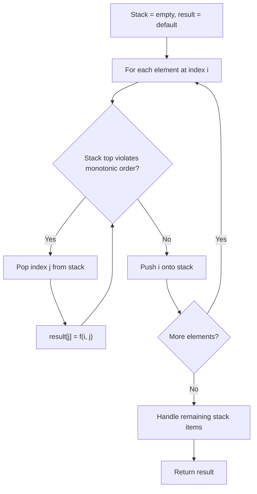
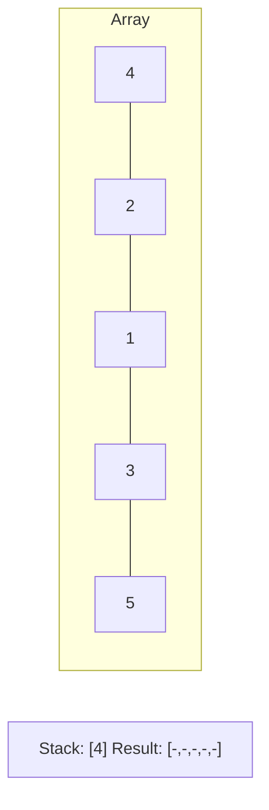
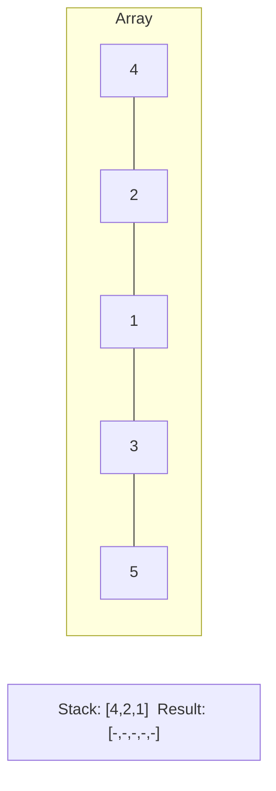
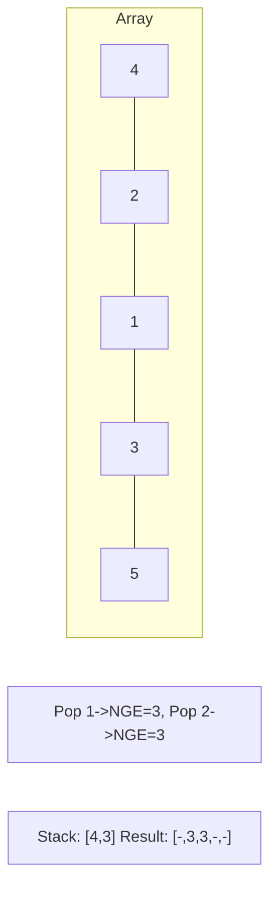
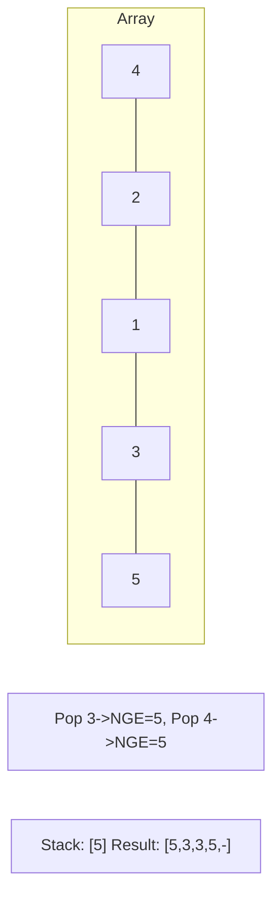

# Problem 402: Remove K Digits

**Difficulty:** Medium  
**Tags:** String, Stack, Greedy, Monotonic Stack  
**Pattern:** Monotonic Stack  
**Link:** [leetcode.com/problems/remove-k-digits](https://leetcode.com/problems/remove-k-digits/)

## Description

Given string num representing a non-negative integer `num`, and an integer `k`, return *the smallest possible integer after removing* `k` *digits from* `num`.

 

Example 1:

```

**Input:** num = "1432219", k = 3
**Output:** "1219"
**Explanation:** Remove the three digits 4, 3, and 2 to form the new number 1219 which is the smallest.

```

Example 2:

```

**Input:** num = "10200", k = 1
**Output:** "200"
**Explanation:** Remove the leading 1 and the number is 200. Note that the output must not contain leading zeroes.

```

Example 3:

```

**Input:** num = "10", k = 2
**Output:** "0"
**Explanation:** Remove all the digits from the number and it is left with nothing which is 0.

```

 

**Constraints:**

	- `1 <= k <= num.length <= 10^5`
	- `num` consists of only digits.
	- `num` does not have any leading zeros except for the zero itself.

## Approach: Monotonic Stack

Maintain a stack where elements are always in monotonic order (increasing or decreasing). When a new element violates the monotonic property, pop elements and compute results (e.g., next greater/smaller element, spans, areas).

## Pseudocode

```
1. Initialize empty stack, result array
2. For each element (index i):
   a. While stack not empty and arr[i] breaks monotonic order:
      - Pop index j from stack
      - result[j] = compute(i, j)
   b. Push i onto stack
3. Handle remaining elements in stack
4. Return result
```

## Algorithm Flow



## Visual State Transitions

**Monotonic Stack (Next Greater Element):**

**Frame 1: Process first elements**


**Frame 2: Push smaller elements**


**Frame 3: Element 3 pops 1 and 2**


**Frame 4: Element 5 pops all**



## Complexity Analysis

- **Time:** O(n)
- **Space:** O(n)

## Solution (Python3)

```python
class Solution:
    def removeKdigits(self, num: str, k: int) -> str:
        # Monotonic stack - O(n) time, O(n) space
        n = len(num)
        result = [0] * n
        stack = []  # indices
        for i in range(n):
            while stack and num[i] > num[stack[-1]]:
                idx = stack.pop()
                result[idx] = i - idx
            stack.append(i)
        return result
```

## Solution (C++)

```cpp
#include <stack>
#include <string>
#include <vector>
using namespace std;

class Solution {
public:
    string removeKdigits(string& num, int k) {
        // Monotonic stack - O(n) time, O(n) space
        int n = num.size();
        vector<int> result(n, 0);
        stack<int> st;
        for (int i = 0; i < n; i++) {
            while (!st.empty() && num[i] > num[st.top()]) {
                int idx = st.top(); st.pop();
                result[idx] = i - idx;
            }
            st.push(i);
        }
        return result;
    }
};
```
