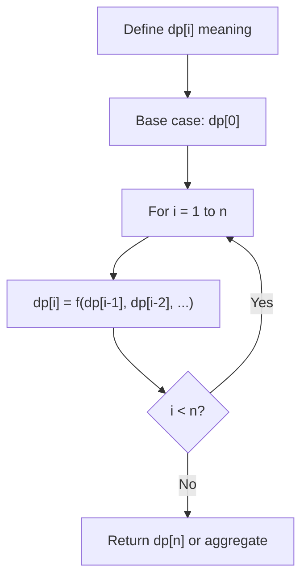
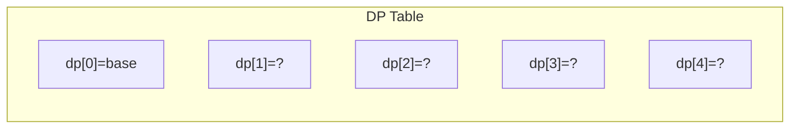
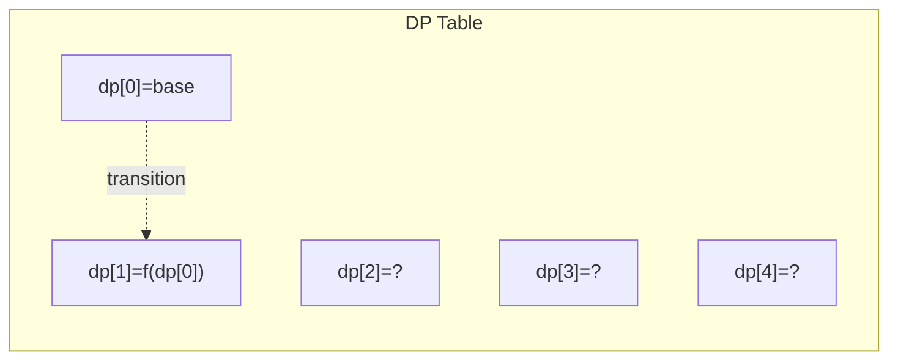
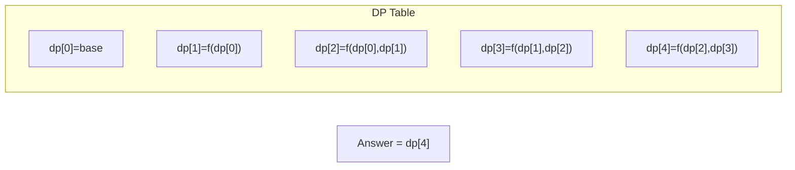

# Problem 403: Frog Jump

**Difficulty:** Hard  
**Tags:** Array, Dynamic Programming  
**Pattern:** Dynamic Programming (1D)  
**Link:** [leetcode.com/problems/frog-jump](https://leetcode.com/problems/frog-jump/)

## Description

A frog is crossing a river. The river is divided into some number of units, and at each unit, there may or may not exist a stone. The frog can jump on a stone, but it must not jump into the water.

Given a list of `stones` positions (in units) in sorted **ascending order**, determine if the frog can cross the river by landing on the last stone. Initially, the frog is on the first stone and assumes the first jump must be `1` unit.

If the frog's last jump was `k` units, its next jump must be either `k - 1`, `k`, or `k + 1` units. The frog can only jump in the forward direction.

 

Example 1:

```

**Input:** stones = [0,1,3,5,6,8,12,17]
**Output:** true
**Explanation:** The frog can jump to the last stone by jumping 1 unit to the 2nd stone, then 2 units to the 3rd stone, then 2 units to the 4th stone, then 3 units to the 6th stone, 4 units to the 7th stone, and 5 units to the 8th stone.

```

Example 2:

```

**Input:** stones = [0,1,2,3,4,8,9,11]
**Output:** false
**Explanation:** There is no way to jump to the last stone as the gap between the 5th and 6th stone is too large.

```

 

**Constraints:**

	- `2 <= stones.length <= 2000`
	- `0 <= stones[i] <= 2^31 - 1`
	- `stones[0] == 0`
	- `stones` is sorted in a strictly increasing order.

## Approach: Dynamic Programming (1D)

Break the problem into overlapping subproblems. Define dp[i] as the optimal value for the subproblem ending at or considering index i. Build the solution bottom-up, using previously computed dp values.

## Pseudocode

```
1. Define dp[i] = optimal value for subproblem i
2. Base case: dp[0] = initial value
3. For i from 1 to n:
   a. dp[i] = recurrence(dp[i-1], dp[i-2], ...)
4. Return dp[n] or max/min of dp
```

## Algorithm Flow



## Visual State Transitions

**1D Dynamic Programming Table Build:**

**Frame 1: Initialize base cases**


**Frame 2: Fill dp[1] from dp[0]**


**Frame 3: Fill remaining cells**



## Complexity Analysis

- **Time:** O(n)
- **Space:** O(n)

## Solution (Python3)

```python
class Solution:
    def canCross(self, stones: List[int]) -> bool:
        # Dynamic programming (1D) - O(n) time, O(n) space
        if not stones:
            return 0
        n = len(stones) if isinstance(stones, list) else stones
        dp = [0] * (n + 1)
        dp[0] = 1  # base case
        for i in range(1, n + 1):
            dp[i] = dp[i-1]  # transition (customize per problem)
            if i >= 2:
                dp[i] += dp[i-2]
        return dp[n]
```

## Solution (C++)

```cpp
#include <string>
#include <vector>
using namespace std;

class Solution {
public:
    bool canCross(vector<int>& stones) {
        // Dynamic programming (1D) - O(n) time, O(n) space
        int n = stones;
        if (n <= 0) return 0;
        vector<int> dp(n + 1, 0);
        dp[0] = 1;
        for (int i = 1; i <= n; i++) {
            dp[i] = dp[i-1];
            if (i >= 2) dp[i] += dp[i-2];
        }
        return dp[n];
    }
};
```
