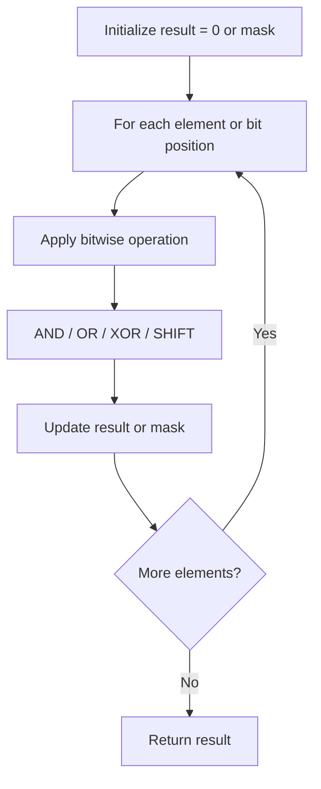

# Problem 405: Convert a Number to Hexadecimal

**Difficulty:** Easy  
**Tags:** Math, String, Bit Manipulation  
**Pattern:** Bit Manipulation  
**Link:** [leetcode.com/problems/convert-a-number-to-hexadecimal](https://leetcode.com/problems/convert-a-number-to-hexadecimal/)

## Description

Given a 32-bit integer `num`, return *a string representing its hexadecimal representation*. For negative integers, two’s complement method is used.

All the letters in the answer string should be lowercase characters, and there should not be any leading zeros in the answer except for the zero itself.

**Note: **You are not allowed to use any built-in library method to directly solve this problem.

 

Example 1:

```
**Input:** num = 26
**Output:** "1a"

```
Example 2:

```
**Input:** num = -1
**Output:** "ffffffff"

```

 

**Constraints:**

	- `-2^31 <= num <= 2^31 - 1`

## Approach: Bit Manipulation

Operate on individual bits using bitwise operators (AND, OR, XOR, shift). Common tricks: x & (x-1) removes lowest set bit, x ^ x = 0, XOR all elements to find unique.

## Pseudocode

```
1. Apply bitwise operations:
   - XOR all elements to cancel paired bits
   - Use bitmask to track state
   - Shift and mask to extract/set individual bits
2. Return result
```

## Algorithm Flow



## Complexity Analysis

- **Time:** O(n) or O(log n)
- **Space:** O(1)

## Solution (Python3)

```python
class Solution:
    def toHex(self, num: int) -> str:
        # Bit manipulation - O(n) time, O(1) space
        result = 0
        for val in num:
            result ^= val
        return result
```

## Solution (C++)

```cpp
#include <string>
#include <vector>
using namespace std;

class Solution {
public:
    string toHex(int num) {
        // Bit manipulation - O(n) time, O(1) space
        int result = 0;
        for (int val : num) {
            result ^= val;
        }
        return result;
    }
};
```
